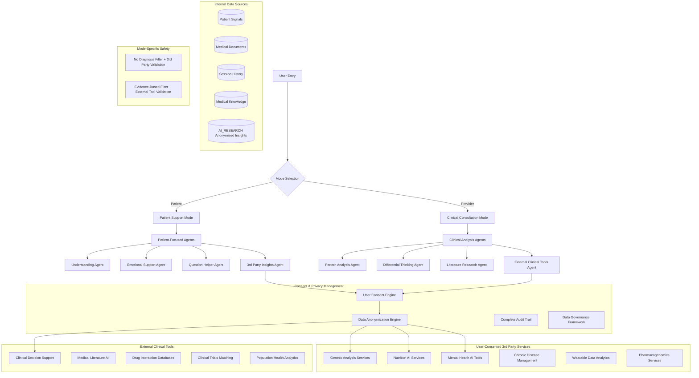

# AI Medical Chat: Dual-Mode Intelligent Health Companion

This document outlines a dual-mode AI chat system that provides differentiated support for patients and healthcare providers, each with distinct goals and interaction patterns.

## Executive Summary

The AI Medical Chat system operates in two distinct modes with enhanced 3rd party integration:

1. **Patient Support Mode**: Focuses on emotional support, understanding, and empowerment
   - Helps patients understand their medical documents
   - Provides coping strategies and emotional comfort
   - Prepares patients for productive healthcare consultations
   - **NEW**: Integrates user-consented 3rd party insights and tools

2. **Clinical Consultation Mode**: Provides analytical support for healthcare providers
   - Offers alternative perspectives on patient conditions
   - Suggests additional diagnostic avenues
   - Highlights patterns across patient history
   - **NEW**: Accesses external clinical decision support tools
   - **NEW**: Integrates with specialized medical AI services

## Core Principle: User-Controlled Data Sharing for Enhanced Insights

**Users maintain complete control over sharing their highly personal medical data with internal and external services to receive enhanced insights for better understanding and coping strategies.** All sharing is:

- **User-Initiated**: Users actively choose which services to share with
- **Fully Consented**: Comprehensive informed consent for each service
- **Purpose-Driven**: Clear understanding of what insights will be provided
- **Reversible for Future Data**: Users can stop future sharing while past anonymized data remains with services
- **Transparent**: Complete visibility into what data is shared and with whom

## Mode Architecture

### Enhanced System Overview with 3rd Party Integration



## Mode 1: Patient Support Mode

### Core Philosophy
- **Empowerment through Understanding**: Help patients comprehend their health situation
- **Emotional Wellbeing**: Provide comfort and coping strategies
- **Active Participation**: Enable informed healthcare conversations
- **Clear Boundaries**: No medical advice or interpretation

### Agent Framework

#### 1. Document Understanding Agent
```typescript
interface PatientUnderstandingAgent {
  // Explain medical documents in simple terms
  explainDocument(params: {
    document: MedicalDocument;
    userEducationLevel: string;
    focusAreas?: string[];
  }): Promise<SimpleExplanation>;
  
  // Define medical terminology
  explainTerms(params: {
    terms: string[];
    context: string;
    preferredComplexity: 'basic' | 'intermediate' | 'detailed';
  }): Promise<TermDefinitions>;
  
  // Provide procedure overviews
  explainProcedure(params: {
    procedureName: string;
    userConcerns: string[];
  }): Promise<ProcedureOverview>;
}

// Example responses
const patientExplanations = {
  bloodTest: {
    simple: "A blood test is like taking a small sample of your blood to check how different parts of your body are working.",
    intermediate: "Blood tests measure various components in your blood, such as cells, chemicals, proteins, and other substances that can indicate how your organs are functioning.",
    analogies: "Think of it like checking the oil and fluid levels in your car to make sure everything is running smoothly."
  }
};
```

#### 2. Emotional Support Agent
```typescript
interface EmotionalSupportAgent {
  // Acknowledge and validate feelings
  acknowledgeEmotions(params: {
    expressedFeelings: string[];
    medicalContext: string;
  }): Promise<EmpatheticResponse>;
  
  // Provide coping strategies
  offerCopingStrategies(params: {
    stressLevel: 'low' | 'medium' | 'high';
    situation: string;
    userPreferences?: CopingPreferences;
  }): Promise<CopingStrategy[]>;
  
  // Connect to support resources
  suggestSupport(params: {
    needType: 'emotional' | 'practical' | 'informational';
    location?: string;
  }): Promise<SupportResource[]>;
}

// Empathetic response templates
const emotionalResponses = {
  anxiety: {
    acknowledgment: "It's completely natural to feel anxious when dealing with medical issues.",
    validation: "Your feelings are valid and many people experience similar concerns.",
    support: "Let's work through this together, one step at a time."
  },
  overwhelm: {
    acknowledgment: "Medical information can definitely feel overwhelming.",
    validation: "It's okay to take time to process this information.",
    support: "We can break this down into smaller, more manageable pieces."
  }
};
```

#### 3. 3rd Party Insights Agent
```typescript
interface ThirdPartyInsightsAgent {
  // Manage user consent for 3rd party services
  manageThirdPartyConsent(params: {
    userId: string;
    availableServices: ThirdPartyService[];
    userDataProfile: UserDataProfile;
  }): Promise<ConsentManagementInterface>;
  
  // Orchestrate insights from multiple consented services
  orchestrateInsights(params: {
    userQuery: string;
    consentedServices: ConsentedService[];
    userMedicalContext: UserMedicalContext;
    insightTypes: InsightType[];
  }): Promise<OrchestatedInsights>;
  
  // Integrate anonymized research insights
  integrateResearchInsights(params: {
    userProfile: AnonymizedUserProfile;
    researchFindings: ResearchFinding[];
    similarCohorts: AnonymizedCohort[];
  }): Promise<ResearchBasedInsights>;
  
  // Present integrated insights to user
  presentIntegratedInsights(params: {
    coreInsights: CoreInsights;
    thirdPartyInsights: ThirdPartyInsight[];
    researchInsights: ResearchInsight[];
    userPreferences: PresentationPreferences;
  }): Promise<IntegratedInsightPresentation>;
}

// Available 3rd party service categories
const thirdPartyServiceCategories = {
  genetic_analysis: {
    description: "Genetic and genomic analysis services",
    example_services: [
      "23andMe Health + Ancestry API",
      "Promethease Genetic Analysis",
      "Genetic Genie Health Analysis",
      "SelfDecode Personalized Health",
      "Nebula Genomics Deep Genomic Analysis"
    ],
    data_shared: ["genetic_variants", "family_history", "ethnicity"],
    insights_received: ["disease_predisposition", "drug_response", "nutritional_needs", "exercise_response"],
    anonymization_level: "enhanced_with_synthetic_injection"
  },
  
  nutrition_optimization: {
    description: "Personalized nutrition and dietary analysis",
    example_services: [
      "Nutrigenomix Personalized Nutrition",
      "MyFitnessPal Nutrition AI",
      "Cronometer Nutritional Analysis",
      "Noom Behavioral Nutrition AI",
      "Precision Nutrition CoachCare"
    ],
    data_shared: ["dietary_preferences", "metabolic_markers", "activity_levels", "health_goals"],
    insights_received: ["personalized_meal_plans", "nutrient_deficiency_alerts", "metabolic_optimization", "weight_management"],
    anonymization_level: "standard_statistical_disclosure"
  },
  
  mental_health_support: {
    description: "Mental health and wellness AI tools",
    example_services: [
      "Woebot Therapeutic AI",
      "Wysa Mental Health Chatbot",
      "Ginger.io Behavioral Health",
      "Talkspace AI Therapy Support",
      "Mindfulness.com Meditation AI"
    ],
    data_shared: ["mood_patterns", "stress_levels", "sleep_quality", "behavioral_data"],
    insights_received: ["mood_trend_analysis", "stress_management_strategies", "cognitive_behavioral_techniques", "mindfulness_recommendations"],
    anonymization_level: "maximum_with_differential_privacy"
  },
  
  chronic_disease_management: {
    description: "Specialized chronic disease management tools",
    example_services: [
      "Dexcom Diabetes Management AI",
      "Omada Diabetes Prevention",
      "Livongo Chronic Care Management",
      "Virta Health Metabolic Reversal",
      "Propeller Health Respiratory Care"
    ],
    data_shared: ["disease_specific_metrics", "medication_adherence", "symptom_tracking", "lifestyle_factors"],
    insights_received: ["disease_progression_monitoring", "treatment_optimization", "lifestyle_modification_recommendations", "complication_prevention"],
    anonymization_level: "enhanced_with_temporal_generalization"
  },
  
  wearable_data_analytics: {
    description: "Advanced wearable device data analysis",
    example_services: [
      "Apple Health AI Insights",
      "Fitbit Premium Health Analytics",
      "Garmin Health Snapshot",
      "Oura Ring Health Intelligence",
      "Whoop Performance Analytics"
    ],
    data_shared: ["activity_patterns", "sleep_data", "heart_rate_variability", "stress_indicators"],
    insights_received: ["activity_optimization", "sleep_improvement", "recovery_recommendations", "performance_insights"],
    anonymization_level: "standard_with_noise_injection"
  },
  
  pharmacogenomics: {
    description: "Personalized medication response analysis",
    example_services: [
      "Pharmacogenomics Knowledge Base (PharmGKB)",
      "GeneSight Psychotropic Testing",
      "Pillpack Medication Management AI",
      "YouScript Personalized Prescribing",
      "Medication Risk Mitigation AI"
    ],
    data_shared: ["genetic_variants", "current_medications", "medication_history", "adverse_reactions"],
    insights_received: ["medication_efficacy_predictions", "dosage_optimization", "adverse_reaction_risk", "alternative_medication_suggestions"],
    anonymization_level: "maximum_with_cryptographic_unlinking"
  }
};

// 3rd party service integration framework
interface ThirdPartyServiceIntegration {
  // Service discovery and evaluation
  discoverServices(params: {
    userHealthProfile: HealthProfile;
    userInterests: HealthInterest[];
    dataAvailability: DataAvailability;
  }): Promise<RecommendedService[]>;
  
  // Service onboarding with consent
  onboardService(params: {
    serviceId: string;
    userId: string;
    consentLevel: ConsentLevel;
    dataCategories: DataCategory[];
    expectedBenefits: ExpectedBenefit[];
  }): Promise<ServiceOnboardingResult>;
  
  // Real-time service integration
  integrateServiceInsights(params: {
    serviceId: string;
    userQuery: string;
    relevantUserData: AnonymizedUserData;
    integrationContext: IntegrationContext;
  }): Promise<ServiceInsightResponse>;
  
  // Service performance monitoring
  monitorServicePerformance(params: {
    serviceId: string;
    userId: string;
    insightQuality: InsightQuality;
    userSatisfaction: UserSatisfaction;
  }): Promise<ServicePerformanceMetrics>;
}

// Example 3rd party integration workflow
const thirdPartyIntegrationWorkflow = {
  user_query: "I'm struggling with my diabetes management and feeling overwhelmed",
  
  step_1_context_analysis: {
    identified_needs: ["diabetes_management", "emotional_support", "lifestyle_optimization"],
    available_user_data: ["glucose_readings", "medication_history", "mood_tracking", "dietary_logs"],
    user_consent_status: "genetic_services_consented, nutrition_ai_consented, mental_health_pending"
  },
  
  step_2_service_orchestration: {
    diabetes_management_ai: {
      service: "Livongo Chronic Care Management",
      data_shared: "anonymized_glucose_patterns, medication_adherence, lifestyle_factors",
      expected_insight: "personalized_diabetes_management_recommendations"
    },
    nutrition_ai: {
      service: "Precision Nutrition CoachCare", 
      data_shared: "anonymized_dietary_logs, metabolic_markers, activity_levels",
      expected_insight: "diabetes_friendly_meal_planning"
    },
    mental_health_support: {
      service: "Woebot Therapeutic AI",
      consent_required: true,
      data_shared: "anonymized_mood_patterns, stress_levels, chronic_disease_impact",
      expected_insight: "coping_strategies_for_chronic_disease_management"
    }
  },
  
  step_3_integrated_response: {
    core_mediqom_insights: "Educational content about diabetes management, emotional validation, question preparation for endocrinologist",
    diabetes_ai_insights: "Your glucose patterns suggest better control with consistent meal timing. Consider 15-minute post-meal walks.",
    nutrition_ai_insights: "Based on your metabolic profile, try these 3 diabetes-friendly meal plans optimized for your preferences",
    mental_health_insights: "Many people with diabetes experience similar feelings. Here are evidence-based coping strategies...",
    integrated_recommendations: "Combining diabetes management with mental health support shows 40% better outcomes in similar patient populations"
  }
};
```

#### 4. Question Preparation Agent
```typescript
interface QuestionPreparationAgent {
  // Generate relevant questions for appointments
  prepareQuestions(params: {
    documentType: string;
    userConcerns: string[];
    appointmentType: 'routine' | 'follow-up' | 'specialist';
  }): Promise<QuestionSet>;
  
  // Create appointment checklists
  createChecklist(params: {
    visitPurpose: string;
    previousVisits?: Visit[];
  }): Promise<AppointmentChecklist>;
  
  // Organize medical history
  organizeHistory(params: {
    documents: Document[];
    focusArea?: string;
  }): Promise<OrganizedHistory>;
}

// Question categories for patients
const questionCategories = {
  understanding: [
    "Can you explain what this test result means in simple terms?",
    "What should I expect during this procedure?",
    "How does this condition typically progress?"
  ],
  treatment: [
    "What are all my treatment options?",
    "What are the benefits and risks of each option?",
    "How will this affect my daily life?"
  ],
  nextSteps: [
    "What happens next in my care?",
    "When should I follow up?",
    "What symptoms should I watch for?"
  ]
};
```

### Patient Interaction Examples

#### Example 1: Lab Result Support
```typescript
// Patient uploads lab results showing elevated glucose

Patient: "My glucose is 126. I'm scared I might have diabetes."

AI Response: {
  emotionalSupport: "I understand why you might be concerned about this glucose reading. It's natural to feel worried when you see numbers outside the typical range.",
  
  explanation: "Glucose is the sugar in your blood that gives your body energy. Your body usually keeps it within a certain range. A reading of 126 mg/dL is slightly above the typical fasting range of 70-100 mg/dL.",
  
  context: "A single glucose reading doesn't tell the whole story. Many factors can affect glucose levels, including:\n- When you last ate\n- Stress levels\n- Recent illness\n- Certain medications",
  
  questionsForDoctor: [
    "Was this a fasting glucose test, and if so, how long should I have fasted?",
    "Should we do additional tests like an A1C to get a fuller picture?",
    "Are there lifestyle changes I can start making now?",
    "How often should I monitor my glucose levels?"
  ],
  
  copingStrategy: "While waiting for your appointment, focus on what you can control:\n- Keep a food diary to share with your doctor\n- Note any symptoms you're experiencing\n- Try stress-reduction techniques like deep breathing\n- Remember that many glucose issues can be managed effectively",
  
  resources: [
    "Understanding Blood Sugar Levels - Patient Guide",
    "Preparing for Your Diabetes Screening Appointment"
  ]
}
```

## Mode 2: Clinical Consultation Mode

### Core Philosophy
- **Analytical Enhancement**: Provide additional perspectives for clinical decision-making
- **Pattern Recognition**: Identify trends and correlations across patient data
- **Evidence Integration**: Connect patient data with current medical knowledge
- **Diagnostic Support**: Suggest areas for further investigation

### Agent Framework

#### 1. Pattern Analysis Agent
```typescript
interface PatternAnalysisAgent {
  // Analyze trends across patient history
  analyzePatterns(params: {
    patientId: string;
    timeframe: TimeRange;
    focusAreas?: string[];
  }): Promise<PatternAnalysis>;
  
  // Identify correlations between symptoms and results
  findCorrelations(params: {
    signals: Signal[];
    symptoms: Symptom[];
    medications: Medication[];
  }): Promise<CorrelationReport>;
  
  // Detect anomalies or unusual presentations
  detectAnomalies(params: {
    patientData: PatientData;
    populationNorms: PopulationData;
  }): Promise<AnomalyReport>;
}

// Clinical pattern insights
interface PatternAnalysis {
  identifiedPatterns: Pattern[];
  temporalTrends: Trend[];
  seasonalVariations?: SeasonalPattern[];
  medicationResponsePatterns: MedicationResponse[];
  riskFactorProgression: RiskProgression[];
}
```

#### 2. Differential Thinking Agent
```typescript
interface DifferentialThinkingAgent {
  // Generate differential considerations
  generateDifferentials(params: {
    presentingSymptoms: Symptom[];
    patientHistory: History;
    currentFindings: Finding[];
  }): Promise<DifferentialList>;
  
  // Suggest additional investigations
  suggestInvestigations(params: {
    currentData: PatientData;
    suspectedConditions: Condition[];
    availableResources: string[];
  }): Promise<InvestigationPlan>;
  
  // Identify red flags or critical patterns
  identifyRedFlags(params: {
    clinicalData: ClinicalData;
    vitalTrends: VitalSign[];
  }): Promise<RedFlagAlert[]>;
}

// Differential support structure
interface DifferentialList {
  primaryConsiderations: DifferentialItem[];
  alternativeConsiderations: DifferentialItem[];
  rareButSerious: DifferentialItem[];
  supportingEvidence: Evidence[];
  contradictingEvidence: Evidence[];
}
```

#### 3. External Clinical Tools Agent
```typescript
interface ExternalClinicalToolsAgent {
  // Integrate with clinical decision support systems
  integrateClinicalDecisionSupport(params: {
    patientCase: ClinicalCase;
    clinicalQuestions: ClinicalQuestion[];
    externalCDSystems: CDSystem[];
    providerCredentials: ProviderCredentials;
  }): Promise<ClinicalDecisionSupport>;
  
  // Access specialized medical AI services
  accessSpecializedMedicalAI(params: {
    specialty: MedicalSpecialty;
    clinicalScenario: ClinicalScenario;
    patientData: AnonymizedPatientData;
    aiServices: SpecializedAIService[];
  }): Promise<SpecializedMedicalInsights>;
  
  // Query external medical databases
  queryExternalMedicalDatabases(params: {
    queryType: 'drug_interactions' | 'clinical_trials' | 'population_data' | 'medical_literature';
    queryParameters: QueryParameters;
    authorizedDatabases: AuthorizedDatabase[];
  }): Promise<ExternalDatabaseResults>;
  
  // Validate findings against multiple sources
  validateFindingsAcrossSources(params: {
    clinicalFindings: ClinicalFinding[];
    externalSources: ExternalSource[];
    validationCriteria: ValidationCriteria;
  }): Promise<CrossValidatedFindings>;
}

// External clinical tool categories
const externalClinicalToolCategories = {
  clinical_decision_support: {
    description: "Advanced clinical decision support systems",
    example_tools: [
      "IBM Watson for Oncology",
      "Epic Clinical Decision Support",
      "Cerner PowerChart Clinical Decision Support",
      "UpToDate Clinical Decision Support",
      "DynaMed Clinical Decision Support",
      "BMJ Best Practice Decision Support"
    ],
    capabilities: ["evidence_based_recommendations", "drug_interaction_alerts", "clinical_guideline_integration", "risk_stratification"],
    data_requirements: "anonymized_patient_case_data",
    integration_level: "api_based_with_provider_authentication"
  },
  
  specialized_medical_ai: {
    description: "Specialty-specific AI diagnostic and treatment tools",
    example_tools: [
      "Google AI Diabetic Retinopathy Detection",
      "Aidoc Radiology AI Suite",
      "PathAI Digital Pathology",
      "Cardiologs ECG Analysis AI",
      "Zebra Medical Vision AI",
      "Paige.AI Prostate Cancer Detection"
    ],
    capabilities: ["diagnostic_imaging_analysis", "pathology_analysis", "ecg_interpretation", "risk_assessment"],
    data_requirements: "specialty_specific_anonymized_data",
    integration_level: "secure_api_with_hipaa_compliance"
  },
  
  drug_interaction_databases: {
    description: "Comprehensive drug interaction and pharmacology databases",
    example_tools: [
      "Lexicomp Drug Interactions",
      "Micromedex Drug Interactions",
      "First Databank Drug Database",
      "Clinical Pharmacology Database",
      "Wolters Kluwer Medi-Span",
      "Thomson Reuters Micromedex"
    ],
    capabilities: ["comprehensive_drug_interactions", "dosage_recommendations", "contraindication_alerts", "pharmacokinetic_data"],
    data_requirements: "medication_lists_and_patient_factors",
    integration_level: "subscription_based_api_access"
  },
  
  clinical_trials_matching: {
    description: "Clinical trials discovery and patient matching services",
    example_tools: [
      "ClinicalTrials.gov API",
      "Antidote Clinical Trial Matching",
      "TrialScope Clinical Trial Intelligence",
      "Clara Health Trial Matching",
      "Deep 6 AI Clinical Trial Matching"
    ],
    capabilities: ["trial_discovery", "eligibility_screening", "geographic_matching", "real_time_trial_updates"],
    data_requirements: "anonymized_patient_eligibility_criteria",
    integration_level: "public_and_commercial_apis"
  },
  
  population_health_analytics: {
    description: "Large-scale population health and epidemiological tools",
    example_tools: [
      "CDC WONDER Database API",
      "WHO Global Health Observatory",
      "OECD Health Statistics",
      "All of Us Research Program",
      "UK Biobank Analytics Platform"
    ],
    capabilities: ["population_trend_analysis", "epidemiological_insights", "public_health_data", "comparative_effectiveness"],
    data_requirements: "aggregated_anonymous_patient_data",
    integration_level: "public_apis_and_research_collaborations"
  },
  
  medical_literature_ai: {
    description: "AI-powered medical literature analysis and synthesis",
    example_tools: [
      "PubMed GPT Literature Analysis",
      "Semantic Scholar Medical AI",
      "Consensus AI Medical Research",
      "Elicit Research Assistant",
      "Meta Medical Literature Synthesis"
    ],
    capabilities: ["literature_synthesis", "evidence_grading", "systematic_review_automation", "real_time_research_updates"],
    data_requirements: "clinical_questions_and_patient_context",
    integration_level: "ai_service_apis"
  }
};

// Clinical tool integration workflow
interface ClinicalToolIntegrationWorkflow {
  // Provider authentication and authorization
  authenticateProvider(params: {
    providerId: string;
    credentials: ProviderCredentials;
    requestedTools: ExternalTool[];
    institutionalAccess: InstitutionalAccess;
  }): Promise<ProviderAuthenticationResult>;
  
  // Tool recommendation based on clinical context
  recommendTools(params: {
    clinicalScenario: ClinicalScenario;
    patientComplexity: ComplexityLevel;
    providerSpecialty: MedicalSpecialty;
    availableTools: AvailableTool[];
  }): Promise<RecommendedTool[]>;
  
  // Real-time tool orchestration
  orchestrateTools(params: {
    clinicalQuery: ClinicalQuery;
    selectedTools: SelectedTool[];
    patientData: AnonymizedPatientData;
    integrationPreferences: IntegrationPreferences;
  }): Promise<OrchestratedClinicalInsights>;
}

// Example clinical tool integration scenario
const clinicalToolIntegrationExample = {
  clinical_scenario: "65-year-old patient with diabetes, hypertension, and new-onset chest pain",
  
  provider_context: {
    specialty: "internal_medicine",
    experience_level: "attending_physician",
    institutional_access: ["epic_cds", "uptodate", "lexicomp", "clinicaltrials_gov"],
    ai_tool_preferences: "evidence_based_with_multiple_source_validation"
  },
  
  recommended_tool_orchestration: {
    primary_clinical_decision_support: {
      tool: "Epic Clinical Decision Support",
      query: "chest_pain_evaluation_diabetes_hypertension",
      expected_output: "evidence_based_diagnostic_recommendations"
    },
    
    drug_interaction_analysis: {
      tool: "Lexicomp Drug Interactions",
      query: "current_medication_list_with_potential_cardiac_medications",
      expected_output: "comprehensive_interaction_analysis"
    },
    
    specialized_cardiology_ai: {
      tool: "Cardiologs ECG Analysis AI",
      query: "ecg_interpretation_with_clinical_context",
      expected_output: "ai_enhanced_ecg_analysis"
    },
    
    clinical_trials_matching: {
      tool: "ClinicalTrials.gov API",
      query: "diabetes_hypertension_cardiovascular_trials",
      expected_output: "relevant_clinical_trial_opportunities"
    },
    
    population_health_context: {
      tool: "CDC WONDER Database",
      query: "cardiovascular_outcomes_diabetes_hypertension_demographics",
      expected_output: "population_level_risk_stratification"
    }
  },
  
  integrated_clinical_output: {
    differential_diagnosis: "AI-enhanced differential with evidence grades from multiple CDS systems",
    treatment_recommendations: "Evidence-based treatment options validated across clinical databases",
    drug_safety_profile: "Comprehensive interaction analysis with personalized risk assessment",
    clinical_trial_options: "Matched clinical trials with eligibility pre-screening",
    population_risk_context: "Patient risk compared to similar population cohorts",
    next_steps: "Prioritized diagnostic and therapeutic recommendations with evidence levels"
  }
};
```

#### 4. Literature Integration Agent
```typescript
interface LiteratureIntegrationAgent {
  // Find relevant clinical guidelines
  findGuidelines(params: {
    condition: string;
    patientFactors: PatientFactors;
    treatmentStage: string;
  }): Promise<ClinicalGuideline[]>;
  
  // Identify recent research relevant to case
  findRelevantResearch(params: {
    clinicalScenario: string;
    publicationWindow?: TimeRange;
    evidenceLevel?: EvidenceLevel[];
  }): Promise<ResearchSummary[]>;
  
  // Compare patient to study populations
  compareToStudyPopulations(params: {
    patientCharacteristics: Characteristics;
    studyPopulations: StudyPopulation[];
  }): Promise<PopulationComparison>;
}
```

### Clinical Interaction Examples

#### Example 1: Complex Case Analysis
```typescript
// Provider reviewing patient with multiple chronic conditions

Provider: "Patient with diabetes, hypertension, and recent onset fatigue. Latest labs show mild anemia and worsening renal function."

AI Clinical Response: {
  patternAnalysis: {
    identified: "Progressive decline in renal function over 6 months correlating with periods of poor glycemic control. Hemoglobin decline began 3 months after starting ACE inhibitor.",
    
    timeline: [
      "6 months ago: eGFR 65, HbA1c 8.2%",
      "3 months ago: Started lisinopril, eGFR 58",
      "Current: eGFR 52, Hgb 10.2 (was 12.5), HbA1c 7.8%"
    ]
  },
  
  differentialConsiderations: {
    primary: [
      {
        condition: "Diabetic nephropathy with secondary anemia",
        supporting: ["Progressive eGFR decline", "Proteinuria present", "Long-standing diabetes"],
        additional_workup: ["Renal ultrasound", "Iron studies", "EPO levels"]
      },
      {
        condition: "Drug-induced renal impairment",
        supporting: ["Temporal relationship with ACE inhibitor", "Elderly patient"],
        additional_workup: ["Hold ACE inhibitor trial", "Repeat creatinine in 2 weeks"]
      }
    ],
    
    alternative: [
      "Chronic kidney disease of mixed etiology",
      "Myeloma or other paraproteinemia",
      "Renovascular disease"
    ]
  },
  
  investigationSuggestions: [
    {
      test: "24-hour urine protein",
      rationale: "Quantify proteinuria and assess nephropathy severity"
    },
    {
      test: "Renal ultrasound with Doppler",
      rationale: "Assess kidney size, rule out obstruction, evaluate blood flow"
    },
    {
      test: "Serum protein electrophoresis",
      rationale: "Given anemia and renal dysfunction, exclude paraproteinemia"
    }
  ],
  
  literatureInsights: [
    {
      guideline: "KDIGO 2022 Diabetes and CKD Guidelines",
      relevant_points: [
        "Consider SGLT2 inhibitors for renal protection",
        "Target HbA1c 7-8% in CKD to avoid hypoglycemia",
        "Monitor for anemia earlier in diabetic CKD"
      ]
    }
  ],
  
  clinicalPearls: [
    "Anemia often appears earlier in diabetic nephropathy than other causes of CKD",
    "Consider holding ACE inhibitor if creatinine rises >30% from baseline",
    "Fatigue in this context may be multifactorial - address anemia, glycemic control, and possible uremia"
  ]
}
```

## Mode-Specific Safety Frameworks

### Patient Mode Safety
```typescript
interface PatientSafetyFramework {
  // Ensure no medical advice
  filterMedicalAdvice(response: string): Promise<SafeResponse>;
  
  // Maintain supportive boundaries
  enforceBoundaries(params: {
    userRequest: string;
    responseType: ResponseType;
  }): Promise<BoundaryCheck>;
  
  // Always defer to healthcare providers
  addProviderDeference(response: Response): Response;
}

// Patient safety filters
const patientSafetyRules = {
  prohibited: [
    "You should take...",
    "This means you have...",
    "Stop taking your medication",
    "You don't need to see a doctor"
  ],
  required: [
    "Discuss with your healthcare provider",
    "Your doctor can explain",
    "Bring this up at your appointment"
  ]
};
```

### Clinical Mode Safety
```typescript
interface ClinicalSafetyFramework {
  // Ensure evidence-based suggestions
  validateClinicalSuggestions(params: {
    suggestions: Suggestion[];
    evidenceLevel: EvidenceLevel;
  }): Promise<ValidatedSuggestions>;
  
  // Maintain clinical decision support boundaries
  enforecClinicalBoundaries(response: ClinicalResponse): ClinicalResponse;
  
  // Add appropriate disclaimers
  addClinicalDisclaimers(response: Response): Response;
}

// Clinical safety principles
const clinicalSafetyRules = {
  required_disclaimers: [
    "Clinical correlation required",
    "Consider patient-specific factors",
    "Not a substitute for clinical judgment"
  ],
  evidence_requirements: {
    minimum_level: "expert_opinion",
    preferred_level: "systematic_review",
    citation_required: true
  }
};
```

## User Consent and Data Sharing Framework

### Comprehensive Consent Management for 3rd Party Integration

```typescript
interface ChatConsentManagement {
  // Initialize consent process for 3rd party services
  initializeServiceConsent(params: {
    userId: string;
    serviceCategory: ServiceCategory;
    proposedServices: ProposedService[];
    chatContext: ChatContext;
  }): Promise<ConsentInitialization>;
  
  // Dynamic consent based on conversation needs
  requestContextualConsent(params: {
    userQuery: string;
    identifiedNeeds: IdentifiedNeed[];
    availableServices: AvailableService[];
    currentConsents: CurrentConsent[];
  }): Promise<ContextualConsentRequest>;
  
  // Manage ongoing consent preferences
  manageConsentPreferences(params: {
    userId: string;
    activeConsents: ActiveConsent[];
    performanceMetrics: ServicePerformanceMetric[];
    userSatisfaction: UserSatisfactionScore[];
  }): Promise<ConsentManagementDashboard>;
  
  // Consent revocation and data handling
  revokeServiceConsent(params: {
    userId: string;
    serviceId: string;
    revocationReason: RevocationReason;
    futureDataHandling: FutureDataHandling;
  }): Promise<ConsentRevocationResult>;
}

// Service consent tiers with different sharing levels
const serviceConsentTiers = {
  basic_insights_only: {
    description: "Receive insights without sharing personal data",
    data_sharing: "none",
    insights_level: "generic_population_based",
    example: "General diabetes management tips without access to user's specific data",
    revocability: "immediate"
  },
  
  aggregated_data_sharing: {
    description: "Share aggregated/anonymized data for population insights",
    data_sharing: "anonymized_aggregated_only",
    insights_level: "cohort_based_personalization",
    example: "Insights based on anonymized data from users with similar conditions",
    revocability: "future_data_only_past_anonymized_remains"
  },
  
  anonymized_personal_sharing: {
    description: "Share anonymized personal data for personalized insights",
    data_sharing: "anonymized_personal_data",
    insights_level: "personalized_based_on_anonymous_profile",
    example: "Personalized nutrition recommendations based on anonymized health profile",
    revocability: "future_data_only_anonymized_data_irreversible"
  },
  
  contextual_data_sharing: {
    description: "Share specific contextual data for targeted insights",
    data_sharing: "contextual_anonymized_data",
    insights_level: "highly_personalized_contextual",
    example: "Share sleep patterns with sleep AI for personalized sleep improvement plan",
    revocability: "can_stop_future_sharing_but_analysis_continues"
  }
};

// Real-time consent request in chat
interface RealTimeConsentRequest {
  // Present consent request during conversation
  presentConsentRequest(params: {
    chatMessage: string;
    identifiedOpportunity: InsightOpportunity;
    proposedService: ProposedService;
    expectedBenefit: ExpectedBenefit;
  }): Promise<ConsentRequestPresentation>;
  
  // Educational consent explanation
  explainConsentImplications(params: {
    service: ThirdPartyService;
    dataRequirements: DataRequirement[];
    sharingLevel: SharingLevel;
    userContext: UserContext;
  }): Promise<ConsentEducation>;
  
  // Quick consent for trusted services
  processQuickConsent(params: {
    userId: string;
    serviceId: string;
    trustedServiceLevel: TrustedLevel;
    quickConsentPreferences: QuickConsentPreferences;
  }): Promise<QuickConsentResult>;
}

// Example real-time consent scenario
const realTimeConsentScenario = {
  user_message: "I've been having trouble sleeping and my energy levels are really low during the day",
  
  ai_analysis: {
    identified_opportunities: [
      "sleep_optimization_via_wearable_data",
      "nutrition_analysis_for_energy_levels", 
      "mental_health_screening_for_fatigue"
    ],
    relevant_services: [
      "Oura Ring Sleep Intelligence",
      "Cronometer Nutrition Analysis", 
      "Woebot Mental Health Assessment"
    ]
  },
  
  consent_presentation: {
    service_suggestion: "I notice you're having sleep and energy issues. I can connect you with specialized sleep analysis and nutrition services that might help. Would you like me to explain how this would work?",
    
    user_chooses_yes: {
      detailed_explanation: {
        sleep_service: {
          service: "Oura Ring Sleep Intelligence",
          data_needed: "Your sleep patterns, heart rate variability, and activity levels from your recent health data",
          data_sharing_level: "anonymized_personal_data",
          insights_provided: "Personalized sleep optimization recommendations, circadian rhythm analysis, recovery metrics",
          duration: "ongoing_until_you_revoke",
          revocability: "You can stop future data sharing anytime, but analysis based on already shared data continues"
        },
        
        nutrition_service: {
          service: "Cronometer Nutrition Analysis",
          data_needed: "Your dietary logs, any lab results showing nutrient levels, activity patterns",
          data_sharing_level: "contextual_anonymized_data",
          insights_provided: "Personalized nutrition recommendations for energy optimization, nutrient deficiency identification",
          duration: "until_goals_achieved_or_revoked",
          revocability: "immediate_for_future_data"
        }
      },
      
      consent_options: [
        "Yes, connect me with both services (recommended for comprehensive analysis)",
        "Yes, but only the sleep service for now",
        "Yes, but only the nutrition service for now", 
        "Let me think about it - remind me later",
        "No, I prefer to keep everything internal to Mediqom"
      ]
    }
  },
  
  user_selects_both_services: {
    consent_confirmation: "I understand that my sleep and nutrition data will be anonymized and shared with Oura and Cronometer to provide personalized insights. I understand I can stop future sharing anytime.",
    processing: "Creating anonymized data profiles for both services...",
    integration_message: "Connected! I'll now incorporate insights from both services into our conversations. You can manage these connections anytime in your settings."
  }
};
```

### Data Governance and Audit Framework

```typescript
interface ChatDataGovernance {
  // Track all data sharing from chat interactions
  trackChatDataSharing(params: {
    chatSessionId: string;
    userId: string;
    sharedData: SharedData[];
    recipientServices: RecipientService[];
    sharingTrigger: SharingTrigger;
  }): Promise<DataSharingRecord>;
  
  // Monitor service performance and user satisfaction
  monitorServicePerformance(params: {
    serviceId: string;
    userId: string;
    insightQuality: InsightQuality;
    userEngagement: UserEngagement;
    chatIntegration: ChatIntegrationQuality;
  }): Promise<ServicePerformanceReport>;
  
  // Provide transparency dashboard for users
  generateTransparencyDashboard(params: {
    userId: string;
    timeRange: TimeRange;
    includeDetails: boolean;
  }): Promise<TransparencyDashboard>;
  
  // Compliance and audit reporting
  generateComplianceReport(params: {
    reportType: 'gdpr' | 'hipaa' | 'internal_audit';
    timeRange: TimeRange;
    serviceScope: ServiceScope[];
  }): Promise<ComplianceReport>;
}

// User transparency dashboard
interface TransparencyDashboard {
  data_sharing_summary: {
    active_services: ActiveService[];
    total_data_shared: DataSharingSummary;
    insights_received: InsightsSummary;
    sharing_timeline: SharingEvent[];
  };
  
  service_performance: {
    service_ratings: ServiceRating[];
    insight_usefulness: InsightUsefulness[];
    chat_enhancement_value: ChatEnhancementValue;
    recommendation_accuracy: RecommendationAccuracy;
  };
  
  privacy_metrics: {
    anonymization_level: AnonymizationLevel;
    data_retention_periods: RetentionPeriod[];
    revocation_options: RevocationOption[];
    audit_trail_access: AuditTrailAccess;
  };
  
  control_options: {
    consent_management: ConsentManagementOptions;
    service_customization: ServiceCustomizationOptions;
    data_download: DataDownloadOptions;
    account_deletion: AccountDeletionOptions;
  };
}
```

## Workflow Integration

### Enhanced Mode Selection and Routing with 3rd Party Integration
```typescript
const enhancedDualModeWorkflow = new StateGraph<EnhancedDualModeState>({
  channels: {
    // User identification and context
    userType: { value: null }, // 'patient' | 'provider'
    userId: { value: "" },
    
    // Query handling
    query: { value: "" },
    documentContext: { value: null },
    conversationHistory: { value: [] },
    
    // Mode-specific processing
    selectedMode: { value: null },
    agentResponses: { value: [] },
    
    // NEW: 3rd party integration channels
    userConsents: { value: [] },
    availableServices: { value: [] },
    thirdPartyInsights: { value: [] },
    externalToolResults: { value: [] },
    
    // NEW: Research integration
    researchInsights: { value: [] },
    anonymizedCohortData: { value: [] },
    
    // Enhanced safety checks
    safetyValidation: { value: null },
    consentValidation: { value: null },
    privacyCompliance: { value: null },
    finalResponse: { value: null }
  }
})

// Enhanced node structure with 3rd party integration
.addNode("mode_detector", detectUserModeWithContext)
.addNode("consent_checker", checkExistingConsents)
.addNode("service_opportunity_detector", detectThirdPartyOpportunities)

// Patient mode enhanced routing
.addNode("patient_router", routeToEnhancedPatientAgents)
.addNode("patient_processor", processPatientQueryWithIntegrations)
.addNode("third_party_integrator", integrateThirdPartyInsights)
.addNode("research_insights_integrator", integrateResearchInsights)

// Clinical mode enhanced routing  
.addNode("clinical_router", routeToEnhancedClinicalAgents)
.addNode("clinical_processor", processClinicalQueryWithExternalTools)
.addNode("external_tools_integrator", integrateExternalClinicalTools)

// Shared enhancement nodes
.addNode("consent_manager", manageRealTimeConsent)
.addNode("privacy_validator", validatePrivacyCompliance)
.addNode("insight_orchestrator", orchestrateAllInsights)
.addNode("safety_validator", validateEnhancedResponseSafety)
.addNode("response_formatter", formatIntegratedResponse)

// Enhanced conditional routing
.addConditionalEdges("mode_detector", (state) => {
  if (state.userType === 'patient') {
    return "consent_checker";
  } else {
    return "clinical_router";
  }
})

// Patient flow with 3rd party integration
.addConditionalEdges("consent_checker", (state) => {
  if (state.availableServices.length > 0) {
    return "service_opportunity_detector";
  } else {
    return "patient_router";
  }
})

.addConditionalEdges("service_opportunity_detector", (state) => {
  if (state.detectedOpportunities.length > 0) {
    return "consent_manager";
  } else {
    return "patient_router";
  }
})

// Integration orchestration
.addEdge("patient_processor", "third_party_integrator")
.addEdge("third_party_integrator", "research_insights_integrator") 
.addEdge("research_insights_integrator", "insight_orchestrator")

.addEdge("clinical_processor", "external_tools_integrator")
.addEdge("external_tools_integrator", "insight_orchestrator")

// Final validation and assembly
.addEdge("insight_orchestrator", "privacy_validator")
.addEdge("privacy_validator", "safety_validator")
.addEdge("safety_validator", "response_formatter");
```

### Real-Time 3rd Party Service Integration

```typescript
interface RealTimeServiceIntegration {
  // Detect opportunities for 3rd party insights during conversation
  detectServiceOpportunities(params: {
    userMessage: string;
    userHealthProfile: HealthProfile;
    conversationContext: ConversationContext;
    availableServices: AvailableService[];
  }): Promise<ServiceOpportunity[]>;
  
  // Present service options contextually in chat
  presentServiceOptions(params: {
    detectedOpportunities: ServiceOpportunity[];
    userPreferences: UserPreferences;
    conversationFlow: ConversationFlow;
  }): Promise<ServiceOptionPresentation>;
  
  // Integrate insights seamlessly into chat responses
  integrateInsightsIntoResponse(params: {
    coreResponse: CoreResponse;
    thirdPartyInsights: ThirdPartyInsight[];
    integrationLevel: IntegrationLevel;
  }): Promise<IntegratedChatResponse>;
}

// Service opportunity detection patterns
const serviceOpportunityPatterns = {
  nutrition_related: {
    triggers: ["eating", "diet", "weight", "energy", "nutrition", "food", "meal"],
    relevant_services: ["nutrition_ai", "meal_planning", "metabolic_analysis"],
    integration_suggestion: "I can connect you with nutrition specialists for personalized recommendations"
  },
  
  mental_health_related: {
    triggers: ["stress", "anxiety", "depression", "mood", "overwhelmed", "mental health", "sleep issues"],
    relevant_services: ["mental_health_ai", "stress_management", "sleep_optimization"],
    integration_suggestion: "Specialized mental health tools could provide additional support strategies"
  },
  
  chronic_disease_management: {
    triggers: ["diabetes", "hypertension", "heart disease", "medication management", "symptoms"],
    relevant_services: ["chronic_disease_ai", "medication_optimization", "symptom_tracking"],
    integration_suggestion: "Disease-specific management tools could enhance your care plan"
  },
  
  fitness_and_activity: {
    triggers: ["exercise", "fitness", "activity", "physical therapy", "movement", "recovery"],
    relevant_services: ["fitness_ai", "recovery_optimization", "activity_tracking"],
    integration_suggestion: "Fitness and recovery specialists could optimize your activity plan"
  }
};
```

## Enhanced Success Metrics

### User Empowerment and Control
- User consent engagement rate (target: >90% informed consent completion)
- Data sharing confidence scores (target: >4.5/5.0)
- Service integration satisfaction (target: >4.0/5.0)
- Consent modification frequency and ease

### 3rd Party Integration Value
- Number of active 3rd party integrations per user (target: 2-3 services)
- Insight quality ratings from integrated services (target: >4.2/5.0)
- User retention improvement with 3rd party insights (target: >25% increase)
- Cross-service insight correlation accuracy

### Clinical Mode Enhancement
- External tool utilization by providers (target: >75% of eligible cases)
- Clinical decision support accuracy improvement (target: >15% increase)
- Time saved through external tool integration (target: >30% reduction in research time)
- Provider satisfaction with integrated insights

### Privacy and Security
- Zero privacy incidents or unauthorized data sharing
- Anonymization effectiveness (target: >99.9% unlinkability)
- Audit trail completeness (target: 100% data sharing events logged)
- Compliance adherence across all integrated services

## Conclusion

The enhanced AI Medical Chat system with 3rd party integration creates a revolutionary approach to personalized healthcare support that:

1. **Empowers User Choice**: Users maintain complete control over data sharing while accessing specialized insights
2. **Enhances Both Modes**: Patient support and clinical consultation both benefit from external expertise
3. **Preserves Privacy**: Advanced anonymization ensures user protection while enabling valuable insights
4. **Scales Intelligence**: Multiple specialized AI services provide deeper insights than any single system
5. **Maintains Trust**: Transparent consent and comprehensive audit trails build user confidence
6. **Delivers Real Value**: Users receive tangible benefits in exchange for their data contributions

This architecture transforms the chat system from a single-source information provider into an intelligent orchestrator of the entire healthcare AI ecosystem, while maintaining the highest standards of user control, privacy, and medical safety.