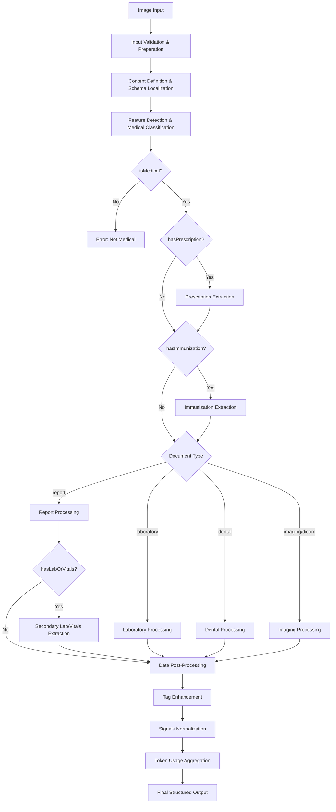

# AI Document Import - Current State Analysis

> **Navigation**: [← README](./AI_IMPORT_README.md) | [Next: Modernization Strategy →](./AI_IMPORT_02_MODERNIZATION_STRATEGY.md)

This document analyzes the current AI document import system, identifying architecture components, workflow steps, and critical limitations that drive the need for modernization.

## Architecture Overview

The current AI document import system consists of two main components:

### 1. Document Assessment (`assessInputs.ts`)
- **Purpose**: Initial document processing and text extraction
- **Input**: Array of base64-encoded images
- **Process**: OCR and document structure analysis using GPT models
- **Output**: 
  - Extracted text from pages with markdown formatting
  - Document metadata (title, date, language, medical classification)
  - Image detection and extraction (DICOM, photos, schemas)
- **Schema**: `import.assessments.ts` - Complex multi-step extraction schema

### 2. Medical Analysis (`analyzeReport.ts`)
- **Purpose**: Deep medical data extraction and structuring
- **Input**: Text and images from assessment phase
- **Process**: Multi-stage AI analysis pipeline with conditional branching
- **Output**: Structured medical data with FHIR compliance
- **Schemas**: 11 specialized extraction schemas based on document type

## Current Workflow Steps



## Detailed Processing Pipeline

The `analyzeReport.ts` file implements a sophisticated 11-step processing pipeline:

### **Step 1: Input Validation & Preparation**
- **Input**: `{ images?: string[], text?: string, language?: string }`
- **Process**: Creates structured Content array, initializes token tracking
- **Output**: Prepared content array and TokenUsage object
- **Node Type**: Input Processor

### **Step 2: Content Definition & Schema Localization**
- **Input**: Raw input parameters
- **Process**: Language setup (defaults to 'English'), schema localization with `[LANGUAGE]` placeholder replacement
- **Output**: Localized schemas and content definition
- **Node Type**: Configuration Processor

### **Step 3: Feature Detection & Medical Classification**
- **Input**: Prepared content
- **Process**: `evaluate(content, Types.featureDetection, tokenUsage)`
- **Schema**: `feature-detection.ts` - Classification and feature detection
- **Output**: `{ isMedical, type, tags, language, hasLabOrVitals, hasPrescription, hasImmunization }`
- **Critical Gate**: Throws 400 error if `!data.isMedical`
- **Node Type**: Classifier with validation gate

### **Step 4: Conditional Prescription Extraction**
- **Condition**: `data.hasPrescription === true`
- **Input**: Text content only
- **Process**: `evaluate([{type: 'text', text: data.text}], Types.prescription, tokenUsage)`
- **Schema**: `prescription.ts` - Detailed medication extraction
- **Output**: `prescription.prescriptions[]` or null
- **Node Type**: Conditional Extractor

### **Step 5: Conditional Immunization Extraction**
- **Condition**: `data.hasImmunization === true`
- **Input**: Text content only
- **Process**: `evaluate([{type: 'text', text: data.text}], Types.immunization, tokenUsage)`
- **Schema**: `immunization.ts` - Vaccination records
- **Output**: `immunization.immunizations[]` or null
- **Node Type**: Conditional Extractor

### **Step 6A: Report Processing (Switch Branch)**
- **Condition**: `data.type === Types.report`
- **Input**: Text content only
- **Process**: `evaluate([{type: 'text', text: data.text}], Types.report, tokenUsage)`
- **Schema**: `report.ts` - General medical reports with patient/performer data
- **Secondary Process**: If `data.hasLabOrVitals`, extract laboratory signals
- **Output**: Structured report with optional lab signals
- **Node Type**: Document Type Processor

### **Step 6B: Laboratory Processing (Switch Branch)**
- **Condition**: `data.type === Types.laboratory`
- **Input**: Text content only
- **Process**: `evaluate([{type: 'text', text: data.text}], Types.laboratory, tokenUsage)`
- **Schema**: `laboratory.ts` - Lab results with signals extraction
- **Post-Process**: Sets `data.report.category = 'laboratory'`
- **Output**: Laboratory report with categorization
- **Node Type**: Document Type Processor

### **Step 6C: Dental Processing (Switch Branch)**
- **Condition**: `data.type === Types.dental`
- **Input**: Text content only
- **Process**: `evaluate([{type: 'text', text: data.text}], Types.dental, tokenUsage)`
- **Schema**: `dental.ts` - Tooth-specific analysis (teeth 1-32)
- **Output**: Dental examination report
- **Node Type**: Document Type Processor

### **Step 6D: Enhanced DICOM/Imaging Processing (Switch Branch)**
- **Condition**: `data.type === Types.imaging || data.type === Types.dicom`
- **Input**: Original content (images + text)
- **Process**: Enhanced multi-stage DICOM processing pipeline
- **Schema**: `imaging.ts` - Medical imaging analysis with DICOM extensions
- **Post-Process**: Sets `data.report.category = 'imaging'`
- **Output**: Comprehensive imaging report with DICOM metadata, anatomy mapping, and AI analysis
- **Node Type**: Enhanced Document Type Processor
- **Enhancement**: *See [AI_IMPORT_09_DICOM_APPS.md](./AI_IMPORT_09_DICOM_APPS.md) for detailed 3rd party app integration*

### **Step 7: Tag Enhancement**
- **Input**: All processed data
- **Process**: Merges body parts identifications into tags array
- **Logic**: `data.tags = [...new Set(data.tags.concat(data.report.bodyParts.map(item => item.identification)))]`
- **Output**: Enhanced tags array
- **Node Type**: Data Enricher

### **Step 8: Signals Normalization**
- **Input**: Report data with signals
- **Process**: Signal name lowercasing, numeric value parsing, cleanup
- **Logic**: 
  ```typescript
  data.report.signals = data.report.signals.map(item => {
    if (item.signal) item.signal = item.signal.toLowerCase();
    if (item.valueType == 'number') item.value = parseFloat(item.value);
    delete item.valueType;
    return item;
  });
  ```
- **Output**: Normalized signals data
- **Node Type**: Data Normalizer
- **Enhancement Note**: *See [AI_SIGNALS_IMPORT.md](./AI_SIGNALS_IMPORT.md) for proposed intelligent signal processing improvements*

### **Step 9: Token Usage Aggregation**
- **Input**: TokenUsage tracking from all AI calls
- **Process**: Consolidates token consumption across all evaluations
- **Output**: Complete cost tracking: `data.tokenUsage = tokenUsage`
- **Node Type**: Metrics Aggregator

### **Step 10: Final Assembly**
- **Input**: All processed components
- **Process**: Assembles complete ReportAnalysis object
- **Output**: Structured medical data ready for storage/API response
- **Node Type**: Output Assembler

### **Step 11: Debug Mode Handling**
- **Condition**: `env.DEBUG_ANALYZER == 'true'`
- **Process**: Returns random TEST_DATA item with artificial delay
- **Purpose**: Development testing without AI API consumption
- **Node Type**: Development Bypass

## Current Limitations

### 1. **Monolithic AI Provider Dependency**
- Hard-coded OpenAI GPT integration via LangChain
- Single provider for all processing steps
- No fallback or model optimization per task

### 2. **Sequential Processing**
- Linear workflow with blocking steps
- No parallel processing of independent tasks
- No error recovery or retry mechanisms

### 3. **Limited Observability**
- Basic token usage tracking
- No detailed step-by-step monitoring
- No performance metrics or bottleneck identification

### 4. **Schema Inconsistencies**
- Missing required fields in several schemas
- Inconsistent validation patterns
- Hard-coded language placeholders

### 5. **Error Handling**
- Simple error propagation
- No partial success handling
- No graceful degradation

## Impact Assessment

### Performance Issues
- **Processing Time**: 10-25 seconds per document
- **Blocking Operations**: Sequential execution prevents parallelization
- **Resource Utilization**: Single-threaded AI calls underutilize available providers

### Reliability Concerns
- **Single Point of Failure**: OpenAI dependency creates vulnerability
- **No Failover**: System fails completely if provider is unavailable
- **Limited Retry Logic**: Basic error handling without intelligent recovery

### Scalability Limitations
- **Concurrent Processing**: Limited by sequential architecture
- **Provider Constraints**: Cannot leverage multiple AI providers simultaneously
- **Resource Scaling**: No dynamic provider selection based on load

## Modernization Drivers

The analysis reveals critical needs for:

1. **Multi-Provider Architecture** - Eliminate single points of failure
2. **Parallel Processing** - Reduce processing time through concurrency
3. **Intelligent Routing** - Optimize provider selection per task type
4. **Comprehensive Monitoring** - Enable observability and performance tracking
5. **Graceful Error Handling** - Implement retry logic and partial success patterns

---

> **Next**: [Modernization Strategy](./AI_IMPORT_02_MODERNIZATION_STRATEGY.md) - LangGraph adoption strategy and framework comparison