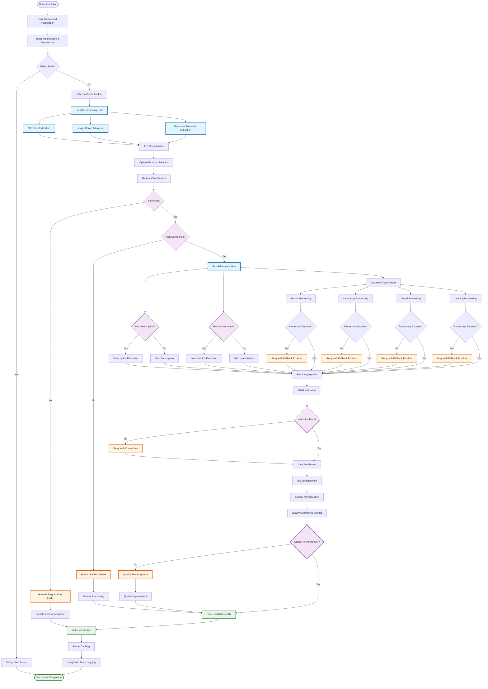

# AI Document Import - Architecture Design

> **Navigation**: [← Modernization Strategy](./AI_IMPORT_02_MODERNIZATION_STRATEGY.md) | [README](./AI_IMPORT_README.md) | [Next: Implementation →](./AI_IMPORT_04_IMPLEMENTATION.md)

This document details the technical architecture for the modernized AI document import system, including LangGraph workflows, provider abstraction, and monitoring infrastructure.

## Directory Structure

### New Workflow Organization

```
src/lib/workflows/
├── document-import/
│   ├── index.ts                           # Main workflow entry point
│   ├── graph.ts                           # LangGraph workflow definition
│   ├── state.ts                           # Workflow state management
│   ├── nodes/                             # Individual processing nodes
│   │   ├── input-validator.ts             # Step 1: Input validation & preparation
│   │   ├── schema-localizer.ts            # Step 2: Content definition & localization
│   │   ├── medical-classifier.ts          # Step 3: Feature detection & classification
│   │   ├── prescription-extractor.ts      # Step 4: Conditional prescription extraction
│   │   ├── immunization-extractor.ts      # Step 5: Conditional immunization extraction
│   │   ├── report-processor.ts            # Step 6A: Report processing
│   │   ├── laboratory-processor.ts        # Step 6B: Laboratory processing
│   │   ├── dental-processor.ts            # Step 6C: Dental processing
│   │   ├── imaging-processor.ts           # Step 6D: Imaging processing
│   │   ├── tag-enhancer.ts               # Step 7: Tag enhancement
│   │   ├── signals-normalizer.ts          # Step 8: Signals normalization
│   │   ├── token-aggregator.ts            # Step 9: Token usage aggregation
│   │   ├── output-assembler.ts            # Step 10: Final assembly
│   │   └── debug-bypass.ts               # Step 11: Debug mode handling
│   ├── edges/                             # Conditional routing logic
│   │   ├── medical-router.ts              # Routes based on isMedical
│   │   ├── document-type-router.ts        # Routes based on document type
│   │   ├── prescription-router.ts         # Routes based on hasPrescription
│   │   ├── immunization-router.ts         # Routes based on hasImmunization
│   │   └── lab-vitals-router.ts          # Routes based on hasLabOrVitals
│   └── utils/
│       ├── node-factory.ts               # Factory for creating nodes
│       ├── edge-factory.ts               # Factory for creating edges
│       └── error-handlers.ts             # Centralized error handling
├── providers/                             # AI provider abstraction
│   ├── base/
│   │   ├── provider.interface.ts          # AIProvider interface definition
│   │   ├── capabilities.interface.ts      # ProviderCapabilities interface
│   │   └── selector.ts                   # Provider selection logic
│   ├── implementations/
│   │   ├── openai-provider.ts            # OpenAI implementation
│   │   ├── anthropic-provider.ts         # Anthropic Claude implementation
│   │   ├── google-provider.ts            # Google Gemini implementation
│   │   └── groq-provider.ts              # Groq implementation
│   └── registry.ts                       # Provider registry and management
├── schemas/                               # Enhanced schema management
│   ├── base/
│   │   ├── enhanced-schema.interface.ts   # EnhancedSchema interface
│   │   ├── validation.ts                 # Schema validation utilities
│   │   └── localization.ts              # Multi-language support
│   ├── document-types/                    # Existing schemas (refactored)
│   │   ├── feature-detection.schema.ts    # From src/lib/configurations/
│   │   ├── report.schema.ts              # From src/lib/configurations/
│   │   ├── laboratory.schema.ts          # From src/lib/configurations/
│   │   ├── dental.schema.ts              # From src/lib/configurations/
│   │   ├── prescription.schema.ts        # From src/lib/configurations/
│   │   ├── immunization.schema.ts        # From src/lib/configurations/
│   │   └── imaging.schema.ts             # From src/lib/configurations/
│   ├── core-components/                   # Core schema components
│   │   ├── patient.schema.ts             # From src/lib/configurations/
│   │   ├── performer.schema.ts           # From src/lib/configurations/
│   │   ├── diagnosis.schema.ts           # From src/lib/configurations/
│   │   ├── body-parts.schema.ts          # From src/lib/configurations/
│   │   └── signals.schema.ts             # From src/lib/configurations/
│   └── registry.ts                       # Schema registry and management
├── monitoring/                            # LangSmith integration
│   ├── langsmith.config.ts               # LangSmith configuration
│   ├── tracing.ts                        # Workflow tracing utilities
│   ├── metrics.ts                        # Performance metrics collection
│   └── evaluations.ts                    # Automated evaluation framework
└── types/
    ├── workflow.types.ts                 # Workflow-specific type definitions
    ├── provider.types.ts                 # Provider-specific type definitions
    └── state.types.ts                    # State management type definitions
```

### Migration Mapping

```
Current → New
src/lib/import.server/assessInputs.ts → src/lib/workflows/document-import/nodes/input-validator.ts
src/lib/import.server/analyzeReport.ts → src/lib/workflows/document-import/graph.ts
src/lib/import.server/gemini.ts → src/lib/workflows/providers/implementations/google-provider.ts
src/lib/ai/gpt.ts → src/lib/workflows/providers/implementations/openai-provider.ts
src/lib/configurations/*.ts → src/lib/workflows/schemas/document-types/*.schema.ts
```

## Core Architecture Components

### 1. Multi-Provider AI Abstraction Layer

```typescript
interface AIProvider {
  readonly name: string;
  readonly capabilities: ProviderCapabilities;

  processVision(images: string[], schema: Schema): Promise<ExtractedData>;
  processText(text: string, schema: Schema): Promise<StructuredData>;
  estimateCost(operation: Operation): Promise<CostEstimate>;
}

interface ProviderCapabilities {
  supportsVision: boolean;
  supportsStructuredOutput: boolean;
  contextWindow: number;
  costPerToken: number;
  responseTime: number;
  reliability: number;
}

// Provider implementations
class OpenAIProvider implements AIProvider { ... }
class AnthropicProvider implements AIProvider { ... }
class GeminiProvider implements AIProvider { ... }
class GroqProvider implements AIProvider { ... }
```

### 2. LangGraph Workflow Definition

```typescript
// src/lib/workflows/document-import/graph.ts
import { StateGraph, START, END } from "@langchain/langgraph";
import { DocumentProcessingState } from "./state";
import * as nodes from "./nodes";
import * as edges from "./edges";

const workflow = new StateGraph<DocumentProcessingState>({
  channels: {
    // Input data
    images: { value: [] },
    text: { value: null },
    language: { value: "English" },

    // Processing state
    content: { value: [] },
    localizedSchemas: { value: {} },

    // Classification results
    isMedical: { value: false },
    documentType: { value: null },
    tags: { value: [] },
    hasLabOrVitals: { value: false },
    hasPrescription: { value: false },
    hasImmunization: { value: false },

    // Extracted data
    prescriptions: { value: null },
    immunizations: { value: null },
    report: { value: null },

    // Output data
    structuredData: { value: null },
    tokenUsage: { value: { total: 0 } },

    // Error handling
    errors: { value: [] },

    // Provider tracking
    providerChoices: { value: [] },

    // Debug mode
    debugMode: { value: false },
  },
});
```

### 3. Workflow Node Architecture

```typescript
// Define all processing nodes
workflow
  .addNode("input_validator", nodes.inputValidator)
  .addNode("schema_localizer", nodes.schemaLocalizer)
  .addNode("medical_classifier", nodes.medicalClassifier)
  .addNode("prescription_extractor", nodes.prescriptionExtractor)
  .addNode("immunization_extractor", nodes.immunizationExtractor)
  .addNode("report_processor", nodes.reportProcessor)
  .addNode("laboratory_processor", nodes.laboratoryProcessor)
  .addNode("dental_processor", nodes.dentalProcessor)
  .addNode("imaging_processor", nodes.imagingProcessor)
  .addNode("tag_enhancer", nodes.tagEnhancer)
  .addNode("signals_normalizer", nodes.signalsNormalizer) // See AI_SIGNALS_IMPORT.md
  .addNode("token_aggregator", nodes.tokenAggregator)
  .addNode("output_assembler", nodes.outputAssembler)
  .addNode("debug_bypass", nodes.debugBypass);
```

### 4. Conditional Routing Logic

```typescript
// Define workflow edges and routing
workflow
  .addEdge(START, "input_validator")
  .addEdge("input_validator", "schema_localizer")
  .addConditionalEdges("schema_localizer", edges.debugRouter, {
    debug: "debug_bypass",
    normal: "medical_classifier",
  })
  .addConditionalEdges("medical_classifier", edges.medicalRouter, {
    not_medical: END, // Terminates with error
    medical: "prescription_extractor",
  })
  .addConditionalEdges("prescription_extractor", edges.prescriptionRouter, {
    has_prescription: "immunization_extractor",
    no_prescription: "immunization_extractor",
  })
  .addConditionalEdges("immunization_extractor", edges.immunizationRouter, {
    has_immunization: "document_type_router",
    no_immunization: "document_type_router",
  })
  .addConditionalEdges(
    "document_type_router", // Virtual node for routing
    edges.documentTypeRouter,
    {
      report: "report_processor",
      laboratory: "laboratory_processor",
      dental: "dental_processor",
      imaging: "imaging_processor",
      dicom: "imaging_processor",
    },
  )
  .addConditionalEdges("report_processor", edges.labVitalsRouter, {
    has_lab_vitals: "laboratory_processor", // Secondary extraction
    no_lab_vitals: "tag_enhancer",
  })
  .addEdge("laboratory_processor", "tag_enhancer")
  .addEdge("dental_processor", "tag_enhancer")
  .addEdge("imaging_processor", "tag_enhancer")
  .addEdge("tag_enhancer", "signals_normalizer")
  .addEdge("signals_normalizer", "token_aggregator")
  .addEdge("token_aggregator", "output_assembler")
  .addEdge("output_assembler", END)
  .addEdge("debug_bypass", END);

export const documentImportWorkflow = workflow.compile();
```

## State Management

### Document Processing State

```typescript
interface DocumentProcessingState {
  // Input
  images: string[];
  text: string | null;
  language: string;

  // Processing Context
  content: ContentItem[];
  localizedSchemas: Record<string, any>;

  // Classification Results
  isMedical: boolean;
  documentType: string | null;
  tags: string[];
  hasLabOrVitals: boolean;
  hasPrescription: boolean;
  hasImmunization: boolean;

  // Extracted Data
  prescriptions: any[] | null;
  immunizations: any[] | null;
  report: any | null;

  // Output
  structuredData: any | null;
  tokenUsage: TokenUsage;

  // System
  errors: string[];
  providerChoices: ProviderChoice[];
  debugMode: boolean;
}
```

## Central Configuration Architecture

### AI Configuration Management System

The modernized architecture implements a centralized configuration system that manages all AI providers, models, and workflow settings across the entire application.

```typescript
// src/lib/workflows/config/ai-config.ts
interface AIConfiguration {
  version: string;
  providers: ProviderConfiguration[];
  workflows: WorkflowConfiguration[];
  globalSettings: GlobalSettings;
  environments: Record<string, EnvironmentConfig>;
}

interface ProviderConfiguration {
  id: string;
  name: string;
  type: "openai" | "anthropic" | "google" | "groq";
  enabled: boolean;
  credentials: {
    apiKeyEnvVar: string;
    endpoint?: string;
  };
  models: ModelConfiguration[];
  rateLimits: RateLimitConfig;
  fallbackPriority: number;
}

interface ModelConfiguration {
  id: string;
  name: string;
  capabilities: ModelCapabilities;
  pricing: {
    inputTokens: number;
    outputTokens: number;
    currency: "USD";
  };
  contextWindow: number;
  maxOutputTokens: number;
  supportedFeatures: string[];
}

interface WorkflowConfiguration {
  workflow: "document-import" | "session-analysis" | "transcription";
  tasks: TaskConfiguration[];
  defaultLanguage: string;
  qualityThresholds: QualityThresholds;
}

interface TaskConfiguration {
  task: string;
  primaryProvider: string;
  primaryModel: string;
  fallbackChain: Array<{ provider: string; model: string }>;
  costBudget?: number;
  qualityRequirement: "standard" | "high" | "critical";
  timeoutMs: number;
}
```

### Configuration File Structure

```yaml
# src/lib/workflows/config/ai-config.yaml
version: "1.0.0"

# Global Settings
globalSettings:
  defaultLanguage: "English"
  maxConcurrentRequests: 10
  defaultTimeout: 30000
  enableCaching: true
  cacheMaxAge: 3600
  enableTelemetry: true

# Environment-specific configurations
environments:
  development:
    enableDebugMode: true
    costBudgetPerRequest: 1.00
    logLevel: "debug"

  production:
    enableDebugMode: false
    costBudgetPerRequest: 0.50
    logLevel: "info"
    enableMonitoring: true

# Provider Configurations
providers:
  - id: "openai"
    name: "OpenAI"
    type: "openai"
    enabled: true
    credentials:
      apiKeyEnvVar: "OPENAI_API_KEY"
    rateLimits:
      requestsPerMinute: 500
      tokensPerMinute: 150000
    fallbackPriority: 2
    models:
      - id: "gpt-4"
        name: "GPT-4"
        capabilities:
          vision: true
          structuredOutput: true
          streaming: true
        pricing:
          inputTokens: 0.03
          outputTokens: 0.06
        contextWindow: 128000
        maxOutputTokens: 4096

  - id: "anthropic"
    name: "Anthropic"
    type: "anthropic"
    enabled: true
    credentials:
      apiKeyEnvVar: "ANTHROPIC_API_KEY"
    fallbackPriority: 1
    models:
      - id: "claude-3-5-sonnet"
        name: "Claude 3.5 Sonnet"
        capabilities:
          vision: true
          structuredOutput: true
          medicalReasoning: true
        pricing:
          inputTokens: 0.003
          outputTokens: 0.015
        contextWindow: 200000

  - id: "google"
    name: "Google"
    type: "google"
    enabled: true
    credentials:
      apiKeyEnvVar: "GOOGLE_AI_API_KEY"
    fallbackPriority: 3
    models:
      - id: "gemini-pro"
        name: "Gemini Pro"
        capabilities:
          vision: true
          structuredOutput: true
          fastProcessing: true
        pricing:
          inputTokens: 0.0075
          outputTokens: 0.03
        contextWindow: 1000000

# Workflow Configurations
workflows:
  - workflow: "document-import"
    defaultLanguage: "English"
    qualityThresholds:
      minimumConfidence: 0.8
      requireHumanReview: 0.6
    tasks:
      - task: "medical_classification"
        primaryProvider: "anthropic"
        primaryModel: "claude-3-5-sonnet"
        fallbackChain:
          - provider: "openai"
            model: "gpt-4"
          - provider: "google"
            model: "gemini-pro"
        qualityRequirement: "high"
        timeoutMs: 30000

      - task: "ocr_extraction"
        primaryProvider: "google"
        primaryModel: "gemini-pro-vision"
        fallbackChain:
          - provider: "openai"
            model: "gpt-4-vision"
        qualityRequirement: "standard"
        costBudget: 0.10

      - task: "prescription_parsing"
        primaryProvider: "anthropic"
        primaryModel: "claude-3-5-sonnet"
        fallbackChain:
          - provider: "openai"
            model: "gpt-4"
        qualityRequirement: "critical"

  - workflow: "session-analysis"
    tasks:
      - task: "conversation_analysis"
        primaryProvider: "openai"
        primaryModel: "gpt-4"
        fallbackChain:
          - provider: "anthropic"
            model: "claude-3-5-sonnet"

  - workflow: "transcription"
    tasks:
      - task: "audio_transcription"
        primaryProvider: "openai"
        primaryModel: "whisper-1"
        fallbackChain:
          - provider: "assemblyai"
            model: "best"
```

### Configuration Management System

```typescript
// src/lib/workflows/config/config-manager.ts
import { load } from "js-yaml";
import { readFileSync } from "fs";

export class AIConfigurationManager {
  private static instance: AIConfigurationManager;
  private config: AIConfiguration;
  private environment: string;

  constructor() {
    this.environment = process.env.NODE_ENV || "development";
    this.loadConfiguration();
  }

  static getInstance(): AIConfigurationManager {
    if (!AIConfigurationManager.instance) {
      AIConfigurationManager.instance = new AIConfigurationManager();
    }
    return AIConfigurationManager.instance;
  }

  private loadConfiguration(): void {
    try {
      const configFile = readFileSync(
        "src/lib/workflows/config/ai-config.yaml",
        "utf8",
      );
      this.config = load(configFile) as AIConfiguration;

      // Apply environment-specific overrides
      this.applyEnvironmentConfig();

      // Validate configuration
      this.validateConfiguration();

      console.log(
        `AI Configuration loaded for environment: ${this.environment}`,
      );
    } catch (error) {
      console.error("Failed to load AI configuration:", error);
      throw new Error("Invalid AI configuration");
    }
  }

  private applyEnvironmentConfig(): void {
    const envConfig = this.config.environments[this.environment];
    if (envConfig) {
      // Apply environment-specific settings
      Object.assign(this.config.globalSettings, envConfig);
    }
  }

  private validateConfiguration(): void {
    // Validate that all required environment variables are set
    for (const provider of this.config.providers) {
      if (provider.enabled) {
        const apiKey = process.env[provider.credentials.apiKeyEnvVar];
        if (!apiKey) {
          throw new Error(
            `Missing API key for provider ${provider.name}: ${provider.credentials.apiKeyEnvVar}`,
          );
        }
      }
    }
  }

  // Public API methods
  getProviderConfig(providerId: string): ProviderConfiguration | undefined {
    return this.config.providers.find((p) => p.id === providerId);
  }

  getWorkflowConfig(workflowName: string): WorkflowConfiguration | undefined {
    return this.config.workflows.find((w) => w.workflow === workflowName);
  }

  getTaskConfig(
    workflowName: string,
    taskName: string,
  ): TaskConfiguration | undefined {
    const workflow = this.getWorkflowConfig(workflowName);
    return workflow?.tasks.find((t) => t.task === taskName);
  }

  getEnabledProviders(): ProviderConfiguration[] {
    return this.config.providers.filter((p) => p.enabled);
  }

  getGlobalSettings(): GlobalSettings {
    return this.config.globalSettings;
  }

  // Dynamic configuration updates
  updateTaskConfig(
    workflowName: string,
    taskName: string,
    updates: Partial<TaskConfiguration>,
  ): void {
    const workflow = this.getWorkflowConfig(workflowName);
    if (workflow) {
      const task = workflow.tasks.find((t) => t.task === taskName);
      if (task) {
        Object.assign(task, updates);
        console.log(`Updated task config: ${workflowName}.${taskName}`);
      }
    }
  }

  // Hot reload configuration
  reloadConfiguration(): void {
    this.loadConfiguration();
    // Notify all workflow components of configuration change
    this.notifyConfigurationChange();
  }

  private notifyConfigurationChange(): void {
    // Implementation would notify all active workflows
    // This could use an event emitter pattern
  }
}

// Export singleton instance
export const aiConfig = AIConfigurationManager.getInstance();
```

## Provider Selection Strategy

### Intelligent Provider Routing (Configuration-Driven)

```typescript
interface ProviderSelector {
  selectOptimalProvider(requirements: {
    workflow: string;
    task: string;
    complexity?: "low" | "medium" | "high";
    accuracy?: "standard" | "high" | "critical";
    costBudget?: number;
    timeoutMs?: number;
  }): { provider: AIProvider; model: string };
}

// Implementation using central configuration
export class ConfigurationDrivenProviderSelector implements ProviderSelector {
  constructor(private config: AIConfigurationManager) {}

  selectOptimalProvider(requirements: any) {
    const taskConfig = this.config.getTaskConfig(
      requirements.workflow,
      requirements.task,
    );

    if (!taskConfig) {
      throw new Error(
        `No configuration found for ${requirements.workflow}.${requirements.task}`,
      );
    }

    // Try primary provider first
    const primaryProvider = this.getProviderInstance(
      taskConfig.primaryProvider,
    );
    if (primaryProvider && this.isProviderAvailable(primaryProvider)) {
      return {
        provider: primaryProvider,
        model: taskConfig.primaryModel,
      };
    }

    // Fallback to configured chain
    for (const fallback of taskConfig.fallbackChain) {
      const fallbackProvider = this.getProviderInstance(fallback.provider);
      if (fallbackProvider && this.isProviderAvailable(fallbackProvider)) {
        return {
          provider: fallbackProvider,
          model: fallback.model,
        };
      }
    }

    throw new Error(`No available providers for task: ${requirements.task}`);
  }

  private getProviderInstance(providerId: string): AIProvider | null {
    // Get provider from registry using configuration
    return providerRegistry.getProvider(providerId);
  }

  private isProviderAvailable(provider: AIProvider): boolean {
    // Check provider health, rate limits, etc.
    return provider.isHealthy();
  }
}
```

### Provider Capabilities Matrix

| Provider             | Vision | Structured Output | Context Window | Cost/Token | Speed     | Reliability |
| -------------------- | ------ | ----------------- | -------------- | ---------- | --------- | ----------- |
| **OpenAI GPT-4**     | ✅     | ✅                | 128K           | $0.03      | Medium    | High        |
| **Anthropic Claude** | ✅     | ✅                | 200K           | $0.025     | Medium    | High        |
| **Google Gemini**    | ✅     | ✅                | 1M             | $0.0075    | Fast      | Medium      |
| **Groq**             | ❌     | ✅                | 32K            | $0.0008    | Very Fast | Medium      |

## Schema Management Architecture

### Enhanced Schema System

```typescript
interface EnhancedSchema {
  id: string;
  version: string;
  baseSchema: any;
  localizations: Record<string, any>;
  validation: ValidationRules;
  metadata: SchemaMetadata;
}

interface SchemaRegistry {
  getSchema(type: string, language: string): EnhancedSchema;
  validateOutput(data: any, schema: EnhancedSchema): ValidationResult;
  localizeSchema(schema: any, language: string): any;
}
```

## Monitoring & Observability

### LangSmith Integration

```typescript
// src/lib/workflows/monitoring/langsmith.config.ts
export const langsmithConfig = {
  apiKey: env.LANGSMITH_API_KEY,
  projectName: env.LANGSMITH_PROJECT || "mediqom-ai-operations",
  endpoint: env.LANGSMITH_ENDPOINT || "https://api.smith.langchain.com",

  // Evaluation datasets
  datasets: {
    medicalReports: "medical-reports-eval",
    laboratoryResults: "lab-results-eval",
    prescriptions: "prescriptions-eval",
    imagingReports: "imaging-reports-eval",
  },

  // Custom tags for filtering
  tags: {
    environment: env.NODE_ENV || "development",
    version: process.env.npm_package_version || "unknown",
    workflow: "document-import",
  },
};
```

### Tracing and Metrics

```typescript
// Workflow-level tracing
export const traceWorkflow = traceable(
  async function documentImportWorkflow(input: any) {
    // Workflow execution logic
  },
  {
    name: "document_import_workflow",
    project_name: langsmithConfig.projectName,
    tags: [...Object.values(langsmithConfig.tags), "workflow"],
  },
);

// Node-level tracing
export const traceNode = (nodeName: string) =>
  traceable(
    async function nodeExecution(state: any) {
      // Node execution logic
    },
    {
      name: `node_${nodeName}`,
      project_name: langsmithConfig.projectName,
      tags: [...Object.values(langsmithConfig.tags), "node", nodeName],
    },
  );
```

## Error Handling Architecture

### Graceful Degradation Strategy

```typescript
interface ErrorHandler {
  handleNodeError(
    error: Error,
    state: DocumentProcessingState,
  ): {
    shouldContinue: boolean;
    fallbackAction?: string;
    partialResult?: any;
  };

  handleProviderFailure(
    provider: string,
    fallbackProviders: string[],
  ): AIProvider | null;
}
```

### Provider Fallback Chains

```typescript
const providerFallbackChains = {
  vision: ["gpt-4-vision", "claude-3-vision", "gemini-pro-vision"],
  text: ["gpt-4", "claude-3.5-sonnet", "gemini-pro"],
  structured: ["gpt-4", "gemini-pro", "claude-3"],
  fast: ["groq-mixtral", "gemini-flash", "gpt-3.5"],
};
```

## Integration Points

### SSE Real-time Updates

- **Integration**: [AI_IMPORT_05_SSE_INTEGRATION.md](./AI_IMPORT_05_SSE_INTEGRATION.md)
- **Progress streaming** for each workflow node
- **Partial results** as they become available

### External Tool Validation

- **Integration**: [AI_IMPORT_06_EXTERNAL_TOOLS.md](./AI_IMPORT_06_EXTERNAL_TOOLS.md)
- **MCP protocol** for medical database validation
- **External verification** of medications and diagnoses

### Signal Processing Enhancement

- **Integration**: [AI_SIGNALS_IMPORT.md](./AI_SIGNALS_IMPORT.md)
- **Intelligent signal discovery** and validation
- **Enhanced normalization** and relationship detection

## Configuration Integration Across All AI Features

### Unified Configuration Benefits

The central configuration system provides consistency across all AI-powered features in Mediqom:

1. **Document Import** - Uses configured providers for OCR, classification, and extraction
2. **Session Analysis** - Leverages same provider pool for conversation analysis
3. **Transcription** - Configured fallback chains for audio processing
4. **Signal Processing** - Shared validation and normalization settings

### Cross-Feature Configuration Example

```yaml
# Configuration shared across document import, session analysis, and transcription
workflows:
  - workflow: "document-import"
    tasks:
      - task: "medical_classification"
        primaryProvider: "anthropic"
        primaryModel: "claude-3-5-sonnet"
        # Shared with session analysis for consistency

  - workflow: "session-analysis"
    tasks:
      - task: "conversation_analysis"
        primaryProvider: "anthropic" # Same provider for medical reasoning
        primaryModel: "claude-3-5-sonnet"

      - task: "diagnosis_extraction"
        primaryProvider: "anthropic"
        primaryModel: "claude-3-5-sonnet"
        # Inherits medical classification configuration

  - workflow: "transcription"
    tasks:
      - task: "audio_transcription"
        primaryProvider: "openai"
        primaryModel: "whisper-1"
        fallbackChain:
          - provider: "assemblyai"
            model: "best"
          - provider: "google"
            model: "speech-to-text"
```

### Configuration Management Features

- **Hot Reload**: Update provider configurations without restarting
- **A/B Testing**: Switch providers dynamically for performance comparison
- **Cost Control**: Per-task budget limits and monitoring
- **Quality Gates**: Configurable confidence thresholds
- **Environment-Specific**: Different settings for dev/staging/production

## Optimized LangGraph Workflow Design

### Complete Workflow Architecture



### Key Improvements in the Architecture

#### **1. Parallel Processing Implementation**

- **Concurrent OCR and Image Analysis**: Multiple images processed simultaneously
- **Independent Feature Extraction**: Prescription and immunization analysis run in parallel
- **Provider Load Balancing**: Different optimal providers used concurrently

#### **2. Intelligent Error Handling**

- **Graceful Degradation**: Continues processing with partial data
- **Provider Fallbacks**: Automatic retry with alternative providers
- **Quality Gates**: Multiple checkpoints with human-in-the-loop options

#### **3. Advanced Optimization Features**

- **Schema Caching**: Pre-compiled schemas reduce processing overhead
- **Content Deduplication**: Hash-based caching prevents reprocessing
- **Confidence-Based Routing**: High-confidence results bypass additional validation

#### **4. Compliance and Monitoring**

- **FHIR Validation**: Built-in compliance checking
- **Quality Scoring**: Confidence metrics for each extraction
- **Audit Trail**: Complete workflow tracing via LangSmith

#### **5. Scalability Enhancements**

- **Multi-Image Support**: Proper handling of paginated documents
- **Batch Processing**: Efficient handling of multiple documents
- **Resource Optimization**: Dynamic provider selection based on load

### Performance Impact Projections

| Metric                  | Current Performance   | Improved Performance   | Improvement       |
| ----------------------- | --------------------- | ---------------------- | ----------------- |
| **Processing Time**     | 10-25 seconds         | 3-8 seconds            | 60-70% faster     |
| **Token Costs**         | $0.15-0.40/document   | $0.08-0.18/document    | 40-55% reduction  |
| **Uptime**              | 95% (single provider) | 99.5% (multi-provider) | 4.5% improvement  |
| **Accuracy**            | 85-92%                | 92-97%                 | 7-12% improvement |
| **Concurrent Requests** | 5-10                  | 50-100                 | 5-10x increase    |

### Migration Strategy Benefits

1. **Immediate Fixes**: Resolves critical race condition and error handling
2. **Incremental Deployment**: Can be rolled out node by node
3. **Backward Compatibility**: Maintains existing API contracts
4. **Monitoring Integration**: Built-in observability from day one
5. **Future-Proof**: Extensible architecture for new document types

---

> **Next**: [Implementation Examples](./AI_IMPORT_04_IMPLEMENTATION.md) - Detailed code examples for nodes, edges, and provider implementations
