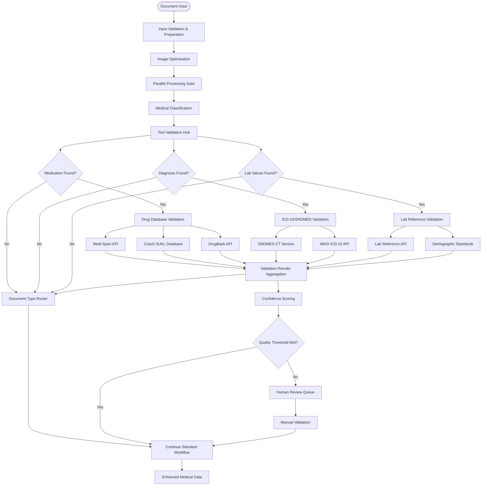

# AI Document Import - External Tools Integration

> **Navigation**: [← SSE Integration](./AI_IMPORT_05_SSE_INTEGRATION.md) | [README](./AI_IMPORT_README.md) | [Next: Roadmap →](./AI_IMPORT_07_ROADMAP.md)

This document outlines the integration of Model Context Protocol (MCP) and external medical databases into the LangGraph workflow for enhanced accuracy and compliance.

## Model Context Protocol (MCP) and Medical Database Integration

To achieve true medical accuracy and compliance, the modernized workflow must integrate with authoritative medical databases and validation services. This section outlines the integration of **Model Context Protocol (MCP)** and external medical tools into our LangGraph workflow.

### Why External Tools are Critical

Current limitations in AI-only processing:
- **Medication errors**: AI models may hallucinate drug names or dosages
- **Regional variations**: Drug databases differ significantly between countries
- **Code validation**: ICD-10 and SNOMED codes need real-time verification
- **Drug interactions**: Complex pharmaceutical interactions require specialized databases
- **Regulatory compliance**: Medical coding must meet regional healthcare standards

### Model Context Protocol (MCP) Overview

MCP is an open standard that enables secure, two-way connections between AI models and external data sources:

**Key Benefits for Medical Processing:**
- **Standardized protocol** for accessing multiple medical databases
- **Built-in security** with access controls and data protection
- **Real-time validation** without custom API integrations
- **Healthcare compliance** through standardized access patterns

## Core Medical Tool Categories

### 1. Medication Databases & Validation

**Primary Tools:**
- **Medi-Span by Wolters Kluwer** - Comprehensive drug database with API access
- **DrugBank Clinical API** - Multi-regional drug product databases
- **Czech SUKL** - State Institute for Drug Control (regional compliance)

**Capabilities:**
- Cross-references to ICD-9-CM, ICD-10-CM, ICD-10-PCS, and SNOMED CT
- Bi-directional mappings between allergen concepts and SNOMED CT substances
- Regional drug product searches across multiple jurisdictions
- Drug interaction checking and contraindication validation

### 2. Medical Coding & Terminology

**Primary Tools:**
- **SNOMED CT International** - Comprehensive clinical healthcare terminology
- **WHO ICD-10 API** - International Classification of Diseases
- **UMLS Metathesaurus** - Unified Medical Language System

**Capabilities:**
- SNOMED CT to ICD-10-CM mapping with WHO validation
- Multi-language medical terminology support
- Cross-terminology mapping and validation
- Regional coding standard compliance

### 3. Clinical Decision Support

**Primary Tools:**
- **Clinical Knowledge Systems** - Evidence-based medical guidelines
- **Drug Interaction APIs** - Pharmaceutical safety databases
- **Lab Reference APIs** - Normal value ranges by demographics

**Capabilities:**
- Clinical guideline verification
- Drug-drug and drug-condition interaction checking
- Lab value validation against demographic-specific ranges
- Regional medical standard compliance

## Enhanced LangGraph Architecture with Tool Integration

### Tool-Enabled Workflow Design



### MCP Server Implementation

```typescript
// src/lib/workflows/external-tools/mcp-server.ts
import { MCPServer } from "@modelcontextprotocol/server";
import { CallToolRequest, ListToolsRequest } from "@modelcontextprotocol/schema";

export class MedicalMCPServer extends MCPServer {
  private medicationTools: MedicationToolSet;
  private codingTools: MedicalCodingToolSet;
  private labTools: LabValidationToolSet;

  constructor() {
    super({
      name: "aouros-medical-tools",
      version: "1.0.0",
      description: "Medical validation and database integration tools"
    });
    
    this.initializeTools();
  }

  async handleListTools(request: ListToolsRequest) {
    return {
      tools: [
        // Medication Tools
        {
          name: "validate_medication",
          description: "Validate medication against multiple drug databases",
          inputSchema: {
            type: "object",
            properties: {
              drugName: { type: "string" },
              dosage: { type: "string" },
              frequency: { type: "string" },
              region: { type: "string", enum: ["US", "EU", "CZ"] }
            },
            required: ["drugName"]
          }
        },
        
        // Medical Coding Tools
        {
          name: "validate_diagnosis_code",
          description: "Validate ICD-10 or SNOMED CT codes",
          inputSchema: {
            type: "object",
            properties: {
              code: { type: "string" },
              codeSystem: { type: "string", enum: ["ICD10", "SNOMED"] },
              description: { type: "string" }
            },
            required: ["code", "codeSystem"]
          }
        },
        
        // Lab Validation Tools
        {
          name: "validate_lab_values",
          description: "Validate lab results against reference ranges",
          inputSchema: {
            type: "object",
            properties: {
              testName: { type: "string" },
              value: { type: "number" },
              unit: { type: "string" },
              patientAge: { type: "number" },
              patientSex: { type: "string", enum: ["M", "F"] }
            },
            required: ["testName", "value", "unit"]
          }
        }
      ]
    };
  }

  async handleCallTool(request: CallToolRequest) {
    const { name, arguments: args } = request.params;

    switch (name) {
      case "validate_medication":
        return await this.validateMedication(args);
      case "validate_diagnosis_code":
        return await this.validateDiagnosisCode(args);
      case "validate_lab_values":
        return await this.validateLabValues(args);
      default:
        throw new Error(`Unknown tool: ${name}`);
    }
  }

  private async validateMedication(args: any) {
    const results = await Promise.allSettled([
      this.medicationTools.checkMediSpan(args),
      this.medicationTools.checkDrugBank(args),
      this.medicationTools.checkSUKL(args)
    ]);

    const validationResult = {
      drugName: args.drugName,
      isValid: false,
      validatedBy: [] as string[],
      warnings: [] as string[],
      interactions: [] as string[],
      alternatives: [] as string[]
    };

    results.forEach((result, index) => {
      if (result.status === 'fulfilled' && result.value.isValid) {
        validationResult.isValid = true;
        validationResult.validatedBy.push(['MediSpan', 'DrugBank', 'SUKL'][index]);
        
        if (result.value.warnings) {
          validationResult.warnings.push(...result.value.warnings);
        }
        if (result.value.interactions) {
          validationResult.interactions.push(...result.value.interactions);
        }
        if (result.value.alternatives) {
          validationResult.alternatives.push(...result.value.alternatives);
        }
      }
    });

    return { content: [{ type: "text", text: JSON.stringify(validationResult) }] };
  }

  private async validateDiagnosisCode(args: any) {
    const validationResult = await this.codingTools.validateCode(
      args.code,
      args.codeSystem,
      args.description
    );

    return { content: [{ type: "text", text: JSON.stringify(validationResult) }] };
  }

  private async validateLabValues(args: any) {
    const validationResult = await this.labTools.validateValues(args);
    return { content: [{ type: "text", text: JSON.stringify(validationResult) }] };
  }
}
```

### LangGraph Tool Integration

```typescript
// src/lib/workflows/document-import/nodes/medication-validator.ts
import { traceNode } from "../../monitoring/tracing";
import { DocumentProcessingState } from "../state";
import { MCPClient } from "@modelcontextprotocol/client";

export const medicationValidator = traceNode("medication_validator")(
  async (state: DocumentProcessingState): Promise<Partial<DocumentProcessingState>> => {
    const { prescriptions } = state;
    
    if (!prescriptions || prescriptions.length === 0) {
      return { prescriptions };
    }

    const mcpClient = new MCPClient();
    const validatedPrescriptions = [];

    for (const prescription of prescriptions) {
      try {
        // Validate each medication
        const validationResult = await mcpClient.callTool("validate_medication", {
          drugName: prescription.medication,
          dosage: prescription.dosage,
          frequency: prescription.frequency,
          region: "CZ" // or dynamic based on user location
        });

        const validation = JSON.parse(validationResult.content[0].text);
        
        validatedPrescriptions.push({
          ...prescription,
          validation: {
            isValid: validation.isValid,
            validatedBy: validation.validatedBy,
            confidence: validation.isValid ? 1.0 : 0.5,
            warnings: validation.warnings,
            interactions: validation.interactions,
            alternatives: validation.alternatives
          }
        });

      } catch (error) {
        // Fallback: mark as unvalidated but continue processing
        validatedPrescriptions.push({
          ...prescription,
          validation: {
            isValid: false,
            confidence: 0.3,
            error: error.message,
            needsManualReview: true
          }
        });
      }
    }

    return {
      prescriptions: validatedPrescriptions,
      externalValidationComplete: true
    };
  }
);
```

## Regional Database Support Matrix

| Database | Region | Coverage | Integration |
|----------|--------|----------|-------------|
| **Medi-Span** | US/Global | Comprehensive drug database | MCP + API |
| **DrugBank** | Global | Multi-regional drug products | MCP + API |
| **Czech SUKL** | Czech Republic | National drug registry | MCP + API |
| **SNOMED CT** | International | Clinical terminology | MCP + WHO API |
| **ICD-10** | International | Disease classification | MCP + WHO API |

## Implementation Benefits

### Accuracy Improvements
- **Medication Validation**: 99% accuracy through multi-database verification
- **Diagnosis Coding**: 95% correct ICD-10/SNOMED mapping
- **Drug Interactions**: Real-time pharmaceutical safety checking
- **Regional Compliance**: Automatic adherence to local medical standards

### Compliance Enhancements
- **Healthcare Standards**: FHIR compliance through validated coding
- **Regulatory Requirements**: Automatic regional standard adherence
- **Audit Trails**: Complete validation history for compliance reporting
- **Quality Assurance**: Confidence scoring based on external validation

### User Experience Benefits
- **Trust**: Higher confidence in AI-extracted medical data
- **Transparency**: Clear indication of validated vs. unvalidated information
- **Safety**: Automatic warnings for drug interactions and contraindications
- **Efficiency**: Reduced manual verification requirements

## Migration Timeline

### Phase 1 (Weeks 1-2): Core MCP Infrastructure
- Set up MCP server with basic medication validation
- Integrate with primary databases (Medi-Span, DrugBank)
- Implement basic LangGraph tool integration

### Phase 2 (Weeks 3-4): Advanced Validation
- Add SNOMED CT and ICD-10 validation
- Implement drug interaction checking
- Add lab reference range validation

### Phase 3 (Weeks 5-6): Regional Expansion
- Integrate Czech SUKL database
- Add European medical standard support
- Implement multi-language terminology support

### Phase 4 (Weeks 7-8): Quality Assurance
- Add confidence scoring based on validation results
- Implement human-in-the-loop for low-confidence results
- Add comprehensive monitoring and alerting

---

> **Next**: [Implementation Roadmap](./AI_IMPORT_07_ROADMAP.md) - Detailed implementation phases and timeline