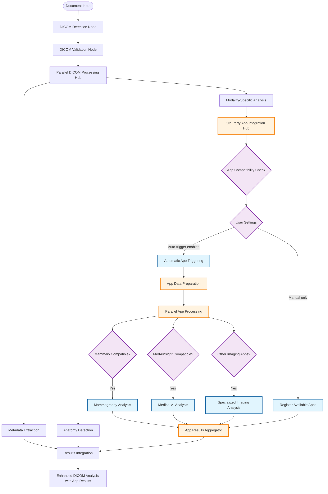

# AI Document Import - DICOM & 3rd Party Apps Integration

> **Navigation**: [← Document Types](./AI_IMPORT_08_DOCUMENT_TYPES.md) | [README](./AI_IMPORT_README.md) | [Next: Cross References →](./AI_IMPORT_10_CROSS_REFERENCES.md)

This document outlines the integration of 3rd party medical analysis applications within the LangGraph workflow for enhanced DICOM and medical imaging processing.

## Integration with Existing Apps System

The current 3rd party apps system in `/src/components/apps/` provides a sophisticated framework for integrating external medical analysis services. This can be enhanced within the LangGraph workflow to provide both automatic and user-triggered analysis of DICOM and other medical data.

### Current Apps System Overview

The existing system supports:

- **Medical Imaging Apps** (e.g., Mammaio for mammography analysis)
- **AI Medical Analysis** (e.g., MedAInsight for comprehensive analysis)
- **Specialized Analysis** (allergy, vaccination, focused analysis)
- **Secure Data Sharing** with RSA encryption and permission controls
- **Credit-based Usage** with user consent workflows

### Enhanced LangGraph Workflow with 3rd Party App Integration



## 3rd Party App Integration Node Implementation

```typescript
// src/lib/workflows/document-import/nodes/app-integration-hub.ts
export const appIntegrationHubNode = traceNode("app_integration_hub")(async (
  state: DocumentProcessingState,
): Promise<Partial<DocumentProcessingState>> => {
  const { dicomFiles, anatomyMappings, userSettings, sessionId } = state;
  const notifier = new SSEWorkflowNotifier(sessionId);

  notifier.notifyProgress(
    "app_integration",
    0.1,
    "Checking compatible apps...",
  );

  // 1. Load available apps and check compatibility
  const availableApps = await loadAvailableApps();
  const compatibleApps = await findCompatibleApps(dicomFiles, availableApps);

  notifier.notifyPartialResult("compatible_apps_found", {
    totalApps: availableApps.length,
    compatibleApps: compatibleApps.map((app) => ({
      name: app.name,
      type: app.connection.type,
      requirements: app.requires,
    })),
  });

  // 2. Check user settings for auto-triggering
  const userPreferences = await getUserAppPreferences(userSettings.userId);
  const autoTriggerApps = compatibleApps.filter(
    (app) =>
      userPreferences.autoTrigger.includes(app.id) &&
      userSettings.credits >= app.costPerAnalysis,
  );

  // 3. Execute automatic analysis for pre-approved apps
  const appResults = [];
  if (autoTriggerApps.length > 0) {
    notifier.notifyProgress(
      "app_integration",
      0.3,
      `Running ${autoTriggerApps.length} automatic analyses...`,
    );

    const appPromises = autoTriggerApps.map(async (app) => {
      try {
        const result = await executeAppAnalysis(app, dicomFiles, {
          userId: userSettings.userId,
          encryption: userSettings.encryptionPrefs,
          returnMode: "structured_data",
        });

        notifier.notifyPartialResult("app_analysis_complete", {
          appName: app.name,
          status: "success",
          confidence: result.confidence,
          findings: result.summary,
        });

        return { app: app.name, result, status: "success" };
      } catch (error) {
        notifier.notifyPartialResult("app_analysis_error", {
          appName: app.name,
          status: "error",
          error: error.message,
        });

        return { app: app.name, error: error.message, status: "error" };
      }
    });

    const results = await Promise.allSettled(appPromises);
    appResults.push(
      ...results
        .filter((r) => r.status === "fulfilled" && r.value.status === "success")
        .map((r) => r.value),
    );
  }

  // 4. Register manual-trigger apps for later use
  const manualApps = compatibleApps.filter(
    (app) => !autoTriggerApps.includes(app),
  );

  notifier.notifyProgress("app_integration", 1.0, "App integration complete");

  return {
    appIntegrationResults: {
      automaticAnalyses: appResults,
      availableManualApps: manualApps.map((app) => ({
        id: app.id,
        name: app.name,
        description: app.description,
        cost: app.costPerAnalysis,
        estimatedTime: app.estimatedProcessingTime,
      })),
    },
    enhancedDicomData: mergeDicomWithAppResults(dicomFiles, appResults),
  };
});
```

## App Results Integration

```typescript
// src/lib/workflows/document-import/nodes/app-results-aggregator.ts
export const appResultsAggregator = traceNode("app_results_aggregator")(async (
  state: DocumentProcessingState,
): Promise<Partial<DocumentProcessingState>> => {
  const { appIntegrationResults, anatomyMappings, report } = state;

  if (!appIntegrationResults?.automaticAnalyses?.length) {
    return { report }; // No app results to integrate
  }

  const enhancedFindings = [];
  const additionalSignals = [];
  const appRecommendations = [];

  for (const appResult of appIntegrationResults.automaticAnalyses) {
    const { app, result } = appResult;

    switch (app) {
      case "Mammaio":
        // Integrate mammography-specific findings
        if (result.biradsScore) {
          enhancedFindings.push({
            category: "mammography",
            finding: `BI-RADS ${result.biradsScore}`,
            confidence: result.confidence,
            details: result.findings,
            source: "Mammaio",
          });

          additionalSignals.push({
            signal: "birads_score",
            value: result.biradsScore,
            unit: "category",
            confidence: result.confidence,
            source: "mammaio",
          });
        }
        break;

      case "MedAInsight":
        // Integrate comprehensive medical analysis
        if (result.medicalFindings) {
          enhancedFindings.push(
            ...result.medicalFindings.map((finding) => ({
              category: "medical_analysis",
              finding: finding.description,
              confidence: finding.confidence,
              details: finding.details,
              source: "MedAInsight",
            })),
          );
        }

        if (result.recommendedActions) {
          appRecommendations.push(...result.recommendedActions);
        }
        break;

      case "RadiologyAI":
        // Integrate radiology-specific findings
        if (result.anatomicalFindings) {
          enhancedFindings.push(
            ...result.anatomicalFindings.map((finding) => ({
              category: "radiology",
              anatomy: finding.anatomy,
              finding: finding.description,
              confidence: finding.confidence,
              measurements: finding.measurements,
              source: "RadiologyAI",
            })),
          );
        }
        break;
    }
  }

  // Merge app findings with existing report
  const enhancedReport = {
    ...report,
    findings: [...(report.findings || []), ...enhancedFindings],
    signals: [...(report.signals || []), ...additionalSignals],
    recommendations: [...(report.recommendations || []), ...appRecommendations],
    appAnalyses: appIntegrationResults.automaticAnalyses.map((result) => ({
      app: result.app,
      status: result.status,
      confidence: result.result?.confidence,
      summary: result.result?.summary,
      analysisDate: new Date().toISOString(),
    })),
  };

  return { report: enhancedReport };
});
```

## User Settings Integration

```typescript
// src/lib/workflows/document-import/utils/user-app-preferences.ts
interface UserAppPreferences {
  userId: string;
  autoTrigger: string[]; // App IDs to trigger automatically
  manualOnly: string[]; // Apps requiring manual approval
  creditLimits: Record<string, number>; // Per-app credit limits
  encryptionPrefs: {
    enabled: boolean;
    keyId: string;
  };
  notificationPrefs: {
    appStarted: boolean;
    appCompleted: boolean;
    appFailed: boolean;
  };
}

export async function getUserAppPreferences(
  userId: string,
): Promise<UserAppPreferences> {
  // Load from user settings database
  const preferences = await db.userAppPreferences.findUnique({
    where: { userId },
  });

  return preferences || getDefaultAppPreferences(userId);
}

export async function updateUserAppPreferences(
  userId: string,
  updates: Partial<UserAppPreferences>,
): Promise<void> {
  await db.userAppPreferences.upsert({
    where: { userId },
    update: updates,
    create: { userId, ...getDefaultAppPreferences(userId), ...updates },
  });
}

function getDefaultAppPreferences(userId: string): UserAppPreferences {
  return {
    userId,
    autoTrigger: [], // No auto-trigger by default
    manualOnly: ["Mammaio", "MedAInsight"], // Require manual approval
    creditLimits: {
      Mammaio: 5,
      MedAInsight: 10,
    },
    encryptionPrefs: {
      enabled: true,
      keyId: "default",
    },
    notificationPrefs: {
      appStarted: true,
      appCompleted: true,
      appFailed: true,
    },
  };
}
```

## Benefits of 3rd Party App Integration

### Enhanced Analysis Capabilities

- **Specialized Expertise**: Leverage domain-specific AI models for imaging analysis
- **Multi-Modal Analysis**: Combine multiple analysis approaches for comprehensive results
- **Real-time Processing**: Integrate app results during document processing workflow
- **Quality Enhancement**: Cross-validate findings across multiple analysis sources

### User Experience Improvements

- **Automatic Analysis**: Pre-configured apps run automatically based on user preferences
- **Manual Control**: Users can manually trigger additional analyses as needed
- **Transparent Processing**: Real-time notifications of app analysis progress
- **Cost Awareness**: Clear credit usage and cost transparency

### Integration Benefits

- **Seamless Workflow**: Apps integrate directly into document processing pipeline
- **Unified Results**: App findings merged with standard document analysis
- **Consistent Format**: All results structured in standard FHIR format
- **Audit Trail**: Complete tracking of all app analyses performed

## Implementation Strategy

### Phase 1: Core Integration (Weeks 1-2)

- Develop app integration hub node
- Implement basic compatibility checking
- Add user preference management
- Test with existing Mammaio integration

### Phase 2: Enhanced Features (Weeks 3-4)

- Add automatic app triggering based on user settings
- Implement app results aggregation and merging
- Add SSE notifications for app processing
- Test with MedAInsight integration

### Phase 3: Advanced Capabilities (Weeks 5-6)

- Add support for new imaging analysis apps
- Implement advanced result correlation
- Add quality scoring for app results
- Comprehensive testing across all app types

### Phase 4: Production Deployment (Weeks 7-8)

- Performance optimization and monitoring
- User training and documentation
- Production rollout with feature flags
- Feedback collection and iteration

---

> **Next**: [Cross References](./AI_IMPORT_10_CROSS_REFERENCES.md) - Integration points and related documentation
