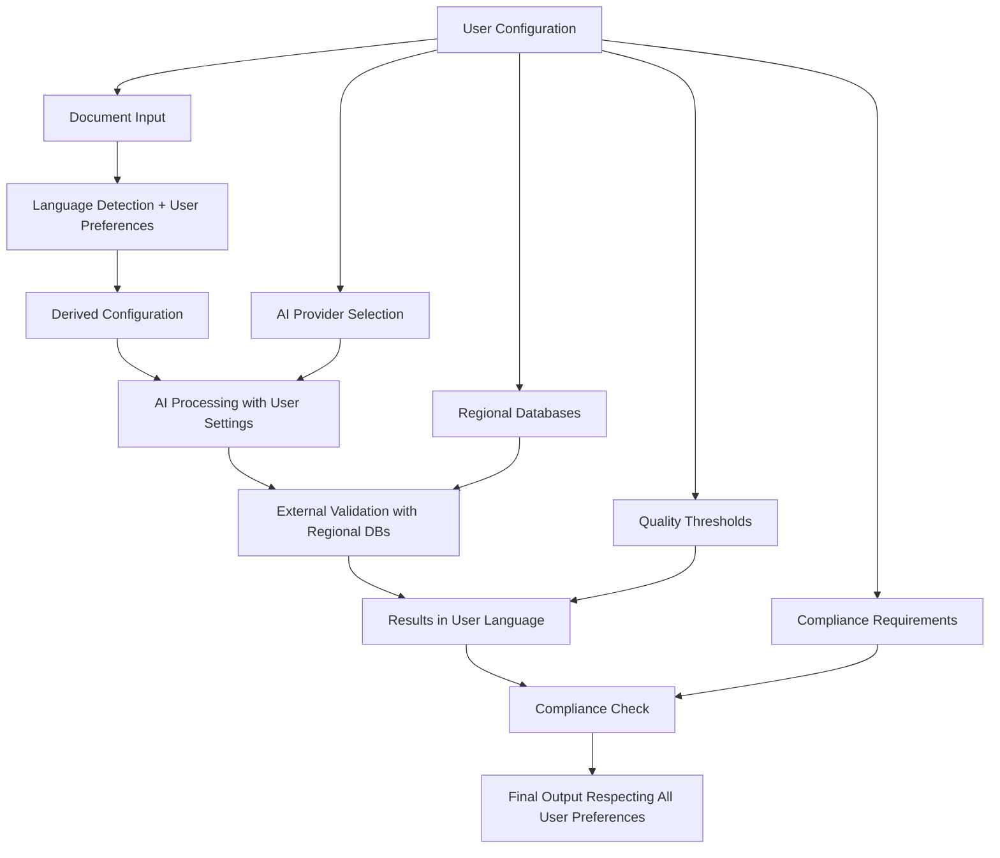

# AI Document Import - User Configuration Integration Summary

> **Navigation**: [User Configuration](./AI_IMPORT_USER_CONFIGURATION.md) | [README](./AI_IMPORT_README.md)

This document summarizes all the touch points where the centralized user configuration system integrates with the AI document import workflow, ensuring consistent user preferences throughout the entire process.

## Configuration Integration Points

### 1. Language Processing (Resolved)

**Previous Issue**: Language was treated as both input parameter and user preference, causing confusion between document language and output language.

**Solution**: Clear separation implemented in [AI_IMPORT_USER_CONFIGURATION.md](./AI_IMPORT_USER_CONFIGURATION.md):

```typescript
// Document source language (metadata only)
documentMetadata: {
  detectedLanguage: 'en',      // What language the document is in
  originalLanguage: 'en',      // Preserved for reference
}

// User output preference (drives all outputs)
userConfig.regional.language.primary: 'cs'  // User wants results in Czech

// Processing optimization
derivedConfig: {
  outputLanguage: 'cs',        // Always user preference
  processingLanguage: 'en',    // Optimized for AI processing
}
```

**Integration Points Updated**:
- ✅ Enhanced workflow state definition
- ✅ Input validator with language detection
- ✅ Schema localization using user language
- ✅ External tool validation with output language
- ✅ Medical validation results in user language

### 2. Regional Database Selection

**Configuration Path**: `userConfig.medical.databases`

**Integration Points**:

| Component | Configuration Used | Example |
|-----------|-------------------|---------|
| **Medication Validation** | `primaryMedicationDB`, `fallbacks` | Czech user → SÚKL primary, EMA fallback |
| **Medical Coding** | `primaryICD`, `primarySNOMED` | US user → ICD-10-CM, SNOMED_US |
| **Lab References** | `referenceRanges` | Czech user → CZECH_LAB_STANDARDS |
| **External APIs** | Regional API preferences | CZ → SÚKL API, US → FDA API |

**Files Updated**:
- ✅ `AI_IMPORT_06_EXTERNAL_TOOLS.md` - Regional database matrix
- ✅ `AI_IMPORT_USER_CONFIGURATION.md` - Database preference configuration
- ✅ MCP server integration with user region

### 3. AI Provider Preferences

**Configuration Path**: `userConfig.aiPreferences.providerPreferences`

**Integration Points**:

```typescript
// Provider selection based on user preferences
const provider = providerRegistry.selectOptimalProvider({
  task: "classification",
  requirements: { supportsVision: true },
  preferences: { 
    costOptimized: userConfig.aiPreferences.optimizationStrategy === 'cost',
    accuracy: userConfig.aiPreferences.optimizationStrategy === 'accuracy' ? 'high' : 'standard'
  }
});
```

**Files Updated**:
- ✅ `AI_IMPORT_04_IMPLEMENTATION.md` - Provider selection logic
- ✅ `AI_IMPORT_USER_CONFIGURATION.md` - Provider preference configuration

### 4. Quality Thresholds & Human Review

**Configuration Path**: `userConfig.quality.confidenceThresholds`

**Integration Points**:

```typescript
// User-defined confidence thresholds for different data types
confidenceThresholds: {
  autoAccept: {
    medication: 0.95,  // High confidence for medications
    diagnosis: 0.90,   // High confidence for diagnosis
    patientInfo: 0.85, // Standard confidence for patient data
  },
  humanReview: {
    medication: 0.80,  // Review required below 80%
    diagnosis: 0.75,   // Review required below 75%
    patientInfo: 0.70, // Review required below 70%
  }
}
```

**Files Updated**:
- ✅ `AI_IMPORT_USER_CONFIGURATION.md` - Quality configuration definitions
- ✅ Quality gate implementation in workflow

### 5. Compliance Requirements

**Configuration Path**: `userConfig.regional.complianceRequirements`

**Regional Compliance Matrix**:

| Region | Compliance Requirements | Impact |
|--------|------------------------|--------|
| **Czech Republic** | `['GDPR', 'EU_MDR', 'CZECH_HEALTHCARE_LAW']` | SÚKL validation required, EU privacy standards |
| **United States** | `['HIPAA', 'FDA_CFR']` | FDA database priority, HIPAA audit trails |
| **European Union** | `['GDPR', 'EU_MDR']` | EMA database access, GDPR data handling |
| **Germany** | `['GDPR', 'EU_MDR', 'GERMAN_MEDICAL_LAW']` | PharmNet.Bund integration |

**Files Updated**:
- ✅ `AI_IMPORT_06_EXTERNAL_TOOLS.md` - Regional compliance in database selection
- ✅ `AI_IMPORT_USER_CONFIGURATION.md` - Compliance configuration

### 6. Patient Context Integration

**Configuration Path**: `userConfig.medical.patientContext`

**Integration Points**:

```typescript
// Patient demographics drive validation accuracy
interface PatientContext {
  age?: number;           // For age-specific lab reference ranges
  sex?: 'M' | 'F' | 'O'; // For gender-specific medical standards
  countryOfCare: RegionCode; // For regional medical standards
  allergies?: string[];   // For drug interaction checking
  chronicConditions?: string[]; // For contraindication validation
  currentMedications?: string[]; // For drug-drug interaction checking
}
```

**Files Updated**:
- ✅ `AI_IMPORT_06_EXTERNAL_TOOLS.md` - Lab validation with patient demographics
- ✅ `AI_IMPORT_USER_CONFIGURATION.md` - Patient context configuration
- ✅ MCP server tools using patient context

### 7. External Tool Configuration

**Configuration Path**: `userConfig.externalTools`

**Integration Points**:

| Tool Category | Configuration | User Control |
|---------------|---------------|--------------|
| **Medical Apps** | `enabledApps`, `autoTrigger` | User chooses which 3rd party apps to use |
| **Database Access** | `credentials`, `timeouts` | User manages API access and performance |
| **Rate Limiting** | `rateLimiting` | User controls API usage costs |
| **Caching** | `caching.enabled`, `caching.ttl` | User balances speed vs. freshness |

**Files Updated**:
- ✅ `AI_IMPORT_09_DICOM_APPS.md` - 3rd party app integration
- ✅ `AI_IMPORT_USER_CONFIGURATION.md` - External tools configuration

### 8. Security & Privacy Configuration

**Configuration Path**: `userConfig.security`

**Integration Points**:

```typescript
// Security configuration affects all data handling
interface SecurityConfiguration {
  encryption: {
    level: 'standard' | 'high' | 'maximum';
    keyRotation: boolean;
  };
  retention: {
    medicalData: number; // days
    processingLogs: number; // days
    auditTrails: number; // days
  };
  privacy: {
    minimizeDataCollection: boolean;
    anonymizeResults: boolean;
    shareWithThirdParty: boolean;
  };
}
```

**Files Updated**:
- ✅ `AI_IMPORT_USER_CONFIGURATION.md` - Security configuration
- ✅ Encryption preferences in workflow state

## Implementation Status

### ✅ Completed Integrations

1. **Language Processing**: Clear separation between document language and user output language
2. **Regional Database Selection**: User region drives primary database choice
3. **Medical Validation**: All validation respects user language and region
4. **External Tools**: MCP server uses user configuration for all tool calls
5. **Workflow State**: Enhanced state includes user configuration throughout
6. **Provider Selection**: AI provider choice respects user cost/accuracy preferences

### 🔄 Integration Points Ready for Implementation

1. **Quality Gates**: Confidence thresholds defined, need workflow integration
2. **Security Policies**: Configuration defined, need enforcement implementation
3. **Compliance Checking**: Requirements defined, need validation logic
4. **Patient Context**: Interface defined, need integration with medical validation
5. **Budget Management**: Configuration defined, need cost tracking implementation

### 📋 Configuration Factory Patterns

**Regional Defaults**: Pre-configured settings for major regions

```typescript
// Czech Republic user gets:
UserConfigurationFactory.forRegion('user123', 'CZ') => {
  regional: { primaryRegion: 'CZ', language: { primary: 'cs' } },
  medical: { databases: { medication: { primary: 'SUKL' } } },
  compliance: ['GDPR', 'EU_MDR', 'CZECH_HEALTHCARE_LAW']
}

// US user gets:
UserConfigurationFactory.forRegion('user456', 'US') => {
  regional: { primaryRegion: 'US', language: { primary: 'en' } },
  medical: { databases: { medication: { primary: 'FDA_ORANGE_BOOK' } } },
  compliance: ['HIPAA', 'FDA_CFR']
}
```

## Configuration Flow Summary



## Benefits Achieved

### 🎯 User Experience
- **Consistent Language**: All outputs in user's preferred language regardless of document source
- **Regional Relevance**: Medical validation uses appropriate regional databases
- **Personal Preferences**: Cost vs. accuracy, quality thresholds respect user choices

### 🔧 Technical Benefits
- **Centralized Configuration**: Single source of truth for all user preferences
- **No Hardcoded Values**: All regional and language settings are user-configurable
- **Extensible Design**: Easy to add new configuration options
- **Clear Separation**: Document metadata vs. user preferences clearly distinguished

### 🏥 Medical Accuracy
- **Regional Standards**: Correct medical databases for user's healthcare system
- **Patient Context**: Demographics improve validation accuracy
- **Compliance Alignment**: Automatic adherence to regional healthcare regulations

---

This comprehensive configuration system ensures that every aspect of the AI document import workflow respects user preferences while maintaining the flexibility to handle documents in any language or medical standard.