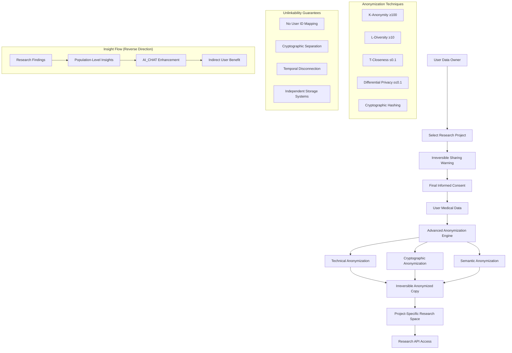

# AI Research: User-Controlled Data Sharing Platform for Medical Insights

This document outlines a comprehensive research module that enables users to maintain complete control over their health data sharing while providing a secure, open platform for 3rd party researchers and developers to access anonymized data for targeted evaluation systems and insights generation.

## Executive Summary

The AI Research platform creates a revolutionary user-controlled data sharing ecosystem that:

- **Complete User Control**: Granular permissions for internal research and 3rd party sharing
- **Irreversible Anonymized Sharing**: Users create permanent anonymized copies for specific research projects
- **Targeted Data Sharing**: Users select specific research projects and data categories with full understanding of permanence
- **Open Developer Platform**: Secure API access for 3rd party research systems
- **Actionable Insights Exchange**: Data sharing in return for personalized insights
- **Agentic Chat Integration**: AI_CHAT leverages all authorized research context
- **Privacy-Preserving Architecture**: Multi-layer anonymization that ensures complete unlinkability

## Critical Sharing Principle: Irreversible Anonymization

**Once data is shared with a research project, it becomes permanently anonymized and cannot be withdrawn or tracked back to the original user.** This fundamental principle ensures:

- **True Anonymity**: No technical possibility of re-identification
- **Research Continuity**: Projects can rely on data availability for longitudinal studies
- **Legal Protection**: Complete separation between user identity and shared data
- **Informed Consent**: Users understand the permanent nature of their contribution

## Core Architecture

### 1. Irreversible Anonymized Sharing Framework



### 2. Advanced Anonymization Engine

```typescript
interface IrreversibleAnonymizationEngine {
  // Multi-layer anonymization with unlinkability guarantees
  anonymizeForResearch(params: {
    userData: UserMedicalData;
    projectId: string;
    anonymizationLevel: "standard" | "enhanced" | "maximum";
    unlinkabilityRequirements: UnlinkabilityRequirement[];
  }): Promise<IrreversibleAnonymizedData>;

  // Validate anonymization quality and re-identification risk
  validateAnonymization(params: {
    anonymizedData: AnonymizedData;
    populationData: PopulationData;
    attackScenarios: AttackScenario[];
  }): Promise<AnonymizationValidationResult>;

  // Generate synthetic data for enhanced privacy
  generateSyntheticComponents(params: {
    realData: MedicalData;
    syntheticRatio: number;
    preservedUtility: UtilityMetric[];
  }): Promise<SyntheticEnhancedData>;
}

// Recommended anonymization techniques for medical data
const medicalAnonymizationTechniques = {
  // Tier 1: Statistical Disclosure Control
  k_anonymity: {
    description:
      "Ensure each record is indistinguishable from at least k-1 others",
    recommended_k: 100,
    implementation: "generalization_and_suppression",
    medical_focus: "quasi_identifiers_like_age_zip_gender",
  },

  l_diversity: {
    description:
      "Ensure sensitive attributes have at least l diverse values in each group",
    recommended_l: 10,
    implementation: "sensitive_attribute_diversification",
    medical_focus: "diagnoses_medications_procedures",
  },

  t_closeness: {
    description:
      "Distribution of sensitive attributes in each group close to overall distribution",
    recommended_t: 0.1,
    implementation: "earth_movers_distance",
    medical_focus: "lab_values_vital_signs_continuous_variables",
  },

  // Tier 2: Differential Privacy
  differential_privacy: {
    description:
      "Mathematical guarantee that individual presence cannot be detected",
    recommended_epsilon: 0.1,
    implementation: "laplace_gaussian_noise_addition",
    medical_focus: "aggregated_statistics_population_queries",
    noise_calibration: "sensitivity_analysis_per_query_type",
  },

  // Tier 3: Cryptographic Techniques
  cryptographic_hashing: {
    description: "One-way transformation of identifiers with salt",
    implementation: "sha256_with_project_specific_salt",
    medical_focus: "patient_identifiers_cross_reference_keys",
    collision_resistance: "256_bit_security_level",
  },

  homomorphic_encryption: {
    description: "Computation on encrypted data without decryption",
    implementation: "paillier_or_bfv_schemes",
    medical_focus: "aggregate_calculations_on_sensitive_values",
    performance: "specialized_for_medical_computations",
  },

  // Tier 4: Semantic Anonymization
  medical_generalization: {
    description: "Replace specific medical terms with broader categories",
    implementation: "icd_snomed_hierarchy_based",
    examples: {
      specific: "Lisinopril 10mg",
      generalized: "ACE_inhibitor_low_dose",
    },
  },

  temporal_generalization: {
    description: "Reduce temporal precision to prevent timing attacks",
    implementation: "date_binning_and_noise_injection",
    granularity: {
      precise_dates: "remove",
      week_level: "acceptable_for_most_research",
      month_level: "high_privacy_research",
    },
  },

  // Tier 5: Synthetic Data Enhancement
  synthetic_data_injection: {
    description: "Mix real anonymized data with synthetic records",
    ratio: "30_percent_synthetic_70_percent_real",
    generation: "gan_based_medical_data_synthesis",
    validation: "utility_preservation_statistical_tests",
  },
};

// Unlinkability guarantee implementation
interface UnlinkabilityGuarantees {
  // Complete separation from user identity
  noUserIdMapping: {
    principle: "No mapping table between user IDs and anonymous IDs";
    implementation: "one_way_cryptographic_transformation";
    verification: "mathematical_proof_of_unlinkability";
  };

  // Cryptographic separation
  cryptographicSeparation: {
    principle: "Different encryption keys and systems for user data vs research data";
    implementation: "separate_key_hierarchies_independent_systems";
    verification: "formal_security_analysis";
  };

  // Temporal disconnection
  temporalDisconnection: {
    principle: "Time-based unlinking to prevent correlation attacks";
    implementation: "anonymization_time_randomization";
    verification: "temporal_correlation_analysis";
  };

  // Independent storage systems
  independentStorage: {
    principle: "Research data stored on completely separate infrastructure";
    implementation: "air_gapped_research_data_centers";
    verification: "infrastructure_audit_and_certification";
  };
}

// Anonymization process implementation
class IrreversibleAnonymizationProcessor {
  async processForProject(
    userData: UserMedicalData,
    projectId: string,
  ): Promise<IrreversibleAnonymizedData> {
    // Step 1: Generate project-specific anonymization parameters
    const anonParams = await this.generateProjectParams(projectId);

    // Step 2: Apply statistical disclosure control
    const statisticallyAnonymized = await this.applyStatisticalAnonymization(
      userData,
      anonParams.statistical,
    );

    // Step 3: Apply differential privacy
    const differentiallyPrivate = await this.applyDifferentialPrivacy(
      statisticallyAnonymized,
      anonParams.differential,
    );

    // Step 4: Apply cryptographic transformations
    const cryptographicallyProtected = await this.applyCryptographicProtection(
      differentiallyPrivate,
      anonParams.cryptographic,
    );

    // Step 5: Apply semantic anonymization
    const semanticallyAnonymized = await this.applySemanticAnonymization(
      cryptographicallyProtected,
      anonParams.semantic,
    );

    // Step 6: Inject synthetic data
    const syntheticEnhanced = await this.injectSyntheticData(
      semanticallyAnonymized,
      anonParams.synthetic,
    );

    // Step 7: Validate unlinkability
    const validationResult = await this.validateUnlinkability(
      syntheticEnhanced,
      userData,
      anonParams.validation,
    );

    if (!validationResult.isUnlinkable) {
      throw new Error("Unlinkability requirements not met");
    }

    // Step 8: Create irreversible copy in project space
    const projectData = await this.createProjectCopy(
      syntheticEnhanced,
      projectId,
      validationResult.unlinkabilityProof,
    );

    // Step 9: Destroy intermediate data and mapping information
    await this.secureDestroy([
      anonParams,
      statisticallyAnonymized,
      differentiallyPrivate,
      cryptographicallyProtected,
      semanticallyAnonymized,
      syntheticEnhanced,
    ]);

    return projectData;
  }

  private async validateUnlinkability(
    anonymizedData: AnonymizedData,
    originalData: UserMedicalData,
    validationParams: ValidationParameters,
  ): Promise<UnlinkabilityValidationResult> {
    // Mathematical proof of unlinkability
    const mathematicalProof = await this.proveMathematicalUnlinkability(
      anonymizedData,
      validationParams,
    );

    // Empirical attack simulation
    const attackSimulation = await this.simulateReidentificationAttacks(
      anonymizedData,
      validationParams.attackScenarios,
    );

    // Information theoretic analysis
    const informationTheoretic = await this.analyzeInformationLeakage(
      anonymizedData,
      originalData,
    );

    return {
      isUnlinkable:
        mathematicalProof.valid &&
        attackSimulation.allAttacksFailed &&
        informationTheoretic.leakage < validationParams.maxLeakage,
      confidence: this.calculateConfidence([
        mathematicalProof,
        attackSimulation,
        informationTheoretic,
      ]),
      unlinkabilityProof: {
        mathematical: mathematicalProof,
        empirical: attackSimulation,
        theoretical: informationTheoretic,
        timestamp: new Date(),
        validationStandard: "NIST_Privacy_Engineering_Framework",
      },
    };
  }
}
```

### 3. Project-Specific Data Isolation

```typescript
interface ProjectDataIsolation {
  // Create isolated research environment
  createProjectSpace(params: {
    projectId: string;
    dataRequirements: DataRequirement[];
    isolationLevel: IsolationLevel;
  }): Promise<IsolatedProjectSpace>;

  // Manage project data lifecycle
  manageProjectDataLifecycle(params: {
    projectSpace: IsolatedProjectSpace;
    lifecycleStage: "active" | "analysis" | "reporting" | "archive" | "destroy";
    dataRetentionPolicy: RetentionPolicy;
  }): Promise<LifecycleManagementResult>;

  // Ensure data isolation integrity
  validateDataIsolation(params: {
    projectId: string;
    isolationValidation: IsolationValidation[];
  }): Promise<IsolationIntegrityResult>;
}

// Project data isolation implementation
const projectIsolationArchitecture = {
  infrastructure_isolation: {
    description: "Separate infrastructure per project",
    implementation: {
      storage: "project_specific_encrypted_databases",
      compute: "isolated_container_environments",
      network: "private_networks_with_firewall_rules",
      access: "project_specific_api_keys_and_authentication",
    },
  },

  data_partitioning: {
    description: "Logical and physical data separation",
    implementation: {
      database_separation: "separate_database_instances_per_project",
      schema_isolation: "project_specific_data_schemas",
      backup_separation: "independent_backup_systems",
      audit_separation: "project_specific_audit_logs",
    },
  },

  access_control_isolation: {
    description: "Independent access control per project",
    implementation: {
      authentication: "project_specific_authentication_systems",
      authorization: "role_based_access_control_per_project",
      api_isolation: "separate_api_endpoints_per_project",
      monitoring: "independent_access_monitoring_systems",
    },
  },

  cryptographic_isolation: {
    description: "Separate encryption systems per project",
    implementation: {
      encryption_keys: "project_specific_key_hierarchies",
      key_management: "independent_key_management_systems",
      cipher_separation: "different_encryption_algorithms_per_project",
      key_rotation: "independent_key_rotation_schedules",
    },
  },
};
```

### 4. Informed Consent for Irreversible Sharing

```typescript
interface IrreversibleSharingConsent {
  // Multi-stage consent process with clear warnings
  initiateConsentProcess(params: {
    userId: string;
    projectId: string;
    dataCategories: DataCategory[];
  }): Promise<ConsentProcessInitiation>;

  // Educational phase about irreversible nature
  provideEducationalContent(params: {
    userProfile: UserProfile;
    projectDetails: ProjectDetails;
    sharingImplications: SharingImplication[];
  }): Promise<EducationalContent>;

  // Final confirmation with explicit acknowledgment
  finalizeIrreversibleConsent(params: {
    userId: string;
    educationCompleted: boolean;
    explicitAcknowledgments: ExplicitAcknowledgment[];
    waitingPeriod: boolean;
  }): Promise<IrreversibleConsentRecord>;
}

// Multi-stage consent process for irreversible sharing
const irreversibleSharingConsentProcess = {
  stage_1_project_discovery: {
    description: "User discovers and evaluates research project",
    duration: "unlimited_browsing_time",
    content: [
      "project_description_and_goals",
      "researcher_credentials_and_institution",
      "data_requirements_and_usage",
      "expected_benefits_and_timeline",
      "participant_feedback_and_ratings",
    ],
    user_actions: ["browse", "bookmark", "request_more_info", "decline"],
  },

  stage_2_education_and_warning: {
    description: "Comprehensive education about irreversible sharing",
    duration: "minimum_10_minutes_required",
    content: [
      "irreversible_nature_explanation",
      "anonymization_process_overview",
      "what_data_will_be_shared",
      "what_data_will_not_be_shared",
      "unlinkability_guarantees",
      "inability_to_withdraw_shared_data",
      "alternative_participation_options",
    ],
    user_actions: [
      "read_all_content",
      "pass_comprehension_quiz",
      "proceed_or_decline",
    ],
  },

  stage_3_explicit_acknowledgment: {
    description: "Explicit acknowledgment of irreversible sharing implications",
    duration: "minimum_5_minutes_reflection_time",
    acknowledgments: [
      "I understand this sharing is permanent and irreversible",
      "I understand my anonymized data cannot be withdrawn once shared",
      "I understand the specific data categories being shared",
      "I understand this is voluntary and I can decline",
      "I understand the anonymization techniques being used",
      "I understand the research purpose and potential benefits",
      "I understand the project timeline and expected duration",
    ],
    user_actions: [
      "check_each_acknowledgment",
      "type_confirmation_phrase",
      "digital_signature",
    ],
  },

  stage_4_cooling_off_period: {
    description: "Optional cooling-off period before final consent",
    duration: "24_hour_minimum_recommended",
    content: [
      "final_opportunity_to_review_decision",
      "access_to_support_and_questions",
      "ability_to_cancel_without_consequence",
    ],
    user_actions: [
      "confirm_final_consent",
      "cancel_consent_process",
      "extend_cooling_off",
    ],
  },

  stage_5_irreversible_activation: {
    description: "Final activation triggers irreversible anonymization",
    duration: "immediate_processing",
    process: [
      "final_consent_validation",
      "anonymization_process_execution",
      "project_data_creation",
      "user_confirmation_of_completion",
      "benefit_delivery_initialization",
    ],
    irreversible_point: "after_anonymization_process_completion",
  },
};

// User education content for informed consent
interface UserEducationContent {
  // Clear explanation of anonymization
  anonymizationExplanation: {
    simple_language: "Your personal information will be removed and replaced with anonymous codes that cannot be traced back to you";
    technical_details: "Multi-layer anonymization including k-anonymity, differential privacy, and cryptographic unlinking";
    visual_aids: [
      "before_after_data_examples",
      "anonymization_process_flowchart",
      "unlinkability_demonstration",
    ];
    analogies: [
      "library_book_checkout_system",
      "survey_response_aggregation",
      "anonymous_donation_process",
    ];
  };

  // What data is shared vs not shared
  dataSharingClarity: {
    shared_data: {
      description: "Data that will be included in anonymous research dataset";
      examples: [
        "age_range_instead_of_exact_age",
        "medication_class_instead_of_specific_drug",
        "region_instead_of_exact_address",
      ];
      anonymization_level: "specific_to_project_requirements";
    };
    not_shared_data: {
      description: "Data that will never be included in research dataset";
      examples: [
        "name",
        "exact_address",
        "phone_number",
        "email",
        "social_security_number",
        "insurance_id",
      ];
      protection_guarantee: "removed_before_anonymization_process";
    };
    derived_insights: {
      description: "How anonymized data might be used to generate insights";
      examples: [
        "population_health_trends",
        "treatment_effectiveness_patterns",
        "medication_response_analysis",
      ];
      benefit_flow: "insights_flow_back_to_users_through_ai_chat_enhancements";
    };
  };

  // Irreversible nature explanation
  irreversibilityExplanation: {
    technical_reason: "Anonymization process destroys the mathematical link between your identity and the research data";
    practical_implication: "Once data is anonymized and shared, it becomes impossible to identify which data came from which user";
    user_control_limitations: "You cannot withdraw specific data points, but you can stop sharing new data at any time";
    research_continuity: "This ensures research can continue and provides meaningful results for the community";
    legal_protection: "Anonymized data provides you with legal protection as it cannot be linked back to you";
  };

  // Alternative participation options
  alternativeOptions: {
    aggregated_insights_only: {
      description: "Receive population insights without contributing individual data";
      limitations: "Less personalized insights, no contribution benefits";
    };
    revocable_research_participation: {
      description: "Participate in studies where data can be withdrawn";
      limitations: "Fewer available studies, less comprehensive research";
    };
    internal_research_only: {
      description: "Share data only within Mediqom for platform improvement";
      limitations: "Limited to internal research scope and benefits";
    };
    synthetic_data_contribution: {
      description: "Contribute to synthetic data generation without sharing real data";
      limitations: "Reduced research utility, different benefit structure";
    };
  };
}

// Comprehension validation system
interface ConsentComprehensionValidation {
  // Validate user understanding before consent
  validateComprehension(params: {
    userId: string;
    educationalContent: EducationalContent;
    quizResponses: QuizResponse[];
  }): Promise<ComprehensionValidationResult>;

  // Adaptive education based on comprehension gaps
  provideAdaptiveEducation(params: {
    comprehensionGaps: ComprehensionGap[];
    userLearningProfile: LearningProfile;
  }): Promise<AdaptiveEducationalContent>;
}

// Sample comprehension quiz questions
const comprehensionQuizQuestions = [
  {
    question:
      "After you share your data with a research project, can you ask for it to be removed?",
    correct_answer:
      "No, once data is anonymized and shared, it cannot be withdrawn or removed",
    common_misconceptions: [
      "Yes, I can withdraw my data at any time",
      "I can withdraw some data but not all of it",
      "I can withdraw data within 30 days",
    ],
  },
  {
    question:
      "What happens to your personal identifiers (name, address, etc.) in the research dataset?",
    correct_answer:
      "They are completely removed and replaced with anonymous codes that cannot be traced back to me",
    common_misconceptions: [
      "They are encrypted but still present",
      "They are replaced with pseudonyms that can be reversed",
      "They are stored separately but still linked",
    ],
  },
  {
    question:
      "If researchers find something concerning in the anonymized data, can they contact you directly?",
    correct_answer:
      "No, because the data cannot be linked back to me individually",
    common_misconceptions: [
      "Yes, they can contact me through Mediqom",
      "Yes, but only in emergencies",
      "They can contact my doctor but not me",
    ],
  },
  {
    question:
      "What type of insights will you receive from participating in research?",
    correct_answer:
      "Population-level insights and trends that may be relevant to my condition, delivered through AI chat enhancements",
    common_misconceptions: [
      "Individual analysis of my specific data",
      "Direct feedback about my personal health status",
      "Personalized medical recommendations",
    ],
  },
];
```

### 5. Granular Consent Management System

```typescript
interface UserDataSharingConsent {
  // Primary consent categories
  internalResearch: InternalResearchConsent;
  externalResearch: ExternalResearchConsent;
  developerPlatform: DeveloperPlatformConsent;

  // Data category permissions
  dataCategories: DataCategoryPermissions;

  // Temporal controls
  sharingDuration: SharingDuration;
  retentionPolicy: RetentionPolicy;

  // Benefit expectations
  expectedBenefits: ExpectedBenefit[];
  insightDelivery: InsightDeliveryPreferences;
}

interface InternalResearchConsent {
  // Mediqom core research participation
  populationHealth: boolean;
  treatmentOutcomes: boolean;
  medicationEffectiveness: boolean;
  diagnosticImprovement: boolean;

  // Internal research scope
  anonymizationLevel: "standard" | "enhanced" | "maximum";
  cohortParticipation: boolean;
  longitudinalStudies: boolean;
}

interface ExternalResearchConsent {
  // 3rd party research projects
  approvedProjects: ResearchProjectConsent[];
  autoApprovalCriteria: AutoApprovalCriteria;
  reviewRequired: boolean;

  // Research categories
  academicResearch: boolean;
  pharmaceuticalResearch: boolean;
  medicalDeviceResearch: boolean;
  publicHealthResearch: boolean;

  // Geographic restrictions
  dataResidencyRequirements: string[];
  prohibitedRegions: string[];
}

interface DeveloperPlatformConsent {
  // Open platform participation
  apiAccess: boolean;
  aggregatedDataSharing: boolean;
  algorithmTesting: boolean;

  // Developer categories
  approvedDeveloperTypes: DeveloperType[];
  verificationRequirements: VerificationLevel;

  // Usage restrictions
  commercialUse: boolean;
  redistributionPermissions: RedistributionPermissions;
}

// Granular data category controls
interface DataCategoryPermissions {
  demographics: {
    ageRange: boolean;
    gender: boolean;
    region: boolean;
    socioeconomic: boolean;
  };

  medical: {
    conditions: boolean;
    medications: boolean;
    labResults: boolean;
    vitalSigns: boolean;
    procedures: boolean;
    imaging: boolean;
  };

  behavioral: {
    treatmentAdherence: boolean;
    lifestyleFactors: boolean;
    copingStrategies: boolean;
    outcomeReporting: boolean;
  };

  temporal: {
    currentData: boolean;
    historicalData: boolean;
    futureUpdates: boolean;
    longitudinalTracking: boolean;
  };
}
```

### 3. Research Project Marketplace

```typescript
interface ResearchProjectMarketplace {
  // Project discovery and evaluation
  discoverProjects(params: {
    userProfile: AnonymizedProfile;
    researchInterests: ResearchInterest[];
    benefitExpectations: BenefitExpectation[];
  }): Promise<RelevantProject[]>;

  // Project application and approval
  applyToProject(params: {
    projectId: string;
    userId: string;
    dataContribution: DataContributionOffer;
    consentLevel: ConsentLevel;
  }): Promise<ApplicationResult>;

  // Ongoing project management
  manageProjectParticipation(params: {
    userId: string;
    activeProjects: ProjectParticipation[];
    performanceMetrics: ParticipationMetrics;
  }): Promise<ProjectManagementDashboard>;
}

interface ResearchProject {
  // Project identification
  projectId: string;
  title: string;
  description: string;
  principalInvestigator: ResearcherProfile;

  // Project details
  researchArea: ResearchArea;
  methodology: ResearchMethodology;
  expectedDuration: number;
  participantRequirements: ParticipantCriteria;

  // Data requirements
  dataRequirements: DataRequirement[];
  anonymizationLevel: AnonymizationLevel;
  dataUsageScope: DataUsageScope;

  // Participant benefits
  participantBenefits: ParticipantBenefit[];
  insightSharingTimeline: InsightTimeline;
  compensationModel: CompensationModel;

  // Validation and trust
  institutionalApproval: InstitutionalApproval[];
  ethicsReview: EthicsReviewStatus;
  dataGovernanceCompliance: ComplianceStatus[];
  participantRatings: ParticipantFeedback;
}

// Example research projects
const researchProjectCategories = {
  pharmaceutical: {
    drugEffectiveness:
      "Real-world effectiveness studies for approved medications",
    adverseEventDetection: "Early detection of medication side effects",
    drugInteractionStudies: "Population-level drug interaction analysis",
    personalizedMedicine: "Genetic and biomarker-based treatment optimization",
  },

  medical_devices: {
    devicePerformance: "Real-world performance of medical devices",
    userExperience: "Patient experience and usability studies",
    outcomeImprovement: "Device impact on health outcomes",
    innovationTesting: "Testing of new medical device concepts",
  },

  academic_research: {
    populationHealth: "Large-scale population health studies",
    diseasePrevention: "Prevention strategy effectiveness research",
    healthDisparities: "Health equity and access research",
    behavioralHealth: "Mental health and behavioral intervention studies",
  },

  public_health: {
    epidemiology: "Disease surveillance and outbreak detection",
    healthPolicy: "Health policy impact assessment",
    preventiveGuidelines: "Evidence for preventive care guidelines",
    communityHealth: "Community-based health intervention studies",
  },
};
```

### 4. Developer Platform and API Access

```typescript
interface DeveloperPlatformAPI {
  // Platform registration and verification
  registerDeveloper(params: {
    developerInfo: DeveloperProfile;
    intendedUse: IntendedUseCase;
    verificationDocuments: VerificationDocument[];
  }): Promise<DeveloperRegistrationResult>;

  // Data access and querying
  queryAnonymizedData(params: {
    developerId: string;
    queryParameters: DataQuery;
    accessScope: AccessScope;
    usageContext: UsageContext;
  }): Promise<AnonymizedDataset>;

  // Algorithm testing and validation
  testAlgorithm(params: {
    algorithm: AlgorithmDefinition;
    testDataset: AnonymizedDataset;
    validationMetrics: ValidationMetric[];
  }): Promise<AlgorithmPerformanceResult>;

  // Insight contribution
  contributeInsights(params: {
    developerId: string;
    insights: GeneratedInsight[];
    applicableUserCohorts: UserCohort[];
    validationEvidence: ValidationEvidence;
  }): Promise<InsightContributionResult>;
}

interface DeveloperProfile {
  // Developer identification
  organizationName: string;
  developerType: "academic" | "commercial" | "nonprofit" | "individual";
  primaryContact: ContactInfo;

  // Verification and trust
  organizationVerification: VerificationStatus;
  institutionalAffiliation?: InstitutionInfo;
  previousProjectHistory: ProjectHistory[];
  communityRatings: CommunityRating[];

  // Technical capabilities
  technicalExpertise: TechnicalExpertise[];
  dataProcessingCapabilities: ProcessingCapability[];
  securityCertifications: SecurityCertification[];

  // Research focus
  researchAreas: ResearchArea[];
  targetPopulations: PopulationCriteria[];
  expectedOutputs: ExpectedOutput[];
}

// Developer platform tiers
const developerPlatformTiers = {
  sandbox: {
    description: "Limited access for testing and proof-of-concept",
    dataAccess: "synthetic_and_sample_data",
    queryLimits: "100_queries_per_month",
    userDataAccess: "aggregated_statistics_only",
    cost: "free",
  },

  research: {
    description: "Academic and nonprofit research access",
    dataAccess: "anonymized_real_data",
    queryLimits: "10000_queries_per_month",
    userDataAccess: "cohort_level_insights",
    cost: "cost_of_infrastructure",
  },

  commercial: {
    description: "Commercial development and validation",
    dataAccess: "anonymized_real_data_with_validation",
    queryLimits: "100000_queries_per_month",
    userDataAccess: "algorithm_testing_datasets",
    cost: "commercial_pricing",
  },

  enterprise: {
    description: "Large-scale research and development partnerships",
    dataAccess: "custom_datasets_and_real_time_feeds",
    queryLimits: "unlimited_with_governance",
    userDataAccess: "custom_cohort_generation",
    cost: "partnership_agreement",
  },
};
```

### 5. Contextual Anonymization Engine

```typescript
interface ContextualAnonymizationEngine {
  // Project-specific anonymization
  anonymizeForProject(params: {
    rawData: UserMedicalData;
    projectRequirements: ProjectDataRequirements;
    userConsentLevel: ConsentLevel;
    riskTolerance: RiskTolerance;
  }): Promise<ProjectSpecificAnonymizedData>;

  // Dynamic anonymization levels
  calculateAnonymizationLevel(params: {
    dataTypes: DataType[];
    recipientType: RecipientType;
    usageContext: UsageContext;
    userPreferences: UserPrivacyPreferences;
  }): Promise<AnonymizationStrategy>;

  // Re-identification risk assessment
  assessReidentificationRisk(params: {
    anonymizedData: AnonymizedData;
    populationData: PopulationData;
    auxiliaryData: AuxiliaryData[];
  }): Promise<RiskAssessment>;
}

// Contextual anonymization strategies
const anonymizationStrategies = {
  minimal_risk_internal: {
    techniques: [
      "remove_direct_identifiers",
      "date_shifting",
      "geographic_generalization",
    ],
    k_anonymity: 5,
    l_diversity: 2,
    differential_privacy: false,
  },

  moderate_risk_academic: {
    techniques: [
      "remove_quasi_identifiers",
      "value_suppression",
      "synthetic_data_injection",
    ],
    k_anonymity: 20,
    l_diversity: 5,
    differential_privacy: "epsilon_1.0",
  },

  high_risk_commercial: {
    techniques: [
      "full_generalization",
      "noise_injection",
      "synthetic_data_replacement",
    ],
    k_anonymity: 100,
    l_diversity: 10,
    differential_privacy: "epsilon_0.1",
  },

  maximum_protection_public: {
    techniques: ["federated_learning_only", "secure_multiparty_computation"],
    k_anonymity: 1000,
    l_diversity: 20,
    differential_privacy: "epsilon_0.01",
  },
};
```

### 6. AI_CHAT Integration with Research Context

```typescript
interface ChatResearchIntegration {
  // Enhanced chat context from research participation
  enrichChatContext(params: {
    userId: string;
    chatQuery: string;
    chatMode: "patient" | "clinical";
    authorizedResearchContext: AuthorizedResearchContext;
  }): Promise<EnhancedChatResponse>;

  // Research-backed insights delivery
  deliverResearchInsights(params: {
    userProfile: UserProfile;
    participatedProjects: ProjectParticipation[];
    relevantFindings: ResearchFinding[];
    insightDeliveryPreferences: InsightPreferences;
  }): Promise<PersonalizedInsight[]>;

  // Dynamic research opportunity suggestions
  suggestResearchOpportunities(params: {
    userContext: UserMedicalContext;
    chatHistory: ChatHistory;
    expressedInterests: ExpressedInterest[];
  }): Promise<ResearchOpportunity[]>;
}

interface AuthorizedResearchContext {
  // User's research participation context
  activeParticipations: ActiveParticipation[];
  availableInsights: AvailableInsight[];
  researchBasedRecommendations: ResearchRecommendation[];

  // Aggregated learnings from similar users
  cohortInsights: CohortInsight[];
  populationTrends: PopulationTrend[];
  treatmentOutcomeData: TreatmentOutcomeData[];

  // Real-time research updates
  relevantStudyUpdates: StudyUpdate[];
  emergingFindings: EmergingFinding[];
  clinicalTrialMatches: ClinicalTrialMatch[];
}

// Chat integration examples
const chatResearchEnhancements = {
  patient_mode_enhancements: {
    treatment_decisions: {
      trigger: "user asking about treatment options",
      enhancement:
        "Based on your participation in the CardioOutcomes study, patients with your profile who chose Treatment A had 23% better outcomes at 6 months",
      source: "anonymized_cohort_data_from_approved_research",
    },

    side_effect_management: {
      trigger: "user reporting medication side effects",
      enhancement:
        "Other participants in the MedAdherence study found that taking this medication with food reduced side effects by 40%",
      source: "behavioral_insights_from_research_participation",
    },

    lifestyle_optimization: {
      trigger: "user asking about lifestyle changes",
      enhancement:
        "The LifestyleGen study shows that people with your genetic profile respond better to interval training vs steady cardio",
      source: "personalized_insights_from_genomic_research",
    },
  },

  clinical_mode_enhancements: {
    treatment_selection: {
      trigger: "provider evaluating treatment options",
      enhancement:
        "Real-world data from 15 studies shows Treatment B has higher effectiveness in patients with comorbidity pattern X-Y-Z",
      source: "aggregated_research_outcomes_across_projects",
    },

    risk_stratification: {
      trigger: "provider assessing patient risk",
      enhancement:
        "Multi-cohort analysis indicates patients with this biomarker pattern have 2.3x higher risk (95% CI: 1.8-2.9)",
      source: "federated_analysis_across_research_platforms",
    },

    emerging_evidence: {
      trigger: "provider reviewing treatment protocols",
      enhancement:
        "Emerging data from 3 ongoing studies suggests earlier intervention may improve outcomes - consider referring patient for EarlyIntervention trial",
      source: "real_time_research_updates_and_trial_matching",
    },
  },
};
```

### 7. Insight Exchange and Benefit Delivery

```typescript
interface InsightExchangeSystem {
  // Generate insights for research contributors
  generateContributorInsights(params: {
    userId: string;
    contributionHistory: DataContribution[];
    participatedProjects: ResearchProject[];
    insightTypes: InsightType[];
  }): Promise<PersonalizedInsight[]>;

  // Research finding translation
  translateResearchFindings(params: {
    researchFindings: ResearchFinding[];
    userProfile: UserProfile;
    comprehensionLevel: ComprehensionLevel;
    deliveryPreferences: DeliveryPreference[];
  }): Promise<TranslatedInsight[]>;

  // Benefit tracking and optimization
  trackAndOptimizeBenefits(params: {
    userId: string;
    expectedBenefits: ExpectedBenefit[];
    actualBenefits: ActualBenefit[];
    satisfactionMetrics: SatisfactionMetric[];
  }): Promise<BenefitOptimizationPlan>;
}

interface PersonalizedInsight {
  // Insight identification
  insightId: string;
  sourceProjects: string[];
  generationDate: Date;
  relevanceScore: number;

  // Content
  title: string;
  summary: string;
  detailedExplanation: string;
  actionableRecommendations: ActionableRecommendation[];

  // Evidence and validation
  evidenceLevel: EvidenceLevel;
  confidenceInterval: ConfidenceInterval;
  validationSources: ValidationSource[];
  limitations: string[];

  // Personalization
  applicabilityToUser: ApplicabilityAssessment;
  personalizedRecommendations: PersonalizedRecommendation[];
  nextSteps: NextStep[];

  // Interaction tracking
  userEngagement: EngagementMetrics;
  feedbackRequested: FeedbackRequest[];
  followUpScheduled: FollowUpAction[];
}

// Benefit delivery mechanisms
const benefitDeliveryMechanisms = {
  immediate_insights: {
    description: "Real-time insights as research progresses",
    delivery: "push_notifications_and_chat_integration",
    frequency: "as_findings_emerge",
    personalization: "high",
  },

  periodic_reports: {
    description: "Comprehensive quarterly research impact reports",
    delivery: "detailed_pdf_reports_with_interactive_dashboard",
    frequency: "quarterly",
    personalization: "moderate",
  },

  treatment_optimization: {
    description: "Research-backed treatment recommendations",
    delivery: "ai_chat_enhanced_recommendations",
    frequency: "context_driven",
    personalization: "maximum",
  },

  clinical_trial_matching: {
    description: "Priority access to relevant clinical trials",
    delivery: "automated_matching_with_consent_verification",
    frequency: "as_trials_become_available",
    personalization: "high",
  },

  community_impact: {
    description: "Updates on how contributions help the broader community",
    delivery: "community_dashboard_and_impact_stories",
    frequency: "monthly",
    personalization: "low",
  },
};
```

### 8. Data Governance and Audit Framework

```typescript
interface DataGovernanceFramework {
  // Comprehensive audit trail
  maintainAuditTrail(params: {
    dataAccessEvent: DataAccessEvent;
    accessorIdentity: AccessorIdentity;
    dataScope: DataScope;
    usageContext: UsageContext;
  }): Promise<AuditRecord>;

  // Dynamic access control
  enforceAccessControl(params: {
    requestorId: string;
    requestedData: DataRequest;
    userConsent: UserConsent;
    riskAssessment: RiskAssessment;
  }): Promise<AccessDecision>;

  // Compliance monitoring
  monitorCompliance(params: {
    activeProjects: ActiveProject[];
    dataUsagePatterns: UsagePattern[];
    regulatoryRequirements: RegulatoryRequirement[];
  }): Promise<ComplianceReport>;

  // User data sovereignty
  enforceDataSovereignty(params: {
    userId: string;
    dataOperations: DataOperation[];
    userRights: DataRight[];
  }): Promise<SovereigntyEnforcementResult>;
}

interface AuditRecord {
  // Event identification
  eventId: string;
  timestamp: Date;
  eventType:
    | "data_access"
    | "consent_change"
    | "insight_delivery"
    | "data_deletion";

  // Parties involved
  dataOwner: string; // anonymized user ID
  dataAccessor: string; // project, developer, or internal system
  dataProcessor: string; // system or algorithm used

  // Data details
  dataTypes: DataType[];
  dataScope: DataScope;
  anonymizationLevel: AnonymizationLevel;
  purposeOfUse: PurposeOfUse;

  // Authorization
  consentBasis: ConsentBasis;
  legalBasis: LegalBasis;
  authorizationChain: AuthorizationStep[];

  // Technical details
  accessMethod: AccessMethod;
  dataTransformations: DataTransformation[];
  securityMeasures: SecurityMeasure[];
  retentionApplied: RetentionPolicy;

  // Validation and integrity
  dataIntegrityHash: string;
  accessValidation: ValidationResult;
  riskMitigation: RiskMitigation[];
}

// Governance principles
const governancePrinciples = {
  user_sovereignty: {
    principle: "Users maintain ultimate control over their data",
    implementation: [
      "granular_consent_management",
      "real_time_access_control",
      "immediate_withdrawal_capability",
      "transparent_usage_reporting",
    ],
  },

  transparency: {
    principle: "All data usage is transparent and auditable",
    implementation: [
      "comprehensive_audit_logs",
      "usage_dashboards_for_users",
      "regular_impact_reporting",
      "open_source_anonymization_algorithms",
    ],
  },

  proportionality: {
    principle: "Data access proportional to research value and user benefit",
    implementation: [
      "risk_benefit_analysis_for_each_request",
      "progressive_data_access_levels",
      "benefit_delivery_validation",
      "continuous_value_assessment",
    ],
  },

  accountability: {
    principle: "All parties accountable for data use and protection",
    implementation: [
      "legal_agreements_with_consequences",
      "regular_compliance_audits",
      "user_feedback_integration",
      "community_oversight_mechanisms",
    ],
  },
};
```

### 9. Research Ecosystem Integration

```typescript
interface ResearchEcosystemIntegration {
  // External research platform connections
  connectExternalPlatforms(params: {
    platformType:
      | "clinical_trials"
      | "academic_research"
      | "pharmaceutical"
      | "public_health";
    integrationLevel: IntegrationLevel;
    dataFlowRequirements: DataFlowRequirement[];
  }): Promise<PlatformIntegration>;

  // Cross-platform insight aggregation
  aggregateInsightsAcrossPlatforms(params: {
    userParticipations: CrossPlatformParticipation[];
    insightCategories: InsightCategory[];
    aggregationMethods: AggregationMethod[];
  }): Promise<AggregatedInsight[]>;

  // Research outcome validation
  validateResearchOutcomes(params: {
    researchFindings: ResearchFinding[];
    validationMethods: ValidationMethod[];
    independentSources: IndependentSource[];
  }): Promise<ValidationResult>;
}

// External platform integrations
const externalPlatformIntegrations = {
  clinicaltrials_gov: {
    integration_type: "trial_matching_and_enrollment",
    data_flow: "user_eligibility_criteria_to_trial_matching",
    benefit_flow: "trial_opportunities_to_user",
    privacy_level: "anonymized_matching_only",
  },

  all_of_us: {
    integration_type: "population_health_research_collaboration",
    data_flow: "anonymized_signals_and_outcomes",
    benefit_flow: "population_insights_and_genetic_analysis",
    privacy_level: "federated_analytics_only",
  },

  pharmaceutical_research: {
    integration_type: "real_world_evidence_generation",
    data_flow: "anonymized_medication_outcomes",
    benefit_flow: "personalized_medication_insights",
    privacy_level: "high_anonymization_with_audit",
  },

  academic_collaborations: {
    integration_type: "multi_institutional_studies",
    data_flow: "anonymized_cohort_data",
    benefit_flow: "evidence_based_treatment_recommendations",
    privacy_level: "institutional_review_board_approved",
  },
};
```

### 10. Implementation Roadmap

#### Phase 1: User Control Foundation (Weeks 1-3)

- [ ] Implement granular consent management system
- [ ] Build user data sharing dashboard
- [ ] Create contextual anonymization engine
- [ ] Establish audit trail infrastructure

#### Phase 2: Research Marketplace (Weeks 4-6)

- [ ] Launch internal research project platform
- [ ] Build 3rd party project approval workflow
- [ ] Implement project discovery and matching
- [ ] Create research benefit delivery system

#### Phase 3: Developer Platform (Weeks 7-9)

- [ ] Launch developer API platform
- [ ] Implement tiered access controls
- [ ] Build algorithm testing infrastructure
- [ ] Create insight contribution mechanisms

#### Phase 4: Chat Integration (Weeks 10-12)

- [ ] Integrate research context into AI_CHAT
- [ ] Implement real-time insight delivery
- [ ] Build research opportunity suggestions
- [ ] Create personalized recommendation engine

#### Phase 5: Ecosystem Expansion (Weeks 13-15)

- [ ] Connect external research platforms
- [ ] Implement cross-platform insight aggregation
- [ ] Launch community oversight mechanisms
- [ ] Optimize user benefit delivery

## Success Metrics

### User Control and Trust

- Granular consent adoption rate (target: >90%)
- User data sharing confidence scores (target: >4.5/5.0)
- Consent modification frequency and patterns
- User withdrawal and re-engagement rates

### Research Platform Value

- Number of active research projects (target: 50+ by end of year)
- Developer platform adoption (target: 1000+ registered developers)
- Data contribution volume and diversity
- Cross-platform insight generation rate

### User Benefit Delivery

- Personalized insight delivery rate (target: weekly)
- User satisfaction with research benefits (target: >4.0/5.0)
- Clinical trial match success rate (target: >15% enrollment)
- Treatment optimization adoption rate

### Platform Sustainability

- Research project sustainability and completion rates
- Developer platform revenue and cost coverage
- External partnership growth and value
- Community engagement and governance participation

## Conclusion

The AI Research platform creates a revolutionary user-controlled data sharing ecosystem that:

1. **Empowers Users**: Complete control over data sharing with granular permissions
2. **Enables Innovation**: Open platform for developers and researchers with secure access
3. **Delivers Value**: Targeted insights and benefits in exchange for data contribution
4. **Ensures Privacy**: Multi-layer anonymization with comprehensive audit trails
5. **Integrates Seamlessly**: Enhanced AI_CHAT experience with research-backed context
6. **Scales Responsibly**: Sustainable ecosystem that grows with community needs

This platform transforms health data from a private asset into a community resource while maintaining user sovereignty and delivering unprecedented personalized value through research participation.
