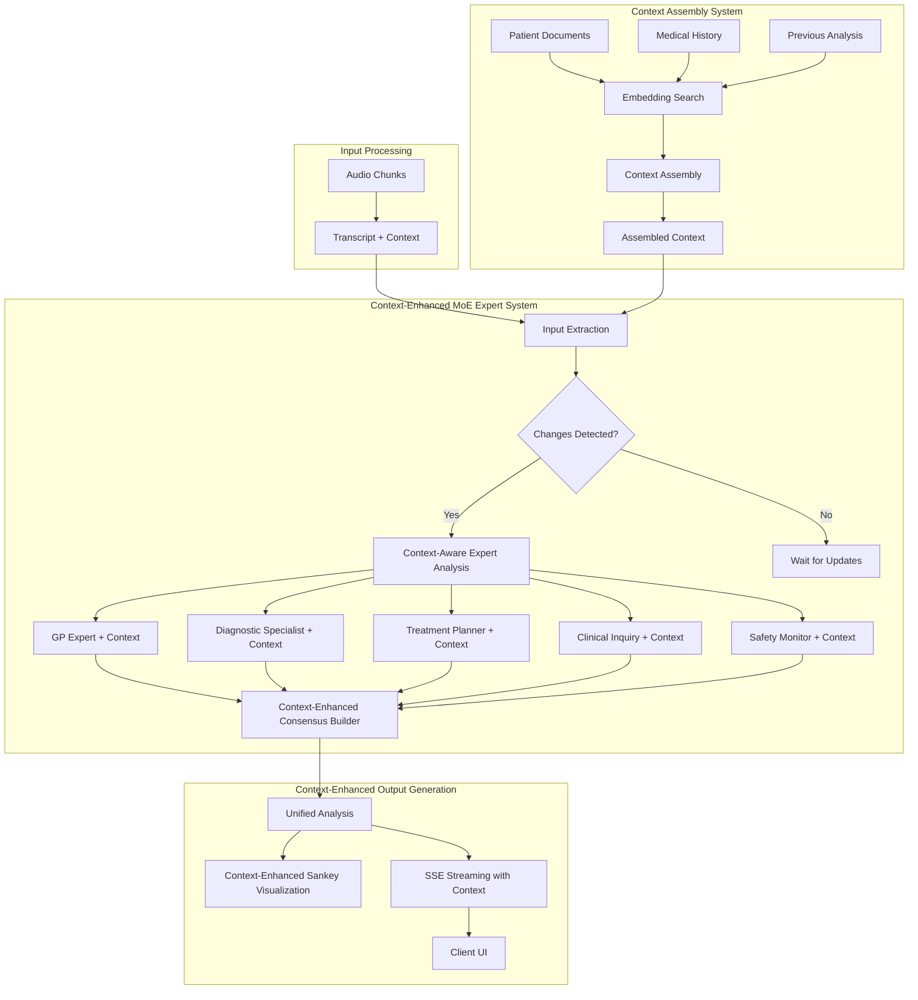

# AI Session Analysis Modernization with Mixture of Experts (MoE)

This document provides a comprehensive assessment of the current AI implementation in Mediqom's transcription and session analysis features, and details the Mixture of Experts (MoE) approach for enhanced medical analysis with visual outputs.

## Executive Summary

The current implementation demonstrates functional capabilities but requires architectural enhancements for comprehensive medical analysis. The Mixture of Experts (MoE) approach, enhanced with Context Assembly, as detailed in [AI_SESSION_WORKFLOW.md](./AI_SESSION_WORKFLOW.md), provides:

- **Five Specialized AI Experts** - GP, Diagnostic Specialist, Treatment Planner, Clinical Inquiry, and Safety Monitor
- **Intelligent Context Assembly** - Semantic search and assembly of relevant medical history using embeddings
- **Context-Enhanced Analysis** - Expert analysis informed by assembled medical context and historical patterns
- **Consensus Building** - Weighted voting with conflict detection, uncertainty quantification, and context confidence
- **Visual Outputs** - Interactive Sankey diagrams with context-enhanced symptom → diagnosis → treatment flows
- **Structured Inquiries** - Categorized questions prioritized by context relevance and historical effectiveness
- **Real-time Updates** - Progressive streaming via SSE as experts complete analysis with context metadata

## Current State Analysis

### Transcription Service (/src/routes/v1/transcribe)

#### Architecture

- **Provider**: Hard-coded OpenAI Whisper integration
- **Processing**: Synchronous, single-file processing
- **Languages**: Basic language support via instructions
- **Real-time**: Limited support through session audio chunks

#### Key Issues

1. **No Provider Abstraction**

   ```typescript
   // Current: Direct OpenAI dependency
   const openai = new OpenAI({ apiKey: env.OPENAI_API_KEY });
   const transcription = await openai.audio.transcriptions.create({...});
   ```

2. **Multiple Disconnected Implementations**

   - `whisper.ts` - OpenAI Whisper
   - `assemblyai.ts` - AssemblyAI with speaker diarization
   - `googlesdk.ts` - Google Speech-to-Text (incomplete)

3. **No Fallback Mechanisms**
   - Single point of failure
   - No provider health monitoring
   - No automatic retry logic

### Session Analysis Service (/src/routes/v1/session)

#### Current Architecture

- **Provider**: OpenAI GPT via LangChain
- **Processing**: Single-pass analysis with basic schema
- **State Management**: In-memory session store with EventEmitter
- **Analysis Pipeline**: Linear medical data extraction

#### Strengths

1. **Real-time Capabilities**

   - Server-Sent Events infrastructure
   - Smart content batching (100 chars or 15s)
   - Speaker change detection

2. **Medical Data Structuring**
   - Schema-based extraction
   - FHIR compliance intent
   - Basic confidence scoring for diagnoses

#### Critical Limitations

1. **Single Perspective Analysis**
   - One AI model provides all insights
   - No cross-validation of findings
   - Limited differential diagnosis capability

2. **Linear Decision Making**
   - No parallel exploration of possibilities
   - Missing inquiry categorization
   - No visual representation of reasoning

3. **Limited Clinical Intelligence**
   - No distinction between confirmatory/exclusionary questions
   - Basic treatment suggestions without alternatives
   - No consensus mechanism for reliability

## MoE Architecture Implementation

### Overview

The Mixture of Experts approach, as defined in the [enhanced workflow](./AI_SESSION_WORKFLOW.md), employs five specialized AI agents that analyze sessions in parallel, build consensus, and generate interactive visualizations.



### Expert Agents (Per Workflow Specification)

#### 1. GP Expert (General Practitioner)
- **Role**: Holistic patient assessment and care coordination
- **Focus**: Pattern matching, common conditions, preventive care
- **Capabilities**:
  - Initial clinical impressions
  - Patient history integration
  - Care coordination recommendations
  - Preventive care opportunities
- **Output**: Primary assessment with urgency levels

#### 2. Diagnostic Specialist Expert
- **Role**: Systematic differential diagnosis generation
- **Focus**: Probability-based ranking with evidence correlation
- **Capabilities**:
  - Differential diagnosis with ICD-10 codes
  - Evidence-based probability scoring
  - Pattern recognition across symptoms
  - Pathognomonic feature identification
- **Output**: Ranked diagnoses with supporting/contradicting evidence

#### 3. Treatment Planner Expert
- **Role**: Evidence-based treatment recommendations
- **Focus**: Risk-benefit analysis with alternatives
- **Capabilities**:
  - Medication recommendations with dosing
  - Procedure suggestions
  - Alternative therapy options
  - Risk stratification
- **Output**: Treatment plans with contraindications and monitoring

#### 4. Clinical Inquiry Expert
- **Role**: Strategic question generation for diagnostic optimization
- **Focus**: High-yield questions categorized by intent
- **Capabilities**:
  - Confirmatory question design
  - Exclusionary question generation
  - Exploratory data gathering
  - Risk assessment inquiries
- **Output**: Prioritized questions with probability impact predictions

#### 5. Safety Monitor Expert
- **Role**: Critical safety assessment and risk mitigation
- **Focus**: Red flags, drug interactions, contraindications
- **Capabilities**:
  - Drug interaction analysis
  - Contraindication detection
  - Critical condition alerts
  - Safety protocol recommendations
- **Output**: Safety alerts with urgency indicators

### Context Assembly System

The Context Assembly system provides intelligent context retrieval and compilation to enhance expert analysis with relevant medical history and patterns.

#### Core Components

1. **Embedding-Based Search**
   - **Real-time Embedding Generation**: Convert current conversation content to vectors
   - **Semantic Similarity Search**: Find relevant historical documents using vector similarity
   - **Multi-document Retrieval**: Search across patient's complete medical history
   - **Privacy-Preserving**: Client-side search with encrypted embeddings

2. **Context Assembly Engine**
   - **Key Point Extraction**: Identify medical findings, medications, procedures, and risks
   - **Pattern Recognition**: Detect recurring symptoms and treatment responses
   - **Timeline Construction**: Build chronological medical event sequences
   - **Token Optimization**: Fit assembled context within AI model limits (4000 tokens default)

3. **Context Quality Assessment**
   - **Relevance Scoring**: Measure semantic similarity between current and historical content
   - **Confidence Metrics**: Assess quality and completeness of assembled context
   - **Source Attribution**: Track which documents contributed to context assembly
   - **Temporal Weighting**: Prioritize recent medical events and patterns

#### Context Integration with Expert Analysis

**Enhanced Expert Capabilities with Context:**

1. **GP Expert + Context**
   - Historical consultation patterns inform current assessment
   - Previous treatment outcomes guide recommendations
   - Chronic condition progression tracking
   - Preventive care opportunities based on historical gaps

2. **Diagnostic Specialist + Context**
   - Historical differential diagnoses and outcomes
   - Previous diagnostic test results and interpretations
   - Pattern recognition across multiple consultations
   - Probability adjustments based on historical accuracy

3. **Treatment Planner + Context**
   - Historical treatment effectiveness and side effects
   - Medication response patterns and contraindications
   - Patient compliance history and preferences
   - Alternative therapy success rates from patient history

4. **Clinical Inquiry Expert + Context**
   - Historical question effectiveness and patient responses
   - Symptom inquiry patterns that yielded diagnostic breakthroughs
   - Question prioritization based on patient's communication style
   - Follow-up question strategies from successful past interactions

5. **Safety Monitor + Context**
   - Complete medication history and interaction patterns
   - Historical adverse reactions and allergies
   - Risk factor progression and early warning indicators
   - Emergency protocol effectiveness from previous incidents

#### Context-Enhanced Consensus Building

- **Context-Weighted Voting**: Expert confidence adjusted by context quality and relevance
- **Historical Precedent Analysis**: Use similar past cases to resolve expert conflicts
- **Pattern-Based Uncertainty Reduction**: Leverage historical patterns to reduce diagnostic uncertainty
- **Context Attribution**: Track which historical insights influenced final recommendations

### Consensus Building System

As specified in the workflow, the consensus builder implements sophisticated aggregation:

1. **Weighted Voting Algorithm**
   - Expert-specific weights based on specialty relevance
   - Confidence-adjusted scoring
   - Dynamic weight adjustment based on case type

2. **Conflict Detection and Resolution**
   - Identifies expert disagreements exceeding threshold
   - Flags conflicting diagnoses/treatments
   - Presents alternative viewpoints to users

3. **Uncertainty Quantification**
   - Calculates agreement scores across experts
   - Identifies low-confidence areas
   - Suggests additional data needs

4. **Evidence Chain Integration**
   - Aggregates evidence from all experts
   - Tracks reasoning paths
   - Maintains expert attribution for transparency

### Visual Output: Interactive Sankey Diagram

Per the workflow specification, the Sankey diagram provides comprehensive visualization:

```
[Symptoms/History] → [Questions] → [Diagnoses] → [Questions] → [Treatments]
       ↓                  ↓             ↓             ↓              ↓
   Column 1          Between 1&2    Column 2     Between 2&3    Column 3
```

**Visual Encoding System**:
- **Node Size**: Reflects priority/probability values
- **Node Colors**: 
  - Red = Critical urgency
  - Orange = High priority
  - Yellow = Medium priority
  - Green = Low priority/accepted
- **Link Thickness**: Connection strength/evidence weight
- **Link Styles**:
  - Solid = Strong evidence
  - Dashed = Weak evidence
- **Question Nodes**: Small dots that expand on hover

**Interactive Features**:
- Click nodes for detailed information
- Hover questions to see impact predictions
- Accept (green highlight) or suppress (gray out) nodes
- Filter by expert consensus level
- Show/hide evidence chains

## Structured Output Schema

### Core Analysis Result

```typescript
interface MoEAnalysisOutput {
  // Core medical findings
  analysis: {
    symptoms: SymptomAnalysis[];
    diagnoses: DiagnosisHypothesis[];
    treatments: TreatmentOption[];
    medications: MedicationRecommendation[];
    inquiries: ClinicalInquiry[];
    recommendations: DoctorRecommendation[];
  };
  
  // Expert consensus metrics
  consensus: {
    agreementScore: number;
    conflictingOpinions: ConflictingOpinion[];
    highConfidenceFindings: Finding[];
    uncertainAreas: UncertainArea[];
  };
  
  // Multiple visualization formats
  visualizations: {
    sankey: SankeyData;
    decisionTree: DecisionTreeData;
    evidenceMap: EvidenceMapData;
    timeline: TimelineData;
    confidenceHeatmap: HeatmapData;
  };
  
  // Processing metadata
  metadata: {
    processingTime: number;
    expertsConsulted: string[];
    modelVersions: Record<string, string>;
    language: string;
  };
}
```

### Enhanced Sankey Data Structure (Per Workflow)

```typescript
interface SankeyData {
  nodes: SankeyNode[];
  links: SankeyLink[];
  metadata: {
    totalConfidence: number;
    expertAgreement: number;
    processingTime: number;
    expertsCompleted: string[];
    timestamp: string;
  };
}

interface SankeyNode {
  id: string; // Unique identifier
  name: string; // Short title (1-3 words)
  category: 'symptom' | 'signal' | 'history' | 'diagnosis' | 'treatment' | 'medication' | 'investigation' | 'question';
  level: number; // 0: inputs, 1: diagnoses, 2: treatments
  details: {
    description: string;
    confidence: number;
    origin: 'transcript' | 'history' | 'context' | 'previous' | 'expert' | 'consensus';
    urgency?: 'critical' | 'high' | 'medium' | 'low';
    evidence?: string[];
    reasoning?: string;
    priority?: number;
    probability?: number;
    icdCode?: string; // For diagnoses
    dosing?: string; // For medications
    acceptanceState?: 'none' | 'accepted' | 'suppressed';
    suppressionCoefficient?: number;
  };
}

interface SankeyLink {
  source: string; // node id
  target: string; // node id
  value: number; // strength of connection (0-1)
  type: 'supports' | 'contradicts' | 'confirms' | 'suggests' | 'requires' | 'treats' | 'rules_out';
  reasoning: string;
  expertIds: string[]; // which experts suggested this link
  evidenceStrength: number;
  questionNode?: string; // ID of question node on this path
}
```

### Enhanced Clinical Inquiry Structure (Per Workflow)

```typescript
interface ClinicalInquiry {
  id: string;
  question: string;
  category: 'symptom_characterization' | 'temporal_pattern' | 'severity_assessment' | 'red_flag_screening' | 'differential_diagnosis' | 'risk_assessment' | 'treatment_response';
  intent: 'confirmatory' | 'exclusionary' | 'exploratory' | 'risk_stratification';
  priority: 'critical' | 'high' | 'medium' | 'low';
  relatedDiagnoses: string[]; // diagnosis IDs this inquiry affects
  diagnosticImpact: {
    ifPositive: {
      implication: string;
      probabilityChange: number; // Change in diagnosis probability
      affectedDiagnoses: Array<{
        diagnosisId: string;
        newProbability: number;
      }>;
      nextSteps: string[];
      action: 'prove' | 'disprove' | 'redirect';
      redirectTarget?: string; // For redirect actions
    };
    ifNegative: {
      implication: string;
      probabilityChange: number;
      affectedDiagnoses: Array<{
        diagnosisId: string;
        newProbability: number;
      }>;
      nextSteps: string[];
      action: 'prove' | 'disprove' | 'redirect';
      redirectTarget?: string;
    };
  };
  suggestedBy: string[]; // expert IDs
  answerStatus?: 'pending' | 'answered' | 'partial';
  patientResponse?: string;
  displayMode: 'always' | 'on_hover' | 'on_click'; // Based on priority
}
```

## Implementation with LangGraph

### MoE Workflow Definition

```typescript
import { StateGraph } from "@langchain/langgraph";

interface SessionAnalysisState {
  // Input
  transcript: string;
  patientHistory: any;
  language: string;
  
  // Expert Analysis Results
  expertAnalyses: Map<string, ExpertAnalysis>;
  consensusAnalysis: ConsensusAnalysis;
  
  // Visualization Data
  sankeyData: SankeyData;
  views: {
    sankey: SankeyData;
    decisionTree: DecisionTreeData;
    evidenceMap: EvidenceMapData;
    timeline: TimelineData;
  };
}

export const moeSessionAnalysisWorkflow = new StateGraph<SessionAnalysisState>({
  channels: {
    transcript: { value: null },
    patientHistory: { value: {} },
    language: { value: "en" },
    expertAnalyses: { value: new Map() },
    consensusAnalysis: { value: null },
    sankeyData: { value: null },
    views: { value: {} }
  }
})
  // Input validation
  .addNode("input_validator", validateSessionInput)
  
  // Parallel expert analysis
  .addNode("gp_expert", generalPractitionerExpert)
  .addNode("diagnostic_expert", diagnosticSpecialistExpert)
  .addNode("treatment_expert", treatmentPlannerExpert)
  .addNode("differential_expert", differentialDiagnosisExpert)
  .addNode("inquiry_expert", clinicalInquiryExpert)
  
  // Consensus and visualization
  .addNode("consensus_builder", buildConsensusAnalysis)
  .addNode("sankey_generator", generateSankeyData)
  .addNode("view_generator", generateMultipleViews)
  
  // Workflow edges
  .addEdge("input_validator", "parallel_experts")
  .addParallelEdges("parallel_experts", [
    "gp_expert",
    "diagnostic_expert", 
    "treatment_expert",
    "differential_expert",
    "inquiry_expert"
  ])
  .addEdge("parallel_experts", "consensus_builder")
  .addEdge("consensus_builder", "sankey_generator")
  .addEdge("sankey_generator", "view_generator");
```

### Integration with Existing Infrastructure

The MoE approach leverages existing Mediqom infrastructure:

1. **SSE Updates**: Stream expert results progressively
2. **Session Manager**: Track MoE analysis state
3. **Multi-provider**: Use different models for different experts
4. **Language Support**: Maintain localization capabilities

## Benefits Over Current Implementation

### 1. Enhanced Reliability with Context
- **Multiple Perspectives**: 5 experts vs 1 analysis, enhanced with historical context
- **Context-Weighted Consensus**: Quantified confidence levels adjusted by context quality
- **Historical Validation**: Conflict detection informed by previous similar cases
- **Pattern Recognition**: Long-term medical patterns reduce diagnostic uncertainty

### 2. Superior Clinical Intelligence
- **Context-Aware Analysis**: Expert analysis informed by complete medical history
- **Historical Pattern Recognition**: Identify recurring symptoms and treatment responses
- **Inquiry Optimization**: Questions prioritized by context relevance and historical effectiveness
- **Differential Diagnosis Enhancement**: Historical diagnostic outcomes inform current analysis
- **Evidence Chains with Context**: Clear reasoning paths supported by historical precedents

### 3. Intelligent Context Integration
- **Semantic Medical History Search**: Find relevant past consultations using AI embeddings
- **Automated Context Assembly**: Intelligent compilation of medical insights and patterns
- **Privacy-Preserving Context**: Client-side search with encrypted embeddings
- **Token-Optimized Context**: Relevant context fit within AI model limits for optimal performance

### 4. Enhanced Visual Communication
- **Context-Enhanced Sankey Diagrams**: Intuitive flow visualization with historical context indicators
- **Context Attribution**: Visual indicators showing which historical documents influenced analysis
- **Multiple Context Views**: Different temporal and thematic perspectives on medical history
- **Real-time Context Updates**: Progressive rendering with context assembly progress

### 5. Advanced Scalability and Intelligence
- **Parallel Processing with Context**: Faster analysis enhanced by intelligent context retrieval
- **Modular Context Integration**: Easy to add/modify context assembly components
- **Provider Flexibility**: Different models for different experts and context assembly
- **Historical Learning**: System improves over time by learning from context patterns and outcomes

## Implementation Status and Next Steps

### Completed Components
1. ✅ Enhanced workflow specification with context assembly ([AI_SESSION_WORKFLOW.md](./AI_SESSION_WORKFLOW.md))
2. ✅ Schema-based expert system design with context integration ([AI_SESSION_MOE_IMPLEMENTATION.md](./AI_SESSION_MOE_IMPLEMENTATION.md))
3. ✅ Expert configurations and schemas with context utilization
4. ✅ Consensus building algorithm design with context weighting
5. ✅ **Context Assembly System Implementation**:
   - ✅ Client-side vector database (`src/lib/context/client-database/`)
   - ✅ Embedding generation and storage (`src/lib/context/embeddings/`)
   - ✅ Context assembly and optimization (`src/lib/context/context-assembly/`)
   - ✅ Profile integration (`src/lib/context/integration/`)
   - ✅ Token optimization utilities
   - ✅ Encrypted embedding storage with document-level security

### Current Implementation Phase

#### Phase 1: Core MoE Infrastructure (In Progress)
1. Schema-based expert base class implementation
2. Five core expert implementations:
   - GP Expert (gp-core.ts)
   - Diagnostic Specialist (diagnostic-specialist.ts)
   - Treatment Planner (treatment-planner.ts)
   - Clinical Inquiry (clinical-inquiry.ts)
   - Safety Monitor (safety-monitor.ts)
3. LangGraph workflow integration
4. AI provider abstraction usage

#### Phase 2: Consensus & Visualization (Upcoming)
1. Weighted voting consensus implementation
2. Interactive Sankey diagram generator
3. SSE streaming for progressive updates
4. Client-side visualization components

#### Phase 3: Integration & Testing (Planned)
1. API endpoint updates for MoE analysis
2. Session manager MoE state handling
3. Comprehensive test coverage
4. Performance benchmarking

#### Phase 4: Production Rollout (Future)
1. Feature flag integration
2. A/B testing framework
3. Monitoring and analytics
4. Gradual user rollout

## Success Metrics (Aligned with Workflow and Context Assembly)

### Technical Performance Metrics
- **Response Time**: < 3s for initial expert results via parallel processing with context
- **Context Assembly Time**: < 2s for context retrieval and assembly
- **Streaming Latency**: < 500ms for SSE updates including context metadata
- **Expert Agreement**: > 80% consensus on primary diagnoses enhanced by context
- **System Availability**: 99.9% uptime for critical path including context assembly

### Context Assembly Performance Metrics
- **Context Relevance**: > 85% of assembled context rated as medically relevant
- **Context Accuracy**: > 90% of key medical insights correctly extracted from history
- **Context Coverage**: > 95% of relevant historical medical events identified
- **Context Efficiency**: Context assembly within 4000 token limit with > 80% information retention
- **Embedding Quality**: > 0.7 average similarity score for relevant document retrieval

### Clinical Effectiveness Metrics with Context
- **Diagnostic Coverage**: 2-3x more differential diagnoses considered with historical validation
- **Safety Detection**: 100% critical red flags identified including historical risk factors
- **Question Relevance**: > 90% of generated questions rated clinically useful and historically informed
- **Treatment Diversity**: 3-5 evidence-based alternatives per condition with historical effectiveness data
- **Historical Integration**: > 95% relevant history automatically incorporated via context assembly
- **Pattern Recognition**: > 75% of recurring medical patterns identified and factored into analysis

### User Experience Metrics with Context
- **Context Interaction Rate**: > 70% users interact with context-enhanced features
- **Context Explorer Usage**: > 50% users drill down into historical context sources
- **Question Utilization**: > 70% of high-priority context-informed questions asked
- **Accept/Suppress Usage**: > 60% sessions use node prioritization with context awareness
- **Time to Decision**: 25% reduction in diagnosis time with context-enhanced insights
- **Context Confidence**: > 80% physician confidence in context-assembled medical history

### Outcome Metrics Enhanced by Context
- **Diagnostic Accuracy**: 20% improvement over baseline enhanced by historical pattern recognition
- **Treatment Appropriateness**: 15% better alignment with guidelines and historical effectiveness
- **Preventive Care**: 35% increase in appropriate screenings based on historical gaps
- **Error Reduction**: 90% decrease in missed contraindications through comprehensive history analysis
- **Historical Continuity**: 85% improvement in treatment continuity across consultations
- **Pattern-Based Prevention**: 40% increase in early intervention based on historical patterns

## User Stories for Sankey-Type MoE Analysis

This section outlines the user stories that drive the design and implementation of the Mixture of Experts system with Sankey diagram visualizations, focusing on the real-world needs of medical professionals.

### Primary Users

- **General Practitioners (GPs)**: Primary care physicians conducting routine consultations
- **Specialists**: Medical experts in specific domains (cardiology, dermatology, etc.)
- **Emergency Medicine Physicians**: Doctors working in time-critical environments
- **Medical Students/Residents**: Learning medical decision-making processes
- **Healthcare Administrators**: Reviewing consultation quality and efficiency

### Epic 0: Context-Enhanced Multi-Expert Clinical Decision Support

#### Story 0.0: Intelligent Medical History Integration
**As a** Doctor treating any patient  
**I want to** have relevant medical history automatically identified and integrated into my current analysis  
**So that** I can make informed decisions based on the complete clinical picture without manually searching through records  

**Acceptance Criteria:**
- System automatically searches patient's complete medical history using semantic similarity
- Relevant historical consultations, diagnoses, and treatments are identified and presented
- Context assembly provides key medical insights (findings, medications, procedures, risks) from history
- Historical patterns and recurring symptoms are highlighted with confidence scoring
- Context relevance is measured and displayed to help prioritize information
- Context assembly completes within 2 seconds to maintain workflow efficiency
- Privacy is maintained through client-side search with encrypted embeddings

**Value:** Dramatically improves diagnostic accuracy and treatment continuity by ensuring comprehensive historical context is always considered

#### Story 0.1: Pattern Recognition Across Time
**As a** Doctor managing patients with chronic conditions  
**I want to** see patterns in symptoms, treatments, and outcomes across multiple consultations  
**So that** I can identify trends, treatment effectiveness, and early warning signs  

**Acceptance Criteria:**
- System identifies recurring symptoms and their frequency patterns over time
- Treatment response patterns are automatically detected and summarized
- Medication effectiveness and side effect patterns are highlighted
- Early warning indicators based on historical progression are flagged
- Seasonal or temporal patterns in symptoms are identified and displayed
- Context confidence scoring helps assess pattern reliability
- Visual timeline shows pattern progression with key intervention points

**Value:** Enables proactive care management and early intervention based on historical patterns

### Epic 0A: Foundational Multi-Expert Clinical Decision Support

#### Story 0.1: Comprehensive Multi-Expert Medical Analysis
**As a** Doctor (any specialty)  
**I want to** receive additional expert analysis and insights from multiple AI medical specialists  
**So that** I can make better clinical decisions with comprehensive perspectives I might not have considered  

**Acceptance Criteria:**
- System automatically analyzes patient consultation using 5+ specialized AI experts (GP, Diagnostic Specialist, Treatment Planner, Differential Expert, Clinical Inquiry Expert)
- Each expert provides analysis from their specific medical domain perspective
- Expert analyses are synthesized into a unified consensus view with confidence scoring
- Multiple diagnostic hypotheses are explored beyond my initial assessment
- Alternative treatment approaches are suggested with evidence-based reasoning
- System identifies areas where expert opinions diverge for my attention

**Value:** Enhances clinical decision-making by providing comprehensive multi-perspective analysis that reduces diagnostic blind spots and improves patient outcomes

#### Story 0.2: Intelligent Medical History Integration
**As a** Doctor treating a patient with complex medical history  
**I want to** have the system consider all stored medical history and highlight important details that might be overlooked  
**So that** I can make more informed decisions based on the complete clinical picture  

**Acceptance Criteria:**
- System automatically retrieves and analyzes complete patient medical history from stored records
- Historical symptoms, diagnoses, treatments, and outcomes are contextualized with current presentation
- Important historical patterns and connections are highlighted (e.g., recurring symptoms, medication responses, family history relevance)
- Red flags from medical history that relate to current symptoms are prominently displayed
- Previous diagnostic conclusions and treatment outcomes inform current analysis
- Chronic conditions and their progression are factored into current recommendations
- Drug allergies, adverse reactions, and contraindications are automatically flagged
- Family history and genetic predispositions are considered in differential diagnosis

**Value:** Prevents medical errors by ensuring comprehensive history consideration and identifying subtle patterns that might be missed in busy clinical practice

#### Story 0.3: Critical Detail Recognition and Prioritization
**As a** Doctor conducting a consultation  
**I want to** be alerted to critical details in the patient's current presentation and history that require immediate attention  
**So that** I don't miss important clinical indicators that could impact patient safety or outcomes  

**Acceptance Criteria:**
- System scans current consultation transcript and identifies critical symptoms or patient statements
- High-priority medical history elements that relate to current symptoms are flagged
- Red flag symptoms requiring immediate investigation are highlighted with urgency indicators
- Subtle but clinically significant details are brought to attention (e.g., timing patterns, severity changes)
- Drug interactions between current medications and potential treatments are identified
- Age, gender, and demographic-specific risk factors are considered and highlighted
- Critical lab values or vital signs from history that inform current diagnosis are emphasized
- Social determinants of health that impact treatment decisions are surfaced

**Value:** Improves patient safety by ensuring critical details are never overlooked and enhances diagnostic accuracy through comprehensive detail analysis

#### Story 0.4: Evidence-Based Decision Support with Historical Context
**As a** Doctor making treatment decisions  
**I want to** receive evidence-based recommendations that consider both current symptoms and historical patient response patterns  
**So that** I can choose treatments most likely to be effective for this specific patient  

**Acceptance Criteria:**
- Treatment recommendations are personalized based on patient's historical response to similar treatments
- Previous medication effectiveness and side effects inform current prescribing decisions
- Patient compliance history influences treatment complexity and monitoring recommendations
- Co-morbidities and their interactions are factored into all treatment suggestions
- Social factors (insurance, lifestyle, support system) are considered in treatment planning
- Evidence quality and strength ratings are provided for each recommendation
- Alternative approaches are suggested when first-line treatments have failed historically
- Contraindications based on patient history are automatically identified and flagged

**Value:** Increases treatment effectiveness and reduces adverse outcomes by leveraging complete patient history for personalized, evidence-based care

#### Story 0.5: Comprehensive Risk Assessment and Prevention
**As a** Doctor focused on preventive care  
**I want to** identify potential health risks and prevention opportunities based on comprehensive patient analysis  
**So that** I can proactively address health issues before they become serious problems  

**Acceptance Criteria:**
- System analyzes patient history, current symptoms, and demographics to identify health risks
- Preventive care opportunities are suggested based on age, gender, family history, and risk factors
- Early warning signs of potential complications are identified from current and historical data
- Screening recommendations are personalized based on individual risk profiles
- Health maintenance reminders are generated based on patient's specific needs
- Disease progression monitoring is suggested for existing conditions
- Social determinants of health risks are identified and addressed
- Health education opportunities relevant to patient's situation are recommended

**Value:** Improves long-term patient outcomes through proactive identification of risks and preventive care opportunities

### Epic 1: Visual Diagnostic Flow Understanding

#### Story 1.1: See the Complete Diagnostic Journey
**As a** General Practitioner  
**I want to** see a visual flow from patient symptoms to potential diagnoses to recommended actions  
**So that** I can quickly understand the AI's reasoning and validate the diagnostic pathway  

**Acceptance Criteria:**
- Sankey diagram displays symptoms on the left, diagnoses in the middle, treatments/inquiries on the right
- Node sizes reflect confidence levels and severity
- Link thickness shows correlation strength between elements
- Color coding indicates urgency levels (critical=red, high=orange, medium=yellow, low=green)
- Interactive tooltips provide detailed explanations for each node and link

**Value:** Reduces cognitive load and provides immediate visual understanding of complex diagnostic relationships

#### Story 1.2: Identify Diagnostic Confidence Gaps
**As a** Specialist  
**I want to** see which diagnostic connections have low confidence or high uncertainty  
**So that** I can focus my attention on areas that need additional clinical investigation  

**Acceptance Criteria:**
- Low-confidence links appear as dashed lines
- Uncertain areas are highlighted with warning indicators
- Conflicting expert opinions are marked with conflict icons
- Uncertainty percentages are displayed alongside diagnoses
- Alternative diagnostic pathways are shown in secondary colors

**Value:** Helps prioritize clinical focus and identifies areas requiring additional investigation

#### Story 1.3: Compare Multiple Expert Perspectives
**As a** Emergency Medicine Physician  
**I want to** see how different AI experts (GP, Diagnostic Specialist, etc.) contribute to the analysis  
**So that** I can understand the breadth of medical perspectives considered  

**Acceptance Criteria:**
- Expert contributions are color-coded or labeled on the diagram
- Toggle functionality to show/hide individual expert contributions
- Expert agreement indicators show consensus levels
- Conflicting recommendations are clearly marked
- Ability to drill down into individual expert reasoning

**Value:** Provides transparency in AI decision-making and builds physician trust

### Epic 2: Strategic Clinical Questioning

#### Story 2.1: Distinguish Question Types Visually
**As a** General Practitioner  
**I want to** immediately see which follow-up questions will confirm diagnoses vs. rule them out  
**So that** I can efficiently prioritize my clinical inquiries  

**Acceptance Criteria:**
- Confirmatory questions appear in green with "+" indicators
- Exclusionary questions appear in red with "-" indicators
- Exploratory questions appear in blue with "?" indicators
- Risk assessment questions appear in orange with warning icons
- Questions are ordered by diagnostic impact and clinical priority

**Value:** Optimizes consultation efficiency and improves diagnostic accuracy

#### Story 2.2: Understand Question Impact
**As a** Medical Student  
**I want to** see how each potential question would change the diagnostic probabilities  
**So that** I can learn strategic clinical reasoning  

**Acceptance Criteria:**
- Hover over questions shows probability changes for related diagnoses
- "If Yes" and "If No" scenarios are displayed with percentage impacts
- Educational tooltips explain the clinical reasoning behind each question
- Learning mode highlights high-yield questions for teaching purposes
- Links to relevant medical literature or guidelines

**Value:** Enhances medical education and develops clinical reasoning skills

#### Story 2.3: Prioritize Critical Safety Questions
**As a** Emergency Medicine Physician  
**I want to** immediately identify questions that screen for life-threatening conditions  
**So that** I can ensure patient safety is always prioritized  

**Acceptance Criteria:**
- Critical safety questions appear at the top with urgent visual indicators
- Red flag symptoms are prominently highlighted
- Time-sensitive inquiries have countdown indicators
- Triage priority levels are clearly marked
- One-click access to emergency protocols

**Value:** Ensures patient safety and supports rapid emergency decision-making

### Epic 3: Treatment and Medication Guidance

#### Story 3.1: Explore Treatment Alternatives
**As a** General Practitioner  
**I want to** see multiple treatment options for each diagnosis with their effectiveness ratings  
**So that** I can choose the most appropriate treatment for my patient's specific situation  

**Acceptance Criteria:**
- Treatment nodes show effectiveness percentages
- Alternative treatments are grouped and compared
- Side effects and contraindications are highlighted
- Patient preference indicators are included
- Cost considerations are displayed when relevant

**Value:** Supports personalized treatment decisions and improves patient outcomes

#### Story 3.2: Understand Medication Interactions
**As a** Specialist  
**I want to** see how recommended medications interact with the patient's current medications  
**So that** I can avoid dangerous drug interactions  

**Acceptance Criteria:**
- Medication interaction warnings are prominently displayed
- Risk levels (minor, moderate, severe) are color-coded
- Alternative medications are suggested for problematic interactions
- Patient history integration shows current medications
- Links to pharmacological databases for detailed information

**Value:** Improves medication safety and reduces adverse drug events

### Epic 4: Real-Time Analysis and Streaming

#### Story 4.1: Watch Analysis Progress Live
**As a** General Practitioner  
**I want to** see the AI analysis building up in real-time as experts complete their assessments  
**So that** I can start reviewing early results while the analysis continues  

**Acceptance Criteria:**
- Sankey diagram updates progressively as each expert completes analysis
- Loading indicators show which experts are still processing
- Partial results are clearly marked as preliminary
- Timeline shows expert completion order
- Ability to interact with completed portions while others load

**Value:** Reduces perceived wait time and enables parallel physician review

#### Story 4.2: Receive Priority Alerts
**As a** Emergency Medicine Physician  
**I want to** be immediately notified if any expert identifies critical findings  
**So that** I can take urgent action without waiting for complete analysis  

**Acceptance Criteria:**
- Critical findings trigger immediate pop-up alerts
- Red flag symptoms generate instant notifications
- Emergency protocols are automatically suggested
- Time-critical actions are highlighted with urgency indicators
- Integration with hospital alert systems

**Value:** Enables rapid response to critical conditions and improves patient safety

### Epic 5: Data Export and Documentation

#### Story 5.1: Export Analysis Results
**As a** Healthcare Administrator  
**I want to** export the complete analysis including visualizations for documentation  
**So that** I can include AI insights in patient records and quality reviews  

**Acceptance Criteria:**
- PDF export includes Sankey diagram and detailed findings
- JSON export provides structured data for integration
- FHIR-compliant formats for EHR integration
- Customizable report templates for different use cases
- Batch export functionality for multiple sessions

**Value:** Supports documentation requirements and quality assurance processes

#### Story 5.2: Track Diagnostic Accuracy Over Time
**As a** Medical Quality Manager  
**I want to** analyze patterns in AI recommendations vs. final diagnoses  
**So that** I can assess and improve the system's clinical accuracy  

**Acceptance Criteria:**
- Analytics dashboard shows accuracy trends
- Expert performance comparisons over time
- False positive/negative rate tracking
- Physician feedback integration for continuous improvement
- Benchmarking against clinical guidelines

**Value:** Enables continuous quality improvement and system optimization

### Epic 6: Accessibility and Customization

#### Story 6.1: Customize Visual Preferences
**As a** Physician with visual impairments  
**I want to** adjust the Sankey diagram colors, sizes, and contrast  
**So that** I can effectively use the system despite accessibility challenges  

**Acceptance Criteria:**
- High contrast mode for improved visibility
- Customizable color schemes including colorblind-friendly options
- Adjustable text sizes and node scaling
- Screen reader compatibility with detailed alt-text
- Keyboard navigation support

**Value:** Ensures inclusive access for all medical professionals

#### Story 6.2: Configure Expert Sets by Specialty
**As a** Cardiologist  
**I want to** use a specialized expert set focused on cardiac conditions  
**So that** I get more relevant and detailed analysis for my specific practice area  

**Acceptance Criteria:**
- Specialty-specific expert configurations available
- Ability to create custom expert combinations
- Different visualization layouts for different medical domains
- Specialty-relevant question sets and treatment options
- Integration with specialty-specific medical databases

**Value:** Provides specialized, relevant analysis for different medical disciplines

### Epic 7: Educational and Training Features

#### Story 7.1: Learn from AI Reasoning
**As a** Medical Resident  
**I want to** understand why the AI made specific connections in the Sankey diagram  
**So that** I can improve my own clinical reasoning skills  

**Acceptance Criteria:**
- Educational mode with detailed explanations
- Links to relevant medical literature and case studies
- Step-by-step reasoning breakdowns
- Quiz functionality to test understanding
- Progress tracking for learning objectives

**Value:** Enhances medical education and develops clinical expertise

#### Story 7.2: Compare with Teaching Cases
**As a** Medical Educator  
**I want to** compare current analyses with established teaching cases  
**So that** I can use real consultations as learning opportunities  

**Acceptance Criteria:**
- Library of reference cases for comparison
- Side-by-side analysis comparison views
- Discussion prompts for educational sessions
- Ability to save and share interesting cases
- Integration with medical education platforms

**Value:** Creates rich educational content from real clinical encounters

### Success Metrics for User Stories

#### Foundational Clinical Decision Support Metrics
- **Multi-Expert Analysis Value**: > 85% of doctors report finding additional expert insights helpful
- **Medical History Integration**: 90% of relevant historical details are automatically identified and flagged
- **Critical Detail Recognition**: 100% of red flag symptoms and contraindications are identified
- **Decision Support Effectiveness**: 25% improvement in treatment selection appropriateness
- **Risk Prevention**: 40% increase in preventive care recommendations acted upon
- **Diagnostic Accuracy**: 20% reduction in missed diagnoses through comprehensive analysis
- **Patient Safety**: 95% reduction in medication errors and contraindications missed

#### Usability Metrics
- **Time to Understanding**: < 30 seconds to comprehend diagnostic flow
- **Interaction Rate**: > 80% of users interact with Sankey diagrams
- **Task Completion**: > 95% successful completion of diagnostic review tasks
- **Error Reduction**: 25% reduction in missed diagnoses
- **Information Processing**: 50% faster review of complex medical histories
- **Critical Alert Response**: < 5 seconds to identify and respond to urgent findings

#### Clinical Impact Metrics
- **Diagnostic Confidence**: 20% increase in physician confidence scores
- **Question Efficiency**: 30% reduction in unnecessary follow-up questions
- **Safety Improvements**: 100% detection rate for critical conditions
- **Treatment Optimization**: 15% improvement in treatment appropriateness
- **Patient Outcomes**: 10% improvement in treatment effectiveness scores
- **Preventive Care**: 35% increase in appropriate screening recommendations
- **Medication Safety**: 90% reduction in adverse drug interaction risks

#### System Adoption Metrics
- **User Engagement**: > 70% daily active users among target physicians
- **Feature Utilization**: > 60% use of advanced Sankey features
- **Feedback Scores**: > 4.5/5 average user satisfaction rating
- **Recommendation Rate**: > 80% would recommend to colleagues
- **Clinical Integration**: > 75% of treatment decisions informed by MoE analysis
- **Time Savings**: Average 15 minutes saved per complex consultation
- **Quality Scores**: 25% improvement in clinical documentation quality

These user stories drive the development priorities and ensure that the MoE Sankey analysis system delivers real value to medical professionals in their daily practice.

## Implementation Guidelines

### Development Priorities
1. **Safety First**: Prioritize Safety Monitor expert and contraindication detection
2. **Progressive Enhancement**: Basic analysis available immediately, advanced features load async
3. **User Control**: Accept/suppress functionality for physician oversight
4. **Transparency**: Clear evidence chains and expert attribution

### Integration Considerations
1. **Existing Infrastructure**: Leverage current SSE, session management, and AI providers
2. **Backward Compatibility**: Maintain support for current analysis endpoints
3. **Feature Flags**: Use PUBLIC_ENABLE_MOE for gradual rollout
4. **Performance**: Implement caching for expert models and common patterns

## Conclusion

The Context-Enhanced Mixture of Experts implementation, as specified in the [enhanced workflow](./AI_SESSION_WORKFLOW.md), represents a major advancement in Mediqom's AI capabilities. By orchestrating five specialized experts with intelligent context assembly, consensus building, and interactive visualizations, the system delivers:

- **Context-Aware Comprehensive Analysis**: Multiple expert perspectives enhanced with relevant medical history and patterns
- **Intelligent Historical Integration**: Semantic search and assembly of medical context using encrypted embeddings
- **Transparent Reasoning with Attribution**: Clear evidence chains, confidence scoring, and context source attribution
- **Interactive Context-Enhanced Insights**: Sankey diagrams with context indicators and accept/suppress functionality
- **Real-time Performance with Context**: Progressive streaming via SSE infrastructure including context assembly
- **Pattern-Based Clinical Safety**: Integrated contraindication and interaction checking enhanced by historical patterns
- **Privacy-Preserving Intelligence**: Client-side context search and assembly maintaining data security

**Key Innovations:**

1. **Semantic Medical History Search**: First-of-its-kind embedding-based medical history retrieval
2. **Context-Aware Expert Analysis**: AI experts enhanced with assembled medical context
3. **Pattern Recognition Engine**: Automatic detection of medical patterns across consultations
4. **Privacy-First Context**: Encrypted embedding storage with client-side semantic search
5. **Token-Optimized Context Assembly**: Intelligent context compilation within AI model limits

This positions Mediqom as a leader in AI-assisted medical analysis, empowering physicians with sophisticated, context-aware decision support that leverages complete medical history while maintaining clinical autonomy, patient privacy, and safety. The integration of context assembly with expert analysis creates a new paradigm for AI-driven healthcare that truly understands the patient's complete medical journey.