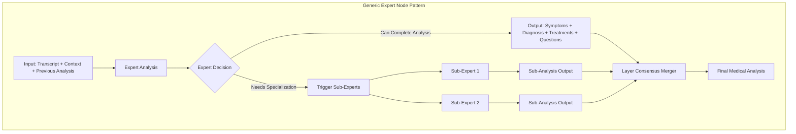
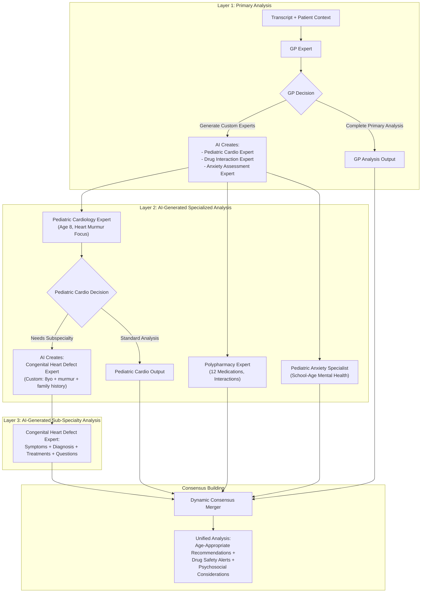

# AI Session DAG - Universal Multi-Expert Medical Analysis Framework

This document defines the Universal DAG (Directed Acyclic Graph) configuration framework for multi-layer medical expert analysis, with dynamic expert selection, hierarchical consensus building, and conflict-aware output generation.

## Overview

The AI Session DAG provides a universal framework for orchestrating multiple medical AI experts in a hierarchical, dynamically expanding structure. Any expert can either provide complete medical analysis (Symptoms, Diagnosis, Treatments, Questions) or trigger additional specialized experts for deeper analysis.

## Architecture Principles

1. **AI-by-AI Expert Generation**: Primary Analyzer uses AI logic to dynamically create specialized expert nodes via MCP tools
2. **Universal Statistical Output**: All nodes produce standardized statistical output for mathematical consensus building
3. **MCP Tool Integration**: Expert creation handled through Model Context Protocol tools with custom prompts and filtered context
4. **Dynamic DAG Structure**: Runtime DAG modification based on AI decisions, not predetermined flows
5. **Statistical Consensus Building**: Mathematical aggregation of expert outputs using probability weighting and confidence scores
6. **No Templates or Registries**: Purely AI-driven expert creation decisions based on case complexity

## DAG Architecture

### Universal Multi-Layer DAG Pattern



### Enhanced Example: AI-Generated Expert Analysis DAG



### Expert Node Categories

| Category | Expert Types | Triggering Logic | Output Format |
|----------|-------------|------------------|---------------|
| **Primary Analyzers** | GP, Initial Assessment, Symptom Analyzer | Always Active | Symptoms + Initial Diagnosis + Custom Expert Instructions |
| **Pre-Configured Specialists** | Cardiology, Neurology, Emergency | Symptom/Context-Based Dynamic Triggering | Specialized Analysis + Sub-Expert Triggers |
| **AI-Generated Specialists** | Custom experts created by AI analysis | AI Decision-Based Dynamic Creation | Patient-Specific Specialized Analysis |
| **AI-Generated Sub-Specialists** | Custom sub-experts for complex cases | Created by AI Specialists when needed | Highly Targeted Analysis |
| **Functional Experts** | Safety Monitor, Drug Interaction, Risk Assessor | Always Active or AI-Triggered | Warnings + Contraindications + Safety Questions |
| **Dynamic Consensus Mergers** | Layer Merger, Final Merger | After AI-Generated Expert Groups Complete | Unified Analysis + Conflict Resolution |

### AI-Generated Expert Examples

| Patient Context | AI-Generated Expert | Custom Prompt | Focus Areas |
|----------------|-------------------|---------------|-------------|
| 85yo, 12 medications, dizziness | "Geriatric Polypharmacy Expert" | "You are a geriatrician specializing in medication management for elderly patients with complex drug regimens" | Drug interactions, fall risk, cognitive effects |
| 6mo infant, seizures, fever | "Pediatric Emergency Neurologist" | "You are a pediatric neurologist specializing in infant seizure disorders and febrile seizures" | Infantile spasms, febrile seizures, developmental impact |
| 28yo pregnant, palpitations | "Maternal Cardiology Specialist" | "You are an obstetrician-cardiologist specializing in cardiac conditions during pregnancy" | Pregnancy-safe treatments, fetal impact, postpartum care |
| 45yo diabetic, chest pain | "Diabetic Cardiology Expert" | "You are a cardiologist with expertise in diabetic cardiovascular complications" | Silent MI risk, diabetic cardiomyopathy, medication interactions |

### Universal Expert Interface

Every expert node, regardless of category, follows this interface:

```typescript
interface UniversalExpertNode {
  // Input Interface
  inputs: {
    transcript: string;
    patientContext: PatientContext;
    previousAnalysis?: MedicalAnalysis;
    triggerConditions?: string[];
  };
  
  // Decision Logic - Enhanced for AI-Generated Experts
  decision: 'complete_analysis' | 'trigger_sub_experts' | 'generate_custom_experts';
  
  // Output Interface (when complete_analysis)
  outputs?: {
    symptoms: SymptomNode[];
    diagnoses: DiagnosisNode[];
    treatments: TreatmentNode[];
    questions: QuestionNode[];
    confidence: number;
    reasoning: string;
  };
  
  // Sub-Expert Triggering (when trigger_sub_experts) - Pre-configured experts
  triggers?: {
    subExperts: string[];  // Pre-defined expert types: 'cardiology', 'neurology'
    triggerConditions: string[];
    enrichedContext: any;
  };
  
  // AI-Generated Expert Creation (when generate_custom_experts)
  customExperts?: {
    experts: CustomExpertDefinition[];
    reasoning: string;
    parallelExecution: boolean;
  };
}

// NEW: AI-Generated Expert Definition
interface CustomExpertDefinition {
  id: string;                    // Generated unique ID: 'pediatric_cardio_expert_001'
  name: string;                  // Human-readable: 'Pediatric Cardiology Expert'
  expertPrompt: string;          // Custom AI prompt: 'You are a pediatric cardiologist specializing in...'
  specialization: string;        // Domain: 'pediatric_cardiology', 'geriatric_pharmacology'
  focusAreas: string[];          // ['congenital_heart_defects', 'pediatric_arrhythmia']
  contextInstructions: string;   // 'Focus on age-appropriate assessment for 8-year-old patient'
  patientSpecificContext: any;   // Filtered patient data relevant to this expert
  priority: 'low' | 'medium' | 'high' | 'critical';
  expectedOutputs: string[];     // ['risk_assessment', 'treatment_recommendations', 'follow_up_questions']
  parentExpert: string;          // Which expert created this one
  creationReasoning: string;     // Why this expert was deemed necessary
}
```

## Configuration Structure

### Universal DAG Configuration (models.yaml)

The universal DAG framework is configured in the `universal_dag_models` section of `models.yaml`:

```yaml
# models.yaml - Universal DAG Configuration Framework
universal_dag_models:
  # Define reusable expert node templates
  expert_templates:
    quorum_manager:
      type: "primary"
      execution: "always_active"
      outputs: ["symptoms", "diagnoses", "trigger_conditions"]
      decision_logic: "complexity_threshold_check"
      
    specialist_expert:
      type: "specialist" 
      execution: "trigger_based"
      outputs: ["symptoms", "diagnoses", "treatments", "questions"]
      decision_logic: "specialization_depth_check"
      
    functional_expert:
      type: "functional"
      execution: "conditional"
      outputs: ["alerts", "contraindications", "safety_questions"]
      decision_logic: "safety_completeness_check"
      
    consensus_merger:
      type: "merger"
      execution: "after_layer_complete"
      outputs: ["unified_analysis", "conflict_alerts"]
      logic: "weighted_consensus_building"

  # Concrete DAG Model Examples
  dag_models:
    chest_pain_assessment:
      id: "chest_pain_dag_v1"
      description: "Multi-layer chest pain differential diagnosis"
      
      # Layer 1: Primary Analysis
      primary_layer:
        gp_expert:
          template: "quorum_manager"
          provider: "openai"
          model: "gpt4"
          triggers:
            cardiology: ["chest_pain", "shortness_of_breath", "palpitations"]
            pulmonology: ["cough", "chest_tightness", "breathing_difficulty"] 
            emergency: ["severe_chest_pain", "crushing_pain", "radiation_to_arm"]
          complexity_threshold: 0.7
          
      # Layer 2: Specialist Analysis  
      specialist_layer:
        cardiology_expert:
          template: "specialist_expert"
          provider: "openai"
          model: "gpt4"
          parent: "gp_expert"
          trigger_conditions: ["cardiology"]
          sub_expert_triggers:
            electrophysiology: ["arrhythmia", "palpitations", "syncope"]
            heart_failure: ["shortness_of_breath", "edema", "fatigue"]
            interventional: ["st_elevation", "acute_mi", "unstable_angina"]
          specialization_threshold: 0.8
          
        pulmonology_expert:
          template: "specialist_expert" 
          provider: "openai"
          model: "gpt4"
          parent: "gp_expert"
          trigger_conditions: ["pulmonology"]
          sub_expert_triggers: {}
          
        emergency_expert:
          template: "specialist_expert"
          provider: "openai" 
          model: "gpt4"
          parent: "gp_expert"
          trigger_conditions: ["emergency"]
          priority: "critical"
          
      # Layer 3: Sub-Specialist Analysis
      sub_specialist_layer:
        electrophysiology_expert:
          template: "specialist_expert"
          provider: "openai"
          model: "gpt4"
          parent: "cardiology_expert"
          trigger_conditions: ["electrophysiology"]
          
        heart_failure_expert:
          template: "specialist_expert"
          provider: "openai"
          model: "gpt4" 
          parent: "cardiology_expert"
          trigger_conditions: ["heart_failure"]
          
      # Always Active Functional Experts
      functional_layer:
        safety_monitor:
          template: "functional_expert"
          provider: "openai"
          model: "gpt4"
          execution: "always_active"
          priority: "critical"
          
      # Consensus Building
      consensus_layer:
        layer_merger:
          template: "consensus_merger"
          provider: "openai"
          model: "gpt4_turbo"
          inputs: ["all_specialist_outputs", "all_functional_outputs"]
          weight_calculation:
            specialty_relevance: 0.4
            confidence_score: 0.3
            evidence_quality: 0.3
          consensus_threshold: 0.75
          conflict_threshold: 0.4

  # Dynamic Behavior Configuration
  behavior_rules:
    triggering_logic:
      symptom_mapping:
        chest_pain: ["cardiology", "emergency", "pulmonology"]
        headache: ["neurology", "emergency"] 
        abdominal_pain: ["gastroenterology", "surgery", "emergency"]
        
      context_mapping:
        age_over_65: ["geriatrics"]
        age_under_18: ["pediatrics"]
        pregnancy: ["obstetrics"]
        multiple_medications: ["clinical_pharmacology"]
        
    consensus_rules:
      agreement_boost: 0.15  # Boost probability when consensus exists
      conflict_alert_threshold: 0.4  # Generate alert when disagreement > 40%
      max_layer_depth: 4  # Prevent infinite recursion
      
    cost_optimization:
      simple_cases_model: "gpt3_5"  # Use cheaper model for straightforward cases
      complex_cases_model: "gpt4"   # Use premium model for complex analysis
      critical_safety_model: "gpt4" # Always use best model for safety
```

### TypeScript Runtime Interfaces

```typescript
// Universal DAG runtime configuration
interface UniversalDAGRuntime {
  dagModel: DAGModel;
  expertTemplates: Map<string, ExpertTemplate>;
  behaviorRules: BehaviorRules;
  executionState: DAGExecutionState;
}

interface DAGModel {
  id: string;
  description: string;
  layers: Map<string, ExpertLayer>;
  dependencies: Map<string, string[]>;
  consensusStrategy: ConsensusStrategy;
}

interface ExpertTemplate {
  type: 'primary' | 'specialist' | 'functional' | 'merger';
  execution: 'always_active' | 'trigger_based' | 'conditional' | 'after_layer_complete';
  outputs: string[];
  decisionLogic: string;
  modelConfig: ModelConfiguration;
}

interface ExpertNode {
  id: string;
  template: string;
  parent?: string;
  triggerConditions: string[];
  subExpertTriggers: Map<string, string[]>;
  thresholds: {
    complexity?: number;
    specialization?: number;
    confidence?: number;
  };
}

interface MedicalAnalysisOutput {
  symptoms: SymptomNode[];
  diagnoses: DiagnosisNode[];
  treatments: TreatmentNode[];
  questions: QuestionNode[];
  confidence: number;
  reasoning: string;
  expertId: string;
  layer: number;
}

// Question nodes align to UI ActionNode (actionType='question'); answers deduced from transcript iterations
interface QuestionNode {
  id: string;                // q_*
  text: string;
  actionType: 'question';
  category: 'symptom_exploration' | 'diagnostic_clarification' | 'treatment_selection' | 'risk_assessment';
  priority: number;          // displayPriority
  status: 'pending' | 'answered' | 'acknowledged' | 'skipped' | 'resolved';
  relationships?: Relationship[];
  impact?: {
    diagnoses?: Record<string, number>;
    yes?: Record<string, number>;
    no?: Record<string, number>;
  };
  answer?: string;
  // Optional internal hint for runtime behavior
  qType?: 'prove' | 'disprove' | 'redirect';
}

interface Relationship {
  nodeId: string;
  type: 'supports' | 'contradicts' | 'confirms' | 'treats' | 'investigates';
  direction: 'incoming' | 'outgoing' | 'bidirectional';
  strength: number;          // 0.0-1.0
  reasoning?: string;
}

interface ConsensusResult {
  unifiedAnalysis: MedicalAnalysisOutput;
  consensusItems: ConsensusItem[];
  conflictAlerts: ConflictAlert[];
  participatingExperts: string[];
  agreementScore: number;
}

interface ConflictAlert {
  type: 'diagnosis_conflict' | 'treatment_conflict' | 'question_priority_conflict';
  conflictingExperts: string[];
  conflictingItems: any[];
  severity: 'low' | 'medium' | 'high';
  recommendedAction: string;
}

// Dynamic DAG execution engine
export class UniversalDAGExecutor {
  async executeDAG(
    transcript: string,
    patientContext: PatientContext,
    dagModelId: string,
    previousAnalysis?: MedicalAnalysisOutput
  ): Promise<ConsensusResult> {
    
    const dagModel = this.loadDAGModel(dagModelId);
    const executionPlan = this.buildExecutionPlan(dagModel);
    
    let layerResults = new Map<string, MedicalAnalysisOutput[]>();
    
    // Execute layers sequentially, experts within layers in parallel
    for (const layer of executionPlan.layers) {
      const layerOutputs = await this.executeLayer(
        layer,
        transcript,
        patientContext,
        previousAnalysis,
        layerResults
      );
      layerResults.set(layer.id, layerOutputs);
    }
    
    // Build final consensus
    return this.buildConsensus(layerResults, dagModel.consensusStrategy);
  }
  
  private async executeLayer(
    layer: ExpertLayer,
    transcript: string,
    patientContext: PatientContext,
    previousAnalysis?: MedicalAnalysisOutput,
    previousLayers?: Map<string, MedicalAnalysisOutput[]>
  ): Promise<MedicalAnalysisOutput[]> {
    
    const activeExperts = this.determineActiveExperts(layer, previousLayers);
    const expertPromises = activeExperts.map(expert => 
      this.executeExpert(expert, transcript, patientContext, previousAnalysis)
    );
    
    return Promise.all(expertPromises);
  }
  
  private async executeExpert(
    expert: ExpertNode,
    transcript: string,
    patientContext: PatientContext,
    previousAnalysis?: MedicalAnalysisOutput
  ): Promise<MedicalAnalysisOutput> {
    
    // Execute expert analysis
    const analysis = await this.runExpertAnalysis(expert, {
      transcript,
      patientContext, 
      previousAnalysis
    });
    
    // Check if expert wants to trigger sub-experts
    if (analysis.decision === 'trigger_sub_experts') {
      const subExperts = this.getTriggeredSubExperts(expert, analysis);
      const subAnalyses = await this.executeSubExperts(subExperts, {
        transcript,
        patientContext,
        parentAnalysis: analysis
      });
      
      // Merge parent and sub-expert analyses
      return this.mergeAnalyses([analysis, ...subAnalyses]);
    }
    
    return analysis;
  }
}
```

## Implementation Checklist

### LangGraph Integration

```typescript
// dag-executor.ts - Execute DAG using LangGraph

import { StateGraph } from "@langchain/langgraph";
import { EnhancedAIProvider } from "$lib/ai/providers/enhanced-abstraction";
import { buildDAGRuntime } from "./dag-runtime";

export async function executeDAG(
  sessionId: string,
  transcript: string,
  context?: any
) {
  const dag = buildDAGRuntime();
  
  // Change gate: skip MoE when Symptoms/Answers unchanged
  if (!await shouldAnalyze(sessionId, transcript, context)) {
    return { skipped: true, reason: 'no_changes' } as any;
  }
  const workflow = new StateGraph<DAGState>({
    channels: createStateChannels(dag)
  });

  // Add nodes dynamically from configuration
  dag.nodes.forEach((nodeConfig, nodeId) => {
    workflow.addNode(nodeId, createNodeExecutor(nodeConfig));
  });

  // Add edges based on dependencies
  dag.nodes.forEach((nodeConfig, nodeId) => {
    if (nodeConfig.dependencies.length === 0) {
      workflow.addEdge("__start__", nodeId);
    } else {
      nodeConfig.dependencies.forEach(depId => {
        workflow.addEdge(depId, nodeId);
      });
    }
  });

  // Execute workflow
  const result = await workflow.compile().invoke({
    sessionId,
    transcript,
    context
  });

  return result;
}

function createNodeExecutor(nodeConfig: DAGNode) {
  return async (state: DAGState) => {
    const startTime = Date.now();
    
    // Emit node started event
    emitSSE({
      type: 'node_started',
      nodeId: nodeConfig.id,
      model: nodeConfig.model,
      provider: nodeConfig.provider
    });

    try {
      // Execute with configured model
      const provider = EnhancedAIProvider.getInstance();
      const result = await provider.executeWithModel(
        nodeConfig.provider,
        nodeConfig.model,
        {
          temperature: nodeConfig.modelConfig.temperature,
          maxTokens: nodeConfig.modelConfig.maxTokens,
          timeoutMs: nodeConfig.modelConfig.timeoutMs
        },
        state[nodeConfig.id + '_input']
      );

      // Emit completion
      emitSSE({
        type: 'node_completed',
        nodeId: nodeConfig.id,
        duration: Date.now() - startTime,
        cost: result.cost
      });

      return {
        [nodeConfig.id + '_output']: result.data
      };

    } catch (error) {
      // Handle fallback
      if (nodeConfig.fallbackChain.length > 0) {
        return executeWithFallback(nodeConfig, state);
      }
      throw error;
    }
  };
}
```

## SSE Event System

### Simple Event Types

```typescript
// sse-events.ts - Minimal SSE event definitions

type DAGEvent = 
  | NodeStartedEvent
  | NodeProgressEvent
  | NodeCompletedEvent
  | NodeFailedEvent
  | ModelSwitchedEvent
  | DAGCompletedEvent;

interface NodeStartedEvent {
  type: 'node_started';
  nodeId: string;
  nodeName: string;
  model: string;
  provider: string;
  timestamp: number;
}

interface NodeProgressEvent {
  type: 'node_progress';
  nodeId: string;
  percent: number;
  message?: string;
}

interface NodeCompletedEvent {
  type: 'node_completed';
  nodeId: string;
  duration: number;
  cost: number;
  tokenUsage?: {
    input: number;
    output: number;
  };
}

interface NodeFailedEvent {
  type: 'node_failed';
  nodeId: string;
  error: string;
  willRetry: boolean;
  fallbackModel?: string;
}

interface ModelSwitchedEvent {
  type: 'model_switched';
  nodeId: string;
  fromModel: string;
  toModel: string;
  reason: string;
}

interface DAGCompletedEvent {
  type: 'dag_completed';
  totalDuration: number;
  totalCost: number;
  nodeCount: number;
  successCount: number;
  failureCount: number;
}

// SSE emitter
export function emitSSE(event: DAGEvent) {
  const sseClient = getSSEClient();
  sseClient.send(JSON.stringify(event));
}
```

## D3.js Visualization

### Visualization Configuration

```json
// dag-visualization.json - Minimal D3.js specific configuration
{
  "layout": {
    "type": "hierarchical",
    "width": 1000,
    "height": 500,
    "margins": { "top": 20, "right": 20, "bottom": 20, "left": 20 },
    "node": {
      "radius": 30,
      "spacing": { "x": 150, "y": 100 }
    }
  },
  "styles": {
    "nodes": {
      "pending": { "fill": "#E0E0E0", "stroke": "#BDBDBD" },
      "running": { "fill": "#FFD54F", "stroke": "#F57C00", "animation": "pulse" },
      "completed": { "fill": "#66BB6A", "stroke": "#388E3C" },
      "failed": { "fill": "#EF5350", "stroke": "#C62828" }
    },
    "links": {
      "default": { "stroke": "#9E9E9E", "strokeWidth": 2 },
      "active": { "stroke": "#2196F3", "strokeWidth": 3 }
    },
    "labels": {
      "fontSize": 11,
      "fontFamily": "system-ui"
    }
  },
  "animations": {
    "pulse": { "duration": 1500, "scale": [1, 1.1, 1] },
    "transition": { "duration": 300, "easing": "ease-in-out" }
  },
  "interactions": {
    "zoomable": true,
    "pannable": true,
    "nodeClickable": true,
    "showTooltips": true
  }
}
```

### Visualization Component

```typescript
// DAGVisualizer.svelte - D3.js visualization component
<script lang="ts">
  import { onMount } from 'svelte';
  import * as d3 from 'd3';
  import { buildDAGRuntime } from './dag-runtime';
  import visualConfig from './dag-visualization.json';
  
  export let sessionId: string;
  
  let container: HTMLElement;
  let dag = buildDAGRuntime();
  let nodeStates = new Map<string, string>();
  
  onMount(() => {
    const svg = d3.select(container)
      .append('svg')
      .attr('width', visualConfig.layout.width)
      .attr('height', visualConfig.layout.height);
    
    // Build hierarchical layout from DAG
    const hierarchy = buildHierarchy(dag);
    const layout = d3.tree()
      .size([visualConfig.layout.width - 100, visualConfig.layout.height - 100]);
    
    const root = layout(d3.hierarchy(hierarchy));
    
    // Render nodes
    const nodes = svg.selectAll('.node')
      .data(root.descendants())
      .enter()
      .append('g')
      .attr('class', 'node')
      .attr('transform', d => `translate(${d.x}, ${d.y})`);
    
    nodes.append('circle')
      .attr('r', visualConfig.layout.node.radius)
      .attr('fill', d => visualConfig.styles.nodes.pending.fill);
    
    nodes.append('text')
      .text(d => d.data.name)
      .attr('dy', 4)
      .style('text-anchor', 'middle')
      .style('font-size', visualConfig.styles.labels.fontSize);
    
    // Render links
    const links = svg.selectAll('.link')
      .data(root.links())
      .enter()
      .append('path')
      .attr('class', 'link')
      .attr('d', d3.linkVertical()
        .x(d => d.x)
        .y(d => d.y))
      .style('fill', 'none')
      .style('stroke', visualConfig.styles.links.default.stroke)
      .style('stroke-width', visualConfig.styles.links.default.strokeWidth);
    
    // Subscribe to SSE events
    subscribeToSSE(sessionId, (event) => {
      updateNodeState(event.nodeId, event.type);
    });
  });
  
  function updateNodeState(nodeId: string, eventType: string) {
    const newState = eventTypeToState(eventType);
    nodeStates.set(nodeId, newState);
    
    // Update visualization
    d3.select(`#node-${nodeId}`)
      .select('circle')
      .transition()
      .duration(visualConfig.animations.transition.duration)
      .attr('fill', visualConfig.styles.nodes[newState].fill)
      .attr('stroke', visualConfig.styles.nodes[newState].stroke);
  }
</script>

<div bind:this={container} class="dag-visualizer"></div>

<style>
  .dag-visualizer {
    width: 100%;
    height: 500px;
    border: 1px solid var(--color-border);
    border-radius: 8px;
  }
</style>
```

## D3 Force-Directed Bidirectional Visualization

The Universal DAG will be visualized using **D3 force-directed graphs** to show the bidirectional nature of expert collaboration:

- **Forward Flow**: Experts trigger sub-experts (blue solid links with animated particles)
- **Reverse Flow**: Sub-experts refine parent analysis (red dashed links with reverse particles)  
- **Interactive Exploration**: Hover nodes to highlight bidirectional relationships and trace information flow
- **Real-Time Updates**: Nodes pulse and change color as DAG executes, showing expert triggering and refinement cycles
- **Natural Clustering**: Force simulation groups experts by specialty with automatic layout adjustment as new experts spawn

Example: GP Expert → triggers → Cardiology Expert → triggers → Electrophysiology Expert → refines back → Cardiology → refines back → GP → all contribute → Consensus Merger with bidirectional feedback loops.

## Implementation Checklist

### Phase 1: AI-Generated Expert System ✅
- [x] Define Universal Expert Interface with custom expert generation
- [x] Create CustomExpertDefinition interface
- [x] Design AI-generated expert examples
- [x] Update DAG visualization concept for dynamic experts

### Phase 2: Dynamic Expert Creation Engine
- [ ] Implement AI expert generation logic in Primary Analyzer
- [ ] Create custom expert prompt construction system
- [ ] Build patient-specific context filtering
- [ ] Add dynamic expert ID and naming system

### Phase 3: Enhanced Simulation & Visualization
- [ ] Update simulation to demonstrate AI-generated experts
- [ ] Create dynamic DAG layout for emerging expert nodes
- [ ] Implement real-time expert creation visualization
- [ ] Add expert creation reasoning display

### Phase 4: Advanced Multi-Expert Consensus Building
- [ ] Build parallel expert execution engine
- [ ] Implement multiple perspective consensus algorithms
- [ ] Create expert disagreement analysis and resolution
- [ ] Add confidence scoring based on expert agreement
- [ ] Develop risk-stratified consensus strategies
- [ ] Implement tie-breaking mechanisms for expert conflicts

### Phase 5: Production Integration
- [ ] Integrate with EnhancedAIProvider for custom expert execution
- [ ] Add cost tracking for dynamic expert creation
- [ ] Implement expert creation audit logging
- [ ] Performance optimization for parallel AI-generated experts

## Benefits of Simplified Architecture

1. **Single Source of Truth**: All configuration in models.yaml
2. **No Duplication**: Each setting defined exactly once
3. **Dynamic Runtime**: DAG built from configuration at execution time
4. **Easy Maintenance**: Update models/providers in one place
5. **Clear Separation**: YAML for config, TypeScript for logic, JSON for visuals
6. **Extensible**: Easy to add new nodes or modify workflow

## Usage Example: AI-Generated Expert Analysis

```typescript
// Using the AI-Generated Expert DAG in session analysis
import { executeDAG } from './dag-executor';
import { DAGVisualizer } from './DAGVisualizer.svelte';

// In your session component
async function analyzeSessionWithAIExperts(transcript: string) {
  const sessionId = generateSessionId();
  
  // Execute DAG with AI expert generation enabled
  const result = await executeDAG(sessionId, transcript, {
    patientHistory: getPatientHistory(),
    enableAIExpertGeneration: true,
    maxCustomExperts: 5,
    language: 'en'
  });
  
  // The DAG will dynamically create experts like:
  // - "Pediatric Cardiology Expert for 8-year-old with innocent murmur"
  // - "Geriatric Polypharmacy Specialist for 12-medication patient"
  // - "Pregnancy Safety Expert for cardiac medications"
  
  // Visualize real-time expert creation and analysis
  <DAGVisualizer {sessionId} showExpertCreation={true} />
  
  // Results include AI-generated expert contributions
  return {
    unifiedAnalysis: result.consensus_output,
    aiGeneratedExperts: result.custom_experts_created,
    expertCreationReasons: result.expert_reasoning,
    conflictResolution: result.consensus_conflicts
  };
}

// Example of what the Primary Analyzer might output:
const primaryAnalyzerOutput = {
  decision: 'generate_custom_experts',
  reasoning: 'Complex pediatric case requiring specialized expertise',
  customExperts: [
    {
      id: 'pediatric_cardio_expert_001',
      name: 'Pediatric Cardiology Expert',
      expertPrompt: 'You are a pediatric cardiologist with 20+ years experience. Focus on innocent vs pathological murmurs in school-age children. Consider family history and physical exam findings.',
      specialization: 'pediatric_cardiology',
      focusAreas: ['innocent_murmurs', 'congenital_heart_disease', 'family_history_assessment'],
      contextInstructions: 'Patient is 8 years old with grade 2/6 systolic murmur detected during school physical. No symptoms reported.',
      priority: 'medium',
      creationReasoning: 'Pediatric heart murmur requires age-specific expertise for proper assessment'
    }
  ]
};
```

This AI-driven architecture provides a truly intelligent, adaptive, and self-organizing foundation for medical analysis. The system demonstrates **AI-by-AI decision making** where artificial intelligence experts autonomously determine what additional expertise is needed and dynamically create specialized analysis nodes tailored to each unique patient case.

### Key Benefits of AI-Generated Expert System:

1. **True Adaptive Intelligence**: No pre-configured expert limits - AI creates exactly the expertise needed
2. **Patient-Specific Analysis**: Custom experts with patient-tailored prompts and context
3. **Unlimited Specialization**: Can create any combination of expertise ("Pregnant Diabetic Cardiologist")
4. **Self-Improving System**: Each case teaches the system new expert combinations
5. **Cost-Efficient**: Only creates experts when genuinely needed, not every possible specialist
6. **Transparent Reasoning**: AI explains why each expert was created and what they contribute

This represents the future of medical AI: **intelligent systems that think about how to think** about medical problems.

## MCP Tool Integration for Dynamic Expert Creation

### Core Philosophy: AI-by-AI Expert Generation

The fundamental breakthrough in this architecture is **AI systems creating other AI systems** based on analytical need rather than predetermined templates. The Primary Analyzer doesn't follow a registry of possible experts - it intelligently determines what expertise the case requires and dynamically creates custom expert nodes.

**Key Principles:**

1. **Intelligence Creates Intelligence**: AI analyzes case complexity and generates specialized AI experts with custom prompts, context, and focus areas
2. **Patient-Specific Expertise**: Every expert is tailored to the unique combination of patient factors (age, conditions, medications, history)
3. **No Predetermined Limits**: System can create any combination of medical expertise (e.g., "Pediatric Diabetic Cardiologist for 8-year-old with Type 1 diabetes")
4. **Transparent Reasoning**: Each expert creation includes clear reasoning for why this specific expertise was deemed necessary

### MCP Tool Philosophy

Model Context Protocol (MCP) tools enable the Primary Analyzer to:
- **Create Custom Expert Nodes**: Generate new DAG nodes with specialized prompts and filtered context
- **Design Expert Interactions**: Define how new experts connect to existing analysis flow
- **Optimize Resource Usage**: Create only the experts needed, with appropriate model selection and cost estimation

### Universal Statistical Output for Consensus Building

All experts (pre-configured and AI-generated) produce standardized statistical output enabling mathematical consensus building:

**Statistical Foundation:**
- Every medical finding includes probability distributions and confidence intervals
- Uncertainty quantification across all analysis dimensions
- Evidence quality scoring for consensus weighting
- Temporal relevance and scope coverage metrics

**Consensus Mathematics:**
- Bayesian probability fusion across multiple expert perspectives
- Dempster-Shafer evidence theory for conflict resolution
- Dynamic expert weighting based on relevance, confidence, and evidence quality
- Automated conflict detection and resolution strategies

### Benefits of AI-Generated Expert Architecture

**Adaptive Intelligence:**
- System learns optimal expert combinations from each case
- No static limits on medical specialization depth
- Intelligent resource allocation based on case complexity

**Medical Accuracy:**
- Multiple specialized perspectives reduce diagnostic blind spots
- Conflict resolution through mathematical consensus building
- Transparent reasoning and evidence weighting

**Scalability:**
- New medical domains automatically supported through AI generation
- Cost-efficient expert creation only when genuinely needed
- Self-improving system through expert generation pattern learning

This architecture represents **meta-medical AI**: artificial intelligence that reasons about what kind of medical reasoning is needed, then creates the appropriate reasoning systems to address complex healthcare challenges.