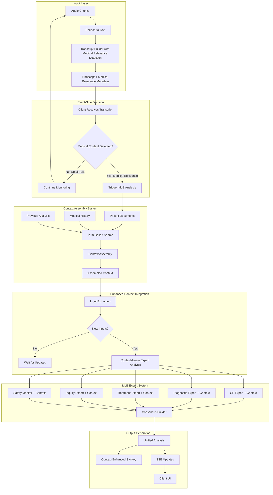

# AI Session Analysis Workflow - Enhanced Version

## Overview

This document describes the complete workflow for AI-powered medical session analysis using a Mixture of Experts (MoE) architecture. The system processes real-time medical conversations, extracts clinical insights, and generates interactive visualizations for diagnostic decision support.

## Real-Time Continuous Assistant Nature

This system is designed as a **continuous, real-time assistant** that works alongside doctors during live patient consultations. Key characteristics:

- **Live Conversation Support**: The AI analyzes the ongoing doctor-patient dialogue as it happens, not as a post-consultation tool
- **Continuous Analysis Loop**: As new information emerges in the conversation, the AI continuously re-analyzes and updates its insights
- **Non-Intrusive Assistance**: Suggestions and insights are presented without interrupting the natural flow of conversation
- **Doctor-Driven Interaction**: The physician remains in full control, choosing which AI suggestions to explore or ignore
- **Progressive Refinement**: Each new patient response or symptom description triggers refined analysis, building a progressively clearer clinical picture
- **No "Final" State**: There is no concept of a "completed" analysis - the system provides ongoing support throughout the entire consultation

The workflow described below operates in a continuous loop, with each phase feeding back into the next as the conversation evolves.

## High-Level Architecture



## Detailed Workflow Steps

### Phase 1: Input Processing and Transcription

1. **Audio Capture and Chunking**

   - Patient-doctor conversation is captured in real-time
   - Audio is segmented into processable chunks
   - Voice Activity Detection (VAD) identifies speech segments

2. **Speech-to-Text Analysis**

   - Chunks are sent to transcription service (Whisper/AssemblyAI)
   - Speaker diarization identifies doctor vs patient
   - Timestamps and confidence scores are preserved

3. **Transcript Reconstruction with Medical Relevance Detection**

   - Individual chunks are assembled into coherent transcript
   - Speaker changes and pauses are marked
   - Medical terminology is validated and corrected
   - **Medical relevance classification** performed during assembly:
     - Lightweight ML model identifies medical content vs small talk
     - Relevance score (0-1) indicates medical significance
     - Categories detected: symptom_mention, medication_reference, medical_history, clinical_observation, small_talk
     - Trigger words/phrases extracted for client visibility
   - Transcript sent to client with medical relevance metadata for decision-making

3.5. **Transcript Output with Medical Relevance Metadata**

   The reconstructed transcript is sent to the client with the following structure:
   ```json
   {
     "sessionId": "session_id",
     "timestamp": "2024-03-15T14:25:00Z",
     "transcript": {
       "text": "Doctor: How are you feeling today?\nPatient: I've had a terrible headache for three days...",
       "speakers": ["doctor", "patient"],
       "duration": 120
     },
     "medicalRelevance": {
       "isRelevant": true,
       "confidence": 0.85,
       "categories": ["symptom_mention", "medication_reference"],
       "triggers": ["headache", "three days", "pain medication"],
       "requiresAnalysis": true
     }
   }
   ```

4. **Client-Side Decision Point**

   - Client receives transcript with medical relevance metadata
   - If `medicalRelevance.isRelevant` is true and confidence > threshold:
     - Client triggers MoE analysis request
     - Proceeds to Context Integration (Step 5)
   - If small talk or low relevance:
     - Client continues transcript monitoring
     - MoE analysis is not triggered
     - Returns to Audio Capture (Step 1)

5. **Context Integration** (Triggered by Client)
   - Patient medical history is retrieved and attached
   - Previous MoE analyses from current session are included
   - Relevant medical records are incorporated
   - Family history and genetic factors are considered
   - Current medications and allergies are highlighted

### Phase 1.5: Intelligent Context Assembly (When Triggered by Client)

6. **Classification-Based Context Search**

   - Medical term extraction from current conversation content
   - Classification-based term matching using medical-expert-tools
   - Search across patient's encrypted medical documents using standardized medical terms
   - Identification of relevant historical consultations through term matching
   - Pattern recognition for recurring symptoms and treatment responses
   - Document categorization and relevance scoring without embeddings
   
   **Classification Approach Details:**
   - Uses `MedicalExpertTools.searchDocuments()` with extracted medical terms
   - Documents contain pre-classified medical terms arrays for efficient matching
   - Relevance calculated by term frequency and document type matching
   - No vector embeddings required - direct term-to-term comparison
   - Supports filtering by document types (lab-results, prescriptions, medical-records)
   - Returns structured results with relevance scores and metadata

7. **Context Assembly and Optimization**

   - Assembly of relevant medical context using ContextAssembler with term-based results
   - Document search using `searchDocumentsByTerms` method:
     - Medical terms extracted from conversation
     - Relevance scoring based on term matching frequency
     - Document type filtering (lab-results, medical-records, prescriptions, etc.)
     - Threshold-based filtering (default 0.6)
   - Extraction of key medical insights (findings, medications, procedures, risks)
   - Token optimization to fit within AI model limits (default 4000 tokens)
   - Confidence scoring for assembled context relevance
   - Structured sections: patient summary, relevant history, recent changes

8. **Context Enhancement with Medical Intelligence**
   - Clinical Data Platform (CDP) integration for structured medical data
   - Timeline construction of significant medical events
   - Risk factor analysis based on historical patterns
   - Treatment response patterns from previous consultations
   - Drug interaction and contraindication checks based on history

### Phase 2: Enhanced Analysis and Input Extraction

9. **Context-Aware Input Extraction**

   - LLM analyzes transcript enhanced with assembled context
   - Medical entities are identified with historical context awareness
   - Temporal patterns and severity indicators cross-referenced with history
   - Each input receives a unique ID to prevent duplicates
   - Context relevance scoring for each extracted input

10. **Input Enhancement with Assembled Context**

   - Assembled context provides rich historical perspective
   - Previous symptoms and treatments are automatically linked
   - Chronic conditions and patterns are factored into analysis
   - Historical inputs are clearly marked with origin tags:
     - `transcript`: Mentioned in current conversation
     - `history`: From medical records via context assembly
     - `context`: Inferred from semantic patterns
     - `previous`: From earlier in session
     - `assembled`: From context assembly system

11. **Question-Answer Evaluation with Context**

    - If MoE previously generated questions, scan for answers
    - Map patient responses to specific questions using context
    - Update question status (answered/pending/partial)
    - Extract follow-up information from answers
    - Context assembly informs question prioritization

12. **Real-time Client Updates with Context**
    - Send discovered inputs via SSE to client with context metadata
    - Update answer statuses in real-time
    - Provide context relevance indicators in UI
    - Stream context confidence scores

### Phase 3: Conditional MoE Analysis

13. **Change Detection with Context Awareness**

- Compare current inputs with previous analysis
- Check if answer set has changed
- Evaluate if new significant information emerged
- **Decision Point**:
  - No changes → Return to step 1 (wait for new transcript)
  - Changes detected → Proceed to MoE analysis

### Phase 4: Context-Enhanced Mixture of Experts Analysis

14. **Context-Aware Parallel Expert Analysis**

    - Multiple specialized experts analyze inputs with assembled context:

    **a) GP Expert (General Practitioner) + Context**

    - Holistic patient assessment enhanced with historical patterns
    - Initial clinical impressions informed by previous consultations
    - Care coordination recommendations based on treatment history
    - Preventive care opportunities identified from context patterns
    - Context confidence scoring for historical relevance

    **b) Diagnostic Specialist Expert + Context**

    - Differential diagnosis generation with historical differential patterns
    - Probability-based ranking enhanced by previous diagnostic outcomes
    - Evidence correlation across current and historical findings
    - Pattern recognition leveraging long-term medical history
    - Context-aware probability adjustments

    **c) Treatment Planner Expert + Context**

    - Evidence-based treatment options informed by previous responses
    - Medication recommendations considering historical effectiveness
    - Risk-benefit analysis enhanced with past treatment outcomes
    - Alternative therapies based on patient's historical preferences
    - Context-driven contraindication checking

    **d) Clinical Inquiry Expert + Context**

    - Strategic question generation informed by historical patterns
    - Confirmatory vs exclusionary questions prioritized by context
    - Diagnostic yield optimization based on historical question effectiveness
    - Question prioritization enhanced by context relevance scoring
    - Historical question-answer pattern analysis

    **e) Safety Monitor Expert + Context**

    - Drug interaction checking enhanced with complete medication history
    - Contraindication identification using comprehensive context
    - Red flag symptoms cross-referenced with historical alerts
    - Critical condition alerts informed by patient's risk factors
    - Context-aware safety protocol recommendations

15. **Context-Enhanced Consensus Building**
    - Weighted voting based on expert confidence and context relevance
    - Conflict detection and resolution using historical precedents
    - Uncertainty quantification enhanced by context quality scores
    - Evidence aggregation across experts with context weighting
    - Generation of unified recommendations with context attribution
    - Context confidence integration in final consensus scoring

### Phase 5: Structured Output Generation

16. **MoE Analysis Structure**

    - Each element receives a unique ID for tracking
    - Bidirectional linkages are established
    - Confidence scores and priorities are assigned

    **a) Diagnosis Nodes**

    - Unique diagnosis ID
    - Short title (1-3 words)
    - Detailed description
    - Clinical reasoning
    - Priority level (critical/high/medium/low)
    - Probability score (0-1)
    - ICD-10 codes
    - Supporting evidence links

    **b) Treatment Nodes**

    - Unique treatment ID
    - Treatment type:
      - Text recommendations
      - Medications (with dosing)
      - Follow-up investigations
      - Procedures
    - Risk assessment
    - Contraindications
    - Expected outcomes
    - Alternative options

    **c) Question Nodes**

    - Question ID and text
    - Question type:
      - `confirmatory`: Strengthen diagnosis
      - `exclusionary`: Rule out conditions
      - `exploratory`: Gather more data
      - `risk_assessment`: Evaluate severity
    - Priority (critical/high/medium/low)
    - Expected impact on diagnosis probabilities
    - Possible answers with actions:
      - Prove and prioritize links
      - Disprove and suppress links
      - Redirect to alternative paths

17. **Relationship Mapping**

    - Create comprehensive node linkages:
      ```
      [Input/Symptom] → [Question] → [Diagnosis] → [Question] → [Treatment]
      ```
    - Support 1:N relationships (one symptom → multiple diagnoses)
    - Include evidence strength for each link
    - Track which experts suggested each connection
    - Bidirectional reasoning chains

18. **Risk and Safety Integration**
    - Evaluate treatment risks based on:
      - Patient medical history
      - Current medications
      - Allergies and adverse reactions
      - Age and demographics
      - Comorbidities
    - Flag high-risk combinations
    - Suggest safer alternatives
    - Include monitoring requirements

### Phase 6: Context-Enhanced Visualization and Delivery

19. **Context-Enhanced Sankey Diagram Generation**

    - **Column 1**: Symptoms/Signals/History nodes with context indicators
    - **Column 2**: Diagnosis nodes (sized by probability + context confidence)
    - **Column 3**: Treatment nodes (sized by priority + historical effectiveness)
    - **Between columns**: Question nodes for path modification with context prioritization

    **Context-Enhanced Visual Encoding**:

    - Node size: Reflects priority/probability weighted by context relevance
    - Node color: Indicates urgency with context confidence overlay
      - Red=critical, orange=high, yellow=medium, green=low
      - Context confidence shown as border thickness or pattern
    - Link thickness: Shows connection strength enhanced by historical evidence
    - Link style: Solid=strong evidence, dashed=weak evidence, dotted=context-inferred
    - Question dots: Small indicators on paths with context priority scoring
    - Context sources: Subtle indicators showing which historical documents contributed

20. **Progressive Streaming with Context Updates**

    - Send completed expert analyses as they finish with context metadata
    - Update visualization incrementally including context confidence changes
    - Show loading states for pending experts and context assembly
    - Prioritize critical findings enhanced by context relevance for immediate display
    - Stream context assembly progress and completion status

21. **Interactive Features Enhanced with Context**
    - Click nodes for detailed information including context sources
    - Hover questions to see impact predictions and historical patterns
    - Accept/suppress functionality with context awareness:
      - Accept: Highlight in green, lock as primary with context boost
      - Suppress: Gray out with opacity reduction, note context conflicts
      - Suppression coefficient affects priority display and context weighting
    - Filter by expert consensus level and context confidence
    - Show/hide evidence chains with context source attribution
    - Context explorer: Drill down into specific historical documents and analyses
    - Context timeline: View temporal progression of symptoms and treatments

## UI Design Implementation

### Layout Structure

1. **Two-Column Responsive Design**

   - Left panel (70%): Interactive Sankey diagram
   - Right panel (30%): Resizable sidebar
   - Mobile: Stacked layout with tabs

2. **Sidebar Tabs**

   - **Transcript Tab**:
     - Real-time conversation display
     - Speaker identification
     - Timestamp navigation
     - Answer highlighting
   - **Questions Tab**:
     - All generated questions listed
     - Priority sorting
     - Answer status indicators
     - Hover to highlight Sankey paths
     - Quick answer input
   - **Details Tab**:
     - Dynamic content based on selection
     - Node-specific information
     - Evidence chains
     - Expert reasoning
     - Medical references

3. **Real-time Updates**
   - SSE connection status indicator
   - Progressive expert completion badges
   - Animated transitions for new nodes
   - Toast notifications for critical findings
