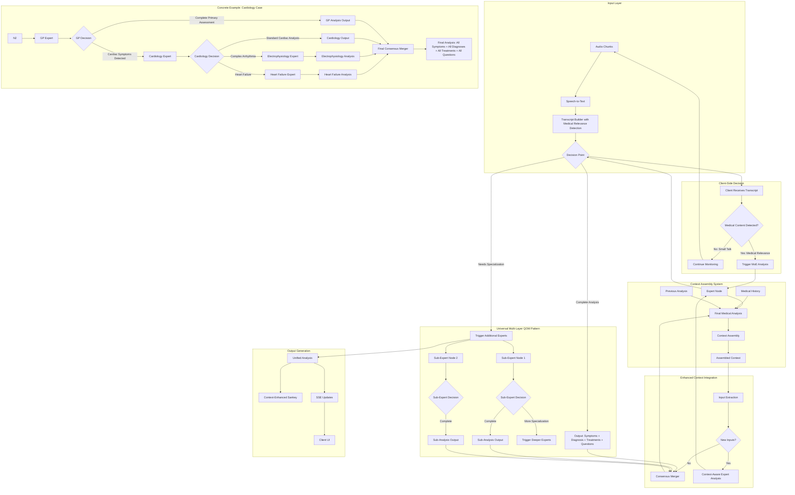

# AI Session Analysis Workflow - Enhanced Version

## Overview

This document describes the complete workflow for AI-powered medical session analysis using a Universal QOM (Query-Oriented Model) Mixture of Experts architecture. The system processes real-time medical conversations through dynamically configured expert nodes, builds consensus through intelligent merging, and handles conflicts by presenting multiple perspectives to clinicians.

## Real-Time Continuous Assistant Nature

This system is designed as a **continuous, real-time assistant** that works alongside doctors during live patient consultations. Key characteristics:

- **Live Conversation Support**: The AI analyzes the ongoing doctor-patient dialogue as it happens, not as a post-consultation tool
- **Continuous Analysis Loop**: As new information emerges in the conversation, the AI continuously re-analyzes and updates its insights
- **Non-Intrusive Assistance**: Suggestions and insights are presented without interrupting the natural flow of conversation
- **Doctor-Driven Interaction**: The physician remains in full control, choosing which AI suggestions to explore or ignore
- **Progressive Refinement**: Each new patient response or symptom description triggers refined analysis, building a progressively clearer clinical picture
- **No "Final" State**: There is no concept of a "completed" analysis - the system provides ongoing support throughout the entire consultation

The workflow described below operates in a continuous loop, with each phase feeding back into the next as the conversation evolves.

## Session Workflow (Concise)

1. Patient and doctor converse; audio captured continuously.
2. Chunks sent to STT; transcript rebuilt server-side.
3. Client submits transcript to server with patient context and previous MoE analysis.
4. Symptoms extraction: AI extracts symptoms and physiologic signals as Symptom nodes.
5. Each symptom gets a stable unique ID; deduplication prevents duplicates across iterations.
6. Historical/contextual items (e.g., prior hypertension, family cardiac history) may be added as Symptom nodes labeled by origin (context vs transcript vs history).
7. If previous MoE generated questions, the transcript is scanned to detect answers and update statuses.
8. Newly discovered Symptoms and Answers stream to the client via SSE for display.
9. If neither Symptoms nor Answers changed, pause analysis and wait for new transcript.
10. If changed, run MoE to produce Diagnoses, Treatments, and new Questions (prove/disprove/redirect) with risk evaluation.
11. Each Diagnosis/Treatment gets a stable ID; build the map: [symptom] → [question] → [diagnosis] → [question] → [treatment] (1:N at each hop).
12. Treatments may be text recommendations, medications, and/or investigations to acquire new inputs (signals).
13. Nodes carry title, description, reasoning, priority, probability; links may include prioritized questions.
14. Return a Sankey-style JSON: column 1 Symptoms/Signals/History, column 2 Diagnoses, column 3 Treatments, with mid-path question nodes.
15. User actions: accept or suppress. Only one diagnosis and one treatment can be accepted at a time. Suppressed items are greyed and reprioritized using visible_priority = ai_priority / coefficient.

## High-Level Architecture



## Universal QOM Architecture Principles

### Core Expert Node Behavior

Every expert node in the QOM follows a universal pattern with two possible outcomes:

#### 1. Complete Analysis Output

When an expert determines it can provide a complete analysis, it outputs:

- **Symptoms**: Identified symptoms with confidence scores and sources
- **Diagnosis**: Differential diagnoses with probabilities and reasoning
- **Treatments**: Treatment recommendations with risk assessments
- **Questions**: Follow-up questions to prove/disprove/redirect diagnoses

#### 2. Trigger Additional Expert Analysis

When an expert identifies the need for specialized knowledge, it can:

- **Activate Specialist Experts**: Trigger domain-specific experts (cardiology, neurology, etc.)
- **Activate Functional Experts**: Trigger role-specific experts (safety monitor, drug interaction checker)
- **Pass Enriched Context**: Provide its preliminary analysis as additional input to sub-experts

### Dynamic Expert Selection Logic

```
Expert Decision Framework:
IF (case_complexity > expert_capability_threshold) THEN
    trigger_specialist_experts(domain_indicators)
ELSE
    return_complete_analysis(symptoms, diagnosis, treatments, questions)
END IF
```

### Multi-Layer Consensus Building

#### Layer-by-Layer Merging

- Each layer of experts produces analysis outputs
- Layer consensus mergers combine outputs from experts at the same level
- Final merger combines all layer outputs into unified medical analysis

#### Weighted Integration

- **Specialty Relevance**: Weight expert opinions based on case relevance
- **Confidence Scoring**: Higher confidence experts have more influence
- **Evidence Quality**: Well-supported recommendations get priority

#### Conflict Handling

- **Consensus Detection**: When >75% agreement exists, boost probabilities
- **Conflict Publication**: When experts disagree, publish all perspectives with conflict alerts
- **No Resolution**: Present conflicting diagnoses/treatments to clinician for discussion

### Expert Triggering Mechanisms

#### Symptom-Based Triggers

```yaml
trigger_conditions:
  cardiology: ["chest_pain", "shortness_of_breath", "palpitations", "syncope"]
  neurology: ["headache", "confusion", "weakness", "seizure"]
  emergency: ["severe_pain", "vital_sign_abnormality", "altered_consciousness"]
```

#### Context-Based Triggers

```yaml
context_triggers:
  geriatrics: "patient_age > 65"
  pediatrics: "patient_age < 18"
  obstetrics: "pregnancy_status = true"
  critical_care: "severity_score > high_threshold"
```

#### Dynamic Depth Control

- **Maximum Layers**: Prevent infinite expert recursion
- **Confidence Thresholds**: Only trigger sub-experts when needed
- **Cost Optimization**: Balance analysis depth with processing costs

## Detailed Workflow Steps

### Phase 1: Input Processing and Transcription

1. **Audio Capture and Chunking**

   - Patient-doctor conversation is captured in real-time
   - Audio is segmented into processable chunks
   - Voice Activity Detection (VAD) identifies speech segments

2. **Speech-to-Text Analysis**

   - Chunks are sent to transcription service (Whisper/AssemblyAI)
   - Speaker diarization identifies doctor vs patient
   - Timestamps and confidence scores are preserved

3. **Transcript Reconstruction with Medical Relevance Detection**

   - Individual chunks are assembled into coherent transcript
   - Speaker changes and pauses are marked
   - Medical terminology is validated and corrected
   - **Medical relevance classification** performed during assembly:
     - Lightweight ML model identifies medical content vs small talk
     - Relevance score (0-1) indicates medical significance
     - Categories detected: symptom_mention, medication_reference, medical_history, clinical_observation, small_talk
     - Trigger words/phrases extracted for client visibility
   - Transcript sent to client with medical relevance metadata for decision-making

3.5. **Transcript Output with Medical Relevance Metadata**

The reconstructed transcript is sent to the client with the following structure:

```json
{
  "sessionId": "session_id",
  "timestamp": "2024-03-15T14:25:00Z",
  "transcript": {
    "text": "Doctor: How are you feeling today?\nPatient: I've had a terrible headache for three days...",
    "speakers": ["doctor", "patient"],
    "duration": 120
  },
  "medicalRelevance": {
    "isRelevant": true,
    "confidence": 0.85,
    "categories": ["symptom_mention", "medication_reference"],
    "triggers": ["headache", "three days", "pain medication"],
    "requiresAnalysis": true
  }
}
```

4. **Client-Side Decision Point**

   - Client receives transcript with medical relevance metadata
   - If `medicalRelevance.isRelevant` is true and confidence > threshold:
     - Client triggers MoE analysis request
     - Proceeds to Context Integration (Step 5)
   - If small talk or low relevance:
     - Client continues transcript monitoring
     - MoE analysis is not triggered
     - Returns to Audio Capture (Step 1)

5. **Context Integration** (Triggered by Client)
   - Patient medical history is retrieved and attached
   - Previous MoE analyses from current session are included
   - Relevant medical records are incorporated
   - Family history and genetic factors are considered
   - Current medications and allergies are highlighted

### Phase 1.5: Intelligent Context Assembly (When Triggered by Client)

6. **Classification-Based Context Search**

   - Medical term extraction from current conversation content
   - Classification-based term matching using medical-expert-tools
   - Search across patient's encrypted medical documents using standardized medical terms
   - Identification of relevant historical consultations through term matching
   - Pattern recognition for recurring symptoms and treatment responses
   - Document categorization and relevance scoring without embeddings

   **Classification Approach Details:**

   - Uses `MedicalExpertTools.searchDocuments()` with extracted medical terms
   - Documents contain pre-classified medical terms arrays for efficient matching
   - Relevance calculated by term frequency and document type matching
   - No vector embeddings required - direct term-to-term comparison
   - Supports filtering by document types (lab-results, prescriptions, medical-records)
   - Returns structured results with relevance scores and metadata

7. **Context Assembly and Optimization**

   - Assembly of relevant medical context using ContextAssembler with term-based results
   - Document search using `searchDocumentsByTerms` method:
     - Medical terms extracted from conversation
     - Relevance scoring based on term matching frequency
     - Document type filtering (lab-results, medical-records, prescriptions, etc.)
     - Threshold-based filtering (default 0.6)
   - Extraction of key medical insights (findings, medications, procedures, risks)
   - Token optimization to fit within AI model limits (default 4000 tokens)
   - Confidence scoring for assembled context relevance
   - Structured sections: patient summary, relevant history, recent changes

8. **Context Enhancement with Medical Intelligence**
   - Clinical Data Platform (CDP) integration for structured medical data
   - Timeline construction of significant medical events
   - Risk factor analysis based on historical patterns
   - Treatment response patterns from previous consultations
   - Drug interaction and contraindication checks based on history

### Phase 2: Enhanced Analysis and Input Extraction

9. **Context-Aware Input Extraction**

   - LLM analyzes transcript enhanced with assembled context
   - Medical entities are identified with historical context awareness
   - Temporal patterns and severity indicators cross-referenced with history
   - Each input receives a unique ID to prevent duplicates
   - Context relevance scoring for each extracted input

10. **Input Enhancement with Assembled Context**

- Assembled context provides rich historical perspective
- Previous symptoms and treatments are automatically linked
- Chronic conditions and patterns are factored into analysis
- Historical inputs are clearly marked with origin tags:
  - `transcript`: Mentioned in current conversation
  - `history`: From medical records via context assembly
  - `context`: Inferred from semantic patterns
  - `previous`: From earlier in session
  - `assembled`: From context assembly system

11. **Question-Answer Evaluation with Context**

    - If MoE previously generated questions, scan for answers
    - Map patient responses to specific questions using context
    - Update question status (answered/pending/partial)
    - Extract follow-up information from answers
    - Context assembly informs question prioritization
    - Rephrased questions are matched to existing question nodes by semantic similarity; IDs persist and nodes are updated in place rather than recreated

12. **Real-time Client Updates with Context**
    - Send discovered inputs via SSE to client with context metadata
    - Update answer statuses in real-time
    - Provide context relevance indicators in UI
    - Stream context confidence scores

### Phase 3: Conditional MoE Analysis

13. **Change Detection with Context Awareness**

- Compare current inputs with previous analysis
- Check if answer set has changed
- Evaluate if new significant information emerged
- **Decision Point**:
  - No changes → Return to step 1 (wait for new transcript)
  - Changes detected → Proceed to MoE analysis

### Phase 4: QOM-Based Mixture of Experts Analysis

14. **Sequential Expert Node Execution**

    The system processes each transcript chunk through a query-oriented model (QOM) of specialized expert nodes. Each node receives the new transcript chunk plus the previous JSON output, enabling true conversational evolution.

    **Input**: New transcript chunk + Previous analysis JSON + Context
    **Output**: Enhanced JSON with incremental improvements and versioning

15. **Core Expert Node Definitions**

    **Node 1: transcript_parser**

    - **Role**: Parser and Structural Analyzer
    - **Input**: Raw transcript chunk with timestamps
    - **Processing**:
      - Extracts structured utterances with speaker identification
      - Preserves exact quotes with timestamps and confidence scores
      - Identifies speaker turns and conversation flow
      - Normalizes medical terminology and abbreviations
    - **Output**: Structured transcript segments ready for medical analysis
    - **Schema Impact**: Provides accurate quotes for symptom nodes

    **Node 2: symptom_extractor**

    - **Role**: Medical NER and Clinical Inference Engine
    - **Input**: Structured transcript + Previous symptoms + Context
    - **Processing**:
      - Identifies explicit symptoms and physiologic signals mentioned in conversation
      - Infers implied symptoms/signals from patient descriptions
      - Extracts severity indicators, duration, characteristics
      - Assigns stable unique IDs; deduplicates across iterations
      - Maps symptoms to appropriate source categories (transcript, medical_history/context, suspected)
      - Assigns confidence scores based on certainty of identification
    - **Output**: New SymptomNode entries with embedded metadata
    - **Schema Impact**: Populates nodes.symptoms array (signals are represented as SymptomNode items, optionally tagged via characteristics)

    **Node 3: diagnosis_mapper**

    - **Role**: Differential Diagnosis Engine
    - **Input**: Current symptoms + Previous diagnoses + Medical context
    - **Processing**:
      - Maps symptom constellations to possible diagnoses
      - Calculates probability scores using Bayesian reasoning
      - Considers epidemiological factors and patient demographics
      - Flags diagnoses for exclusion vs confirmation
      - Updates existing diagnosis probabilities based on new evidence
    - **Output**: Ranked differential diagnoses with reasoning
    - **Schema Impact**: Creates/updates nodes.diagnoses with probabilities and clinical reasoning

    **Node 4: treatment_recommender**

    - **Role**: Clinical Decision Support Engine
    - **Input**: Confirmed/probable diagnoses + Patient history + Previous treatments
    - **Processing**:
      - Suggests evidence-based treatments per diagnosis
      - Considers patient-specific factors (allergies, contraindications, preferences)
      - Ranks treatments by priority, effectiveness, and urgency
      - Evaluates treatment interactions and safety profiles
      - Accounts for previous treatment responses
    - **Output**: Prioritized treatment recommendations with detailed rationale
    - **Schema Impact**: Populates nodes.treatments with comprehensive treatment plans

    **Node 5: question_generator**

    - **Role**: Strategic Clinical Interrogator
    - **Input**: Current differential + Diagnostic uncertainty + Previous Q&A
    - **Processing**:
      - Generates targeted questions to disambiguate differential diagnoses
      - Creates confirmatory questions to strengthen high-probability diagnoses
      - Develops exclusionary questions to rule out serious conditions
      - Prioritizes questions by diagnostic yield and clinical impact
      - Avoids redundant questions from previous iterations
    - **Output**: Strategic questions with expected diagnostic impact
    - **Schema Impact**: Adds questions to nodes.actions with impact predictions

    **Node 6: warning_annotator**

    - **Role**: Clinical Risk and Safety Monitor
    - **Input**: Diagnoses + Treatments + Patient profile + Drug database
    - **Processing**:
      - Identifies drug interactions and contraindications
      - Flags red flag symptoms requiring immediate attention
      - Generates allergy and adverse reaction alerts
      - Monitors for critical condition development
      - Creates safety protocols and monitoring recommendations
    - **Output**: Prioritized safety alerts with action recommendations
    - **Schema Impact**: Adds safety alerts to nodes.actions with urgency levels

    **Node 7: relationship_builder**

    - **Role**: Semantic Graph Constructor
    - **Input**: All nodes from previous experts + Relationship ontology
    - **Processing**:
      - Creates semantic relationships between symptoms, diagnoses, and treatments
      - Assigns relationship types (supports, contradicts, treats, investigates, etc.)
      - Calculates relationship strength based on clinical evidence
      - Determines relationship direction (incoming/outgoing/bidirectional)
      - Provides clinical reasoning for each relationship
    - **Output**: Comprehensive relationship mappings
    - **Schema Impact**: Populates relationships arrays in all node types

    **Node 8: schema_merger**

    - **Role**: Version Control and Integration Engine
    - **Input**: New analysis + Previous JSON + Change tracking
    - **Processing**:
      - Merges new findings with existing schema structure
      - Updates confidence scores and probabilities
      - Tracks changes and increments analysisVersion
      - Maintains node ID consistency across iterations
      - Preserves user interactions and preferences
      - ID stability and minimal-diff updates (refinement-based, no semantic matching):
        - Generates/reuses stable IDs via canonicalization (normalize casing/units, lemmatize, strip stop-words) with anchor metadata (speaker, time window, category, ontology codes like ICD-10 when present)
        - For each existing node in previous analysis, the expert must output one explicit refinement action:
          - prove: increase confidence/priority, update reasoning/relationships
          - disprove: decrease confidence/priority, mark suppressed if appropriate
          - keep: preserve node unchanged
          - rephrase: update text/label without changing the node ID
          - remove: mark for removal; actual deletion deferred to cleaner hysteresis
        - Only explicit add creates a new node; otherwise update existing nodes in place to avoid visualization churn
        - Never delete immediately; mark suppressed/low-visibility and defer removal to cleaner hysteresis
    - **Output**: Integrated schema with version tracking
    - **Schema Impact**: Creates unified, versioned analysis output

    **Node 9: user_feedback_applier**

    - **Role**: Human-AI Interaction Processor
    - **Input**: Merged schema + User actions (suppress, accept, modify)
    - **Processing**:
      - Applies doctor's suppress/accept decisions to node visibility
      - Updates node states based on user feedback
      - Incorporates manual corrections and additions
      - Adjusts confidence scores based on clinical validation
      - Tracks user interaction patterns for learning
    - **Output**: User-validated analysis with interaction tracking
    - **Schema Impact**: Updates node states and userActions array

    **Node 10: node_cleaner**

    - **Role**: Relevance Filter and Optimization Engine
    - **Input**: User-validated schema + Relevance thresholds
    - **Processing**:
      - Removes obsolete or ruled-out diagnoses
      - Prunes low-confidence relationships
      - Eliminates duplicate or redundant suggestions
      - Optimizes schema size for visualization performance
      - Maintains critical information regardless of confidence
      - Hysteresis and anti-flap controls:
        - Confidence hysteresis (example: add above 0.55, remove below 0.45) to avoid churn
        - minRoundsToDelete: require a node to remain below thresholds for N consecutive iterations before removal
    - **Output**: Clean, optimized analysis ready for visualization
    - **Schema Impact**: Final pruned schema with optimal node set

    Additional execution utilities:

    - id_allocator_deduplicator: Generates stable IDs and removes duplicates across all node types.
    - change_detector_gate: Compares current Symptoms/Answers to the previous iteration and conditionally triggers MoE.

16. **QOM Execution Flow and Dependencies**

    **Sequential Dependencies:**

    ```
    transcript_parser → symptom_extractor → diagnosis_mapper
                                         ↓
    relationship_builder ← treatment_recommender
           ↓              ← question_generator
    schema_merger         ← warning_annotator
           ↓
    user_feedback_applier
           ↓
    node_cleaner → Enhanced JSON Output
    ```

    **Parallel Execution Opportunities:**

    - treatment_recommender, question_generator, and warning_annotator can run in parallel after diagnosis_mapper
    - relationship_builder waits for all parallel nodes to complete
    - Context assembly can run in parallel with transcript_parser

17. **Incremental Conversational Processing**

    **Version Control:**

    - Each iteration increments analysisVersion
    - Node IDs persist across conversations for tracking
    - Confidence scores evolve with new evidence
    - Relationship strengths adapt to clinical developments

    **Memory Management:**

    - Previous analysis provides conversational context
    - User actions influence subsequent reasoning
    - Clinical patterns learned from interaction history
    - Schema grows incrementally rather than rebuilding entirely

    **Real-time Adaptation:**

    - New symptoms modify existing diagnosis probabilities
    - Treatment recommendations adjust to patient responses
    - Questions evolve based on previous answers
    - Safety alerts adapt to changing clinical picture

    **Schema Integration:**

    - Node IDs persist across QOM executions for consistent tracking
    - relationships arrays populated by relationship_builder expert node
    - analysisVersion incremented by schema_merger for version control
    - userActions array maintained by user_feedback_applier expert node
    - Priority scale (1-10) consistent across all expert node outputs

### Phase 5: Structured Output Generation

18. **Schema-Driven Analysis Structure**

    - Each element receives a unique ID for tracking
    - All nodes contain embedded relationships arrays
    - Confidence scores and priorities are assigned using 1-10 scale

    **Unified Node Structure:**

    - All symptoms (current, historical, suspected) in single symptom array with source indicators:
      - `transcript`: From current conversation
      - `medical_history`: From patient records
      - `family_history`: From family medical history
      - `social_history`: From social/lifestyle factors
      - `medication_history`: From medication records
      - `suspected`: AI-suggested symptoms based on diagnoses
    - Questions and safety alerts unified in actions array with actionType field
    - Relationships embedded in each node with direction indicators
    - Priority scale: 1 (critical) to 10 (low) across all node types

    **a) Diagnosis Nodes**

    - Unique diagnosis ID (diag\_\*)
    - Short title (1-3 words)
    - Detailed description
    - Clinical reasoning
    - Priority level (1=critical to 10=low)
    - Probability score (0-1)
    - ICD-10 codes
    - Embedded relationships with other nodes

    **b) Treatment Nodes**

    - Unique treatment ID (treat\_\*)
    - Treatment type: medication, procedure, therapy, lifestyle, investigation, immediate
    - Treatment name and dosing details
    - Priority (1=critical to 10=low)
    - Risk assessment
    - Contraindications
    - Expected outcomes
    - Embedded relationships with diagnoses and symptoms

    **c) Action Nodes (Questions and Safety Alerts)**

    - Action ID (q*\* for questions, safety*\* for alerts)
    - Action text
    - Action type: "question" or "alert"
    - Category:
      - Questions: symptom_exploration, diagnostic_clarification, treatment_selection, risk_assessment
      - Alerts: drug_interaction, contraindication, allergy, warning, red_flag
    - Priority (1=critical to 10=low)
    - Status (pending/answered/acknowledged/skipped/resolved)
    - Expected impact on diagnosis probabilities
    - Embedded relationships with connected nodes

    Question semantics (aligns with ActionNode in visualization types):

    - actionType: "question"
    - category: symptom_exploration | diagnostic_clarification | treatment_selection | risk_assessment
    - displayPriority: numeric rank; only top items are expanded by default, others appear as small dots on the path until hovered/clicked
    - Answer handling (refinement-based):
      - The model receives previous questions with IDs and must choose one: prove, disprove, keep, rephrase, or remove
      - Updates are applied in place: set `status`, optional `answer`, and encode effects via `impact` and/or `relationships`
      - Prove/disprove effects: encode weight adjustments in `impact.yes/no` or `impact.diagnoses`
      - Redirect: add/update a relationship to the target node with `relationship: "investigates"`

19. **Embedded Relationship Mapping**

    - Each node contains its own relationships array with:
      - Target node ID
      - Relationship type (supports, contradicts, confirms, treats, etc.)
      - Direction (incoming/outgoing/bidirectional)
      - Strength/confidence score (0.0-1.0)
      - Clinical reasoning for relationship
    - Support complex diagnostic chains:
      ```
      [Symptom] ↔ [Action] ↔ [Diagnosis] ↔ [Action] ↔ [Treatment]
      ```
    - Track bidirectional evidence flows
    - No separate links array - all relationships embedded in nodes

20. **Risk and Safety Integration**
    - Evaluate treatment risks based on:
      - Patient medical history
      - Current medications
      - Allergies and adverse reactions
      - Age and demographics
      - Comorbidities
    - Flag high-risk combinations
    - Suggest safer alternatives
    - Include monitoring requirements

### Phase 6: Context-Enhanced Visualization and Delivery

21. **QOM-Enhanced Sankey Diagram Generation**

    - **Column 1**: Symptom nodes (current, historical, suspected) with source indicators
    - **Column 2**: Diagnosis nodes (sized by probability + context confidence)
    - **Column 3**: Treatment nodes (sized by priority + historical effectiveness)
    - **Between columns**: Action nodes (questions/alerts) for diagnostic chain modification

    **Context-Enhanced Visual Encoding**:

    - Node size: Reflects priority (1-10 scale) weighted by context relevance
    - Node color: Indicates urgency with context confidence overlay
      - Priority 1-2=red (critical), 3-4=orange (high), 5-6=yellow (medium), 7-10=green (low)
      - Context confidence shown as border thickness or pattern
    - Relationship visualization: Lines between nodes showing embedded relationships
      - Thickness shows relationship strength (0.0-1.0)
      - Style indicates direction (solid=bidirectional, arrow=directional)
    - Action nodes: Interactive elements showing questions and safety alerts
    - Suspected symptoms: Distinctive styling with "suspected" source indicator

22. **Progressive QOM Execution Streaming**

    - Stream individual expert node completions as they finish processing
    - Show real-time progress through the QOM execution pipeline:
      - transcript_parser → symptom_extractor → diagnosis_mapper (parallel) → relationship_builder → schema_merger → user_feedback_applier → node_cleaner
    - Update visualization incrementally as each expert contributes new nodes
    - Display loading states for pending expert nodes with estimated completion times
    - Prioritize critical findings (priority 1-2) for immediate streaming regardless of QOM position
    - Show dependency relationships visually while nodes are processing
    - Stream version updates (analysisVersion increments) with change highlights

23. **Interactive Features Enhanced with QOM Processing**
    - **Node Interaction with Expert Provenance:**
      - Click nodes to see which expert nodes contributed to their creation
      - View expert reasoning chain and confidence evolution across iterations
      - See QOM execution timestamps for each node's creation/modification
    - **Real-time QOM Execution Monitoring:**
      - Visual progress indicators showing current expert node processing
      - Hover over processing indicators to see expert node dependencies
      - Real-time updates as nodes flow through the QOM pipeline
    - **Enhanced Accept/Suppress with QOM Awareness:**
      - Accept: Triggers immediate re-processing through relevant expert nodes
      - Suppress: Updates node states and triggers downstream QOM re-evaluation
      - User actions influence subsequent QOM executions for incremental learning
      - Constraints: Only one diagnosis and one treatment can be accepted at a time
      - Suppression effect: visible_priority = ai_priority / coefficient (UI greys suppressed nodes and reduces size accordingly)
    - **Incremental Analysis Features:**
      - Version comparison: Compare analysisVersion iterations side-by-side
      - Change highlighting: Visual indicators for nodes modified in latest iteration
      - Conversation timeline: Scrub through analysis evolution over transcript chunks
    - **Advanced Relationship Exploration:**
      - Trace relationship creation back to specific expert nodes
      - Filter relationships by strength, direction, and expert provenance
      - Show relationship evolution over conversation iterations
    - **Expert Node Performance Metrics:**
      - Display processing time and confidence scores for each expert
      - Show expert node contribution statistics (nodes created/modified)
      - Performance optimization suggestions based on QOM execution patterns

## UI Design Implementation

### Layout Structure

1. **Two-Column Responsive Design**

   - Left panel (70%): Interactive Sankey diagram
   - Right panel (30%): Resizable sidebar
   - Mobile: Stacked layout with tabs

2. **Sidebar Tabs**

   - **Transcript Tab**:
     - Real-time conversation display
     - Speaker identification
     - Timestamp navigation
     - Answer highlighting
   - **Questions Tab**:
     - All generated questions listed
     - Priority sorting
     - Answer status indicators
     - Hover to highlight Sankey paths
     - Quick answer input
   - **Details Tab**:
     - Dynamic content based on selection
     - Node-specific information
     - Evidence chains
     - Expert reasoning
     - Medical references

3. **Real-time Updates**
   - SSE connection status indicator
   - Progressive expert completion badges
   - Animated transitions for new nodes
   - Toast notifications for critical findings
