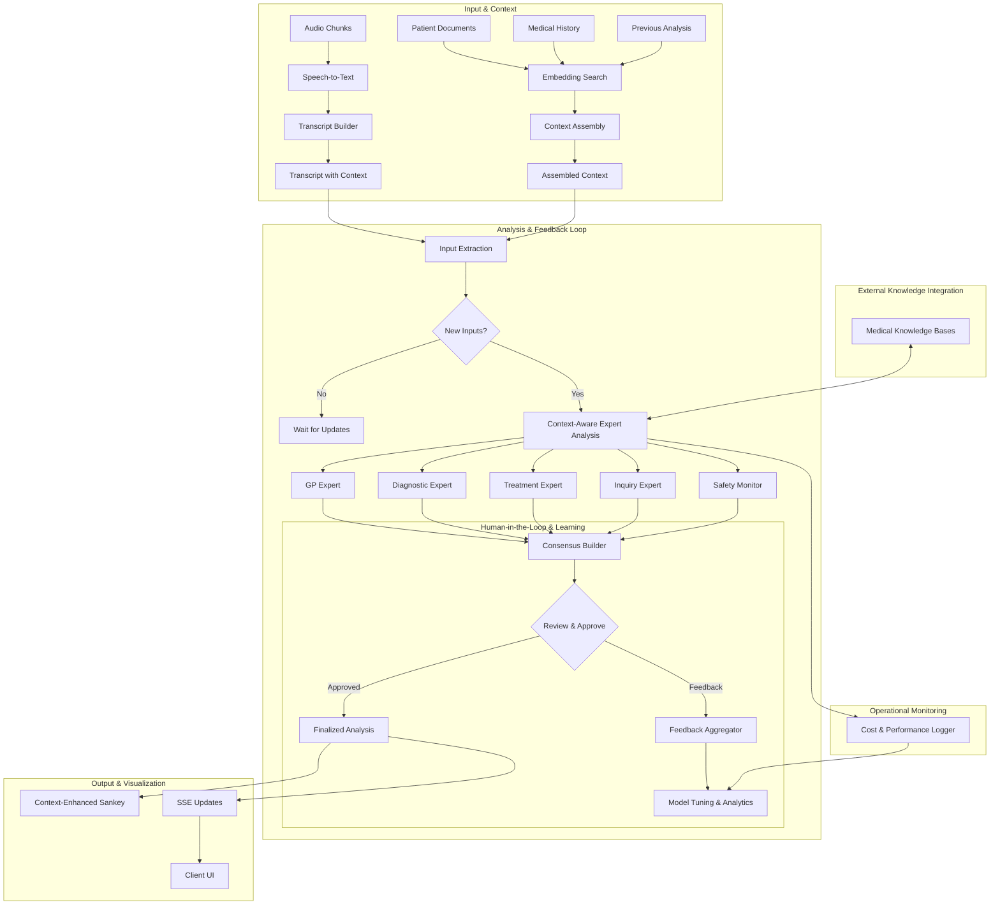

# AI Session Workflow - Suggestions for Enhancement

## Introduction

This document provides an analysis of the existing `AI_SESSION_WORKFLOW.md` and related strategy documents. It affirms the significant strengths of the current architecture and proposes several enhancements to further improve its plausibility, usability, and robustness. The suggestions are designed to build upon the existing foundation, adding layers of learning, safety, and efficiency.

## Affirmation of Core Strengths

The current AI session workflow is exceptionally well-designed and demonstrates a deep understanding of the complexities of medical AI. The following core strengths are particularly noteworthy:

*   **Comprehensive MoE Architecture:** The five-expert model (GP, Diagnostic, Treatment, Inquiry, Safety) is a robust and holistic approach to clinical analysis.
*   **Advanced Context-Awareness:** The "Context Assembly System" using client-side embeddings is a state-of-the-art solution that ensures personalization while preserving privacy.
*   **Rich Visual Outputs:** The proposed interactive Sankey diagram is an innovative and intuitive way to represent complex medical reasoning.
*   **Structured and Actionable Outputs:** The detailed schemas for all outputs (diagnoses, treatments, questions) ensure the AI's contributions are immediately usable within the application.
*   **User-Centric Dual-Mode Chat:** The clear distinction between patient and clinical modes addresses the unique needs of each user group effectively.

## Proposed Enhancements

The following suggestions are intended to enhance the existing workflow by introducing mechanisms for continuous improvement, human oversight, and operational efficiency.

### 1. Closed-Loop Feedback for Expert Tuning

**Challenge:** While the MoE system is powerful, it currently lacks a formal mechanism for learning from the real-world expertise of its clinical users.

**Suggestion:** Introduce a feedback system that allows clinicians to rate the quality and accuracy of the AI experts' suggestions. This feedback can be used to fine-tune the models and improve their performance over time.

**Implementation:**

*   **UI:** Add a simple "thumbs up/down" or a 1-5 star rating system to each major node (diagnosis, treatment) in the Sankey diagram.
*   **Data Model:** Extend the analysis output schema to include a `feedback` object where user ratings and comments can be stored.
*   **Backend:** Create a service to collect and aggregate this feedback. This data can be used for:
    *   **Model Fine-Tuning:** Periodically use the feedback data to fine-tune the expert models.
    *   **Performance Monitoring:** Track the performance of each expert over time.
    *   **Identifying Weaknesses:** Pinpoint areas where the AI is consistently underperforming.

### 2. "Human-in-the-Loop" for Consensus Approval

**Challenge:** In medicine, the final decision must always rest with a qualified clinician. While the consensus builder is designed to be robust, an explicit step for human review and approval is crucial for safety and accountability.

**Suggestion:** Add a "Review and Approve" step after the consensus is built but before the analysis is finalized. This gives the clinician the final say on the AI's output.

**Implementation:**

*   **Workflow State:** Introduce a new state in the workflow, such as `PENDING_APPROVAL`.
*   **UI:** The Sankey diagram would be presented in a "draft" mode. The clinician would have an "Approve Analysis" button.
*   **Audit Trail:** Record the approval event, including the clinician's identity and a timestamp, in the session's audit trail.

### 3. Cost, Performance, and Usage Monitoring

**Challenge:** The MoE architecture, involving multiple parallel calls to sophisticated AI models, can be computationally expensive and have variable performance.

**Suggestion:** Implement a dedicated monitoring and analytics component to track the cost, latency, and usage patterns of the MoE system.

**Implementation:**

*   **Instrumentation:** Add logging to each expert and the consensus builder to record:
    *   Token usage (prompt and completion).
    *   Latency (time to first token and total time).
    *   Provider used (e.g., OpenAI, Gemini).
    *   Cost per analysis.
*   **Dashboard:** Create an internal dashboard to visualize these metrics. This will help in:
    *   **Cost Management:** Identifying the most expensive parts of the workflow.
    *   **Performance Optimization:** Finding and addressing bottlenecks.
    *   **Usage Analysis:** Understanding which experts are used most and in what contexts.

### 4. Explicit Integration with Medical Knowledge Bases

**Challenge:** While the system uses ICD-10 codes, a deeper integration with standardized medical terminologies can enhance accuracy and interoperability.

**Suggestion:** Formalize the integration with external medical knowledge bases like SNOMED CT (for clinical terms), RxNorm (for medications), and LOINC (for lab tests).

**Implementation:**

*   **Entity Linking:** After extracting medical entities, use an entity linking service to map them to standard codes from these knowledge bases.
*   **Schema Enhancement:** Add fields to the output schemas for these standard codes (e.g., `snomedCtCode`, `rxNormCui`).
*   **Reasoning Enhancement:** The experts can use the structured information from these knowledge bases to improve their reasoning. For example, the Safety Monitor can use RxNorm to get more reliable drug interaction data.

### 5. UI/UX Enhancements for Sankey Diagram Complexity

**Challenge:** For complex cases, the Sankey diagram could become cluttered and difficult to interpret.

**Suggestion:** Introduce UI/UX features to manage this complexity.

**Implementation:**

*   **Simple/Expert View Toggle:**
    *   **Simple View:** Shows only the top 3-5 most likely paths.
    *   **Expert View:** Shows the full, detailed diagram.
*   **Focus Mode:** Allow the user to click on a node to highlight only its direct connections and fade out the rest of the diagram.
*   **Filtering:** Provide options to filter the diagram by expert, confidence level, or evidence type.

### 6. Ethical and Bias Monitoring

**Challenge:** AI models can inadvertently perpetuate or even amplify biases present in their training data.

**Suggestion:** Implement a framework for monitoring and mitigating bias in the AI's analysis.

**Implementation:**

*   **Demographic Analysis:** Regularly analyze the AI's performance across different demographic groups (age, sex, ethnicity) to identify any performance disparities.
*   **Fairness Metrics:** Define and track fairness metrics (e.g., equal opportunity, predictive equality) for the AI's suggestions.
*   **Transparency Reports:** Generate periodic transparency reports on the system's bias and fairness performance.

## Updated AI Session Workflow Diagram

This updated diagram incorporates the proposed enhancements, highlighted with comments.

## Conclusion

The proposed enhancements aim to make the AI session workflow more robust, safe, and intelligent. By introducing a closed-loop feedback system, formalizing human oversight, monitoring performance, and actively mitigating bias, the system can evolve into a true partnership between AI and clinicians. These changes will not only improve the quality of the analysis but also build greater trust and confidence in the system among its users.
