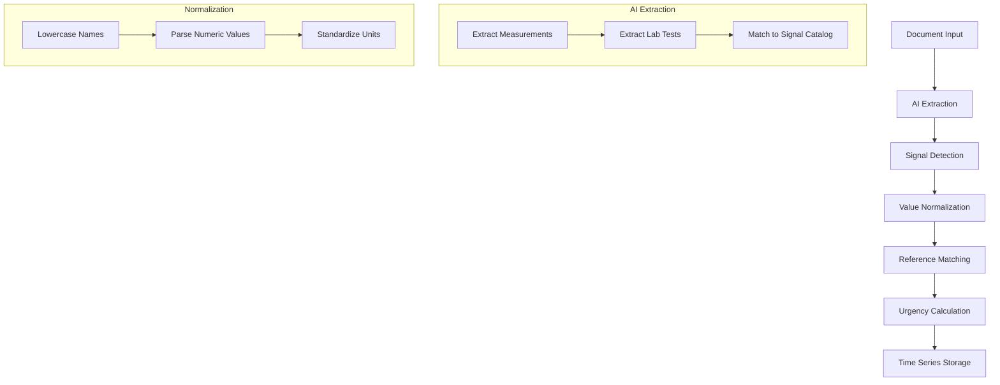
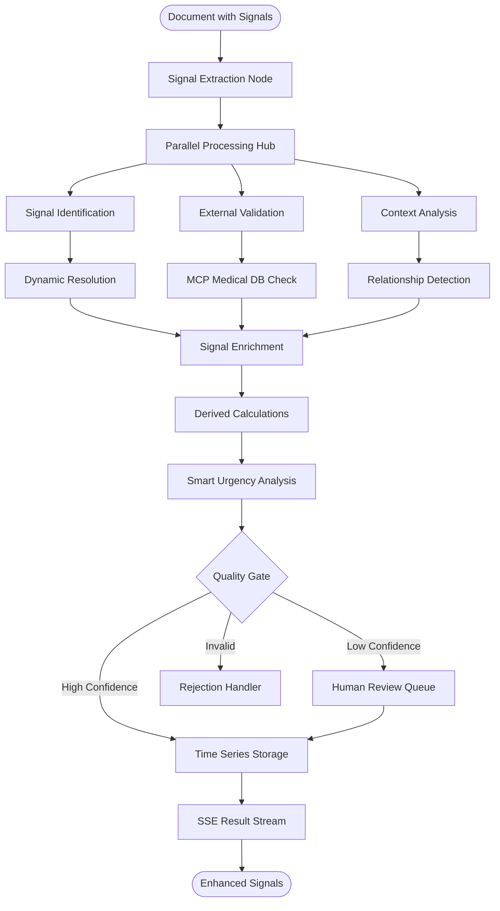

# AI Signals Import Analysis & Enhancement Strategy

This document provides a comprehensive analysis of the current signals system and proposes enhancements aligned with the LangGraph agentic approach for medical data processing.

> **Related Documentation**: This document focuses on signal processing improvements. For overall document import workflow modernization, see the [AI_IMPORT documentation suite](./AI_IMPORT_README.md). For implementation within the LangGraph workflow, see the [LangGraph Signal Processing Workflow](#langgraph-signal-processing-workflow) section.

## Current State Analysis

### Signal Architecture Overview

The current signal system is designed as a time-series data store for medical measurements with the following structure:

```typescript
// Core Signal Type (src/lib/types.d.ts)
export type Signal = {
    signal: string;      // Standardized signal name (lowercase)
    value: any;         // Measured value (numeric, string, or enum)
    unit: string;       // Unit of measurement
    reference: string;  // Reference range (e.g., "3.5-5.0")
    date: string;       // Date in YYYY-MM-DD format
    urgency?: number;   // Severity scale 1-5
    source?: 'input' | string;  // Measurement source
}
```

### Signal Properties System

The system maintains a comprehensive signal catalog in `/src/data/lab.properties.defaults.json` with:
- **230+ predefined medical signals** covering vital signs, lab tests, and health metrics
- **Type-safe definitions** (number, string, enum, boolean, date)
- **Age and sex-specific reference ranges** for accurate interpretation
- **Value expiration tracking** (e.g., temperature expires in 0.5 days, height in 365 days)
- **Multi-language support** for localized signal names

### Current Signal Processing Pipeline

> **Workflow Integration**: This pipeline integrates with the document processing workflow described in [AI_IMPORT_01_CURRENT_ANALYSIS.md - Step 8: Signals Normalization](./AI_IMPORT_01_CURRENT_ANALYSIS.md#step-8-signals-normalization).



### Current Limitations

#### 1. **Static Signal Catalog**
- **Problem**: Hardcoded list of 230+ signals can't adapt to new medical tests
- **Impact**: Missing signals are ignored or incorrectly mapped
- **Example**: Novel COVID-19 antibody tests weren't initially supported

#### 2. **Limited Context Awareness**
- **Problem**: Signals extracted without considering document context
- **Impact**: Same signal name might mean different things in different contexts
- **Example**: "Glucose" could be blood glucose, urine glucose, or CSF glucose

#### 3. **No Relationship Tracking**
- **Problem**: Signals treated as independent measurements
- **Impact**: Missing correlations and derived insights
- **Example**: Can't automatically calculate APRI score from AST/Platelet values

#### 4. **Basic Urgency Calculation**
- **Problem**: Simple range-based urgency (1-5 scale)
- **Impact**: Doesn't consider clinical context or patient history
- **Example**: Slightly elevated glucose in diabetic vs non-diabetic patient

#### 5. **No Validation Against External Sources**
- **Problem**: No verification of extracted values against medical databases
- **Impact**: Potential for AI hallucinations in critical values
- **Example**: Impossible lab values like hemoglobin of 50 g/dL

## Enhanced Signal Architecture for LangGraph

### Proposed Signal Model V2

```typescript
// Enhanced Signal Type
export interface EnhancedSignal extends Signal {
    // Core fields (existing)
    signal: string;
    value: any;
    unit: string;
    reference: string;
    date: string;
    urgency?: number;
    source?: string;
    
    // New context fields
    context: SignalContext;
    validation: SignalValidation;
    relationships: SignalRelationship[];
    metadata: SignalMetadata;
}

export interface SignalContext {
    documentType: string;        // Source document type
    specimen?: string;           // Blood, urine, CSF, etc.
    method?: string;             // Test methodology
    fasting?: boolean;           // Pre-test conditions
    location?: string;           // Lab/facility identifier
    clinicalContext?: string[];  // Relevant diagnoses/conditions
}

export interface SignalValidation {
    status: 'validated' | 'unvalidated' | 'suspicious' | 'invalid';
    confidence: number;          // 0-1 confidence score
    validationSources: string[]; // External DBs used
    warnings?: string[];         // Validation warnings
    alternatives?: string[];     // Suggested corrections
}

export interface SignalRelationship {
    type: 'derives_from' | 'correlates_with' | 'contradicts' | 'confirms';
    targetSignal: string;
    strength: number;           // Relationship strength 0-1
    formula?: string;           // For derived calculations
}

export interface SignalMetadata {
    extractedBy: string;        // AI model/provider used
    extractionConfidence: number;
    alternativeInterpretations?: any[];
    clinicalNotes?: string;
    trending?: TrendAnalysis;
}
```

### Dynamic Signal Discovery System

Instead of a static catalog, implement a learning signal system:

```typescript
export class DynamicSignalRegistry {
    private knownSignals: Map<string, SignalDefinition>;
    private contextualMappings: Map<string, Map<string, SignalDefinition>>;
    private abbreviationResolver: AbbreviationResolver;
    private unitNormalizer: UnitNormalizer;
    
    async resolveSignal(
        rawName: string, 
        context: SignalContext
    ): Promise<SignalDefinition> {
        // 1. Check exact matches
        const exact = this.knownSignals.get(rawName.toLowerCase());
        if (exact) return exact;
        
        // 2. Check contextual mappings
        const contextual = this.contextualMappings
            .get(context.documentType)
            ?.get(rawName.toLowerCase());
        if (contextual) return contextual;
        
        // 3. Resolve abbreviations
        const expanded = await this.abbreviationResolver.expand(rawName, context);
        if (expanded) return this.resolveSignal(expanded, context);
        
        // 4. Fuzzy match against known signals
        const fuzzyMatch = await this.fuzzyMatch(rawName);
        if (fuzzyMatch.confidence > 0.8) return fuzzyMatch.signal;
        
        // 5. Create new signal candidate
        return this.createCandidateSignal(rawName, context);
    }
    
    async createCandidateSignal(
        name: string, 
        context: SignalContext
    ): Promise<SignalDefinition> {
        // Query external medical databases
        const externalData = await this.queryMedicalDatabases(name);
        
        // Create new signal definition
        const newSignal: SignalDefinition = {
            id: generateSignalId(name, context),
            name: name.toLowerCase(),
            displayName: name,
            type: inferTypeFromContext(context),
            unit: await this.unitNormalizer.detectUnit(name, context),
            category: inferCategoryFromContext(context),
            status: 'candidate',
            confidence: externalData ? 0.7 : 0.3,
            sources: externalData?.sources || []
        };
        
        // Add to pending review queue
        await this.queueForReview(newSignal);
        
        return newSignal;
    }
}
```

### LangGraph Signal Processing Workflow

> **Integration Point**: This enhanced workflow replaces the basic signal normalization step in the main document processing workflow. See [AI_IMPORT_03_ARCHITECTURE.md - Proposed LangGraph Workflow](./AI_IMPORT_03_ARCHITECTURE.md#proposed-langgraph-workflow-definition) for the complete document processing context.



### Signal Relationship Engine

Implement intelligent signal relationships:

```typescript
export class SignalRelationshipEngine {
    private rules: RelationshipRule[];
    
    async analyzeRelationships(
        signals: EnhancedSignal[], 
        patientContext: PatientContext
    ): Promise<SignalInsight[]> {
        const insights: SignalInsight[] = [];
        
        // 1. Check for derived calculations
        insights.push(...this.calculateDerivedSignals(signals));
        
        // 2. Detect correlations
        insights.push(...this.detectCorrelations(signals));
        
        // 3. Identify contradictions
        insights.push(...this.findContradictions(signals));
        
        // 4. Apply clinical rules
        insights.push(...this.applyClinicalRules(signals, patientContext));
        
        return insights;
    }
    
    private calculateDerivedSignals(signals: EnhancedSignal[]): SignalInsight[] {
        const derived: SignalInsight[] = [];
        
        // Example: Calculate eGFR from creatinine
        const creatinine = signals.find(s => s.signal === 'creatinine');
        const age = signals.find(s => s.signal === 'age');
        const sex = signals.find(s => s.signal === 'biologicalSex');
        
        if (creatinine && age && sex) {
            const egfr = calculateEGFR(
                creatinine.value, 
                age.value, 
                sex.value
            );
            
            derived.push({
                type: 'derived_signal',
                signal: createDerivedSignal('egfr', egfr, {
                    formula: 'CKD-EPI',
                    dependencies: ['creatinine', 'age', 'biologicalSex']
                }),
                confidence: 0.95,
                explanation: 'Calculated eGFR using CKD-EPI formula'
            });
        }
        
        // Add more derived calculations...
        return derived;
    }
}
```

### Smart Urgency Calculation

Replace simple range-based urgency with intelligent analysis:

```typescript
export class SmartUrgencyAnalyzer {
    async calculateUrgency(
        signal: EnhancedSignal,
        patientHistory: Signal[],
        clinicalContext: ClinicalContext
    ): Promise<UrgencyAssessment> {
        // 1. Base urgency from reference ranges
        let baseUrgency = this.calculateBaseUrgency(signal);
        
        // 2. Adjust for patient baseline
        const historicalBaseline = this.calculateBaseline(
            signal.signal, 
            patientHistory
        );
        
        if (historicalBaseline) {
            baseUrgency = this.adjustForBaseline(
                baseUrgency, 
                signal.value, 
                historicalBaseline
            );
        }
        
        // 3. Consider rate of change
        const trend = this.analyzeTrend(signal.signal, patientHistory);
        if (trend.isRapidChange) {
            baseUrgency = Math.max(baseUrgency, trend.urgency);
        }
        
        // 4. Apply clinical context rules
        const contextualUrgency = await this.applyContextRules(
            signal, 
            clinicalContext
        );
        
        // 5. Check critical value protocols
        const criticalProtocol = await this.checkCriticalProtocols(
            signal,
            clinicalContext
        );
        
        return {
            urgency: Math.max(baseUrgency, contextualUrgency),
            factors: {
                referenceRange: baseUrgency,
                patientBaseline: historicalBaseline,
                trendAnalysis: trend,
                clinicalContext: contextualUrgency,
                criticalProtocol: criticalProtocol
            },
            recommendations: this.generateRecommendations(
                signal, 
                baseUrgency, 
                contextualUrgency
            )
        };
    }
}
```

### Signal Validation with MCP Integration

Integrate with medical databases for validation:

```typescript
export class SignalValidator {
    private mcpClient: MCPToolClient;
    
    async validateSignal(signal: EnhancedSignal): Promise<SignalValidation> {
        const validation: SignalValidation = {
            status: 'unvalidated',
            confidence: 0,
            validationSources: [],
            warnings: []
        };
        
        try {
            // 1. Validate against reference databases
            const labValidation = await this.mcpClient.callTool(
                'validate_lab_value',
                {
                    testName: signal.signal,
                    value: signal.value,
                    unit: signal.unit,
                    specimen: signal.context.specimen
                }
            );
            
            // 2. Check for impossible values
            if (labValidation.isImpossible) {
                validation.status = 'invalid';
                validation.warnings.push(
                    `Value ${signal.value} is outside possible range`
                );
                validation.alternatives = labValidation.suggestions;
            }
            
            // 3. Verify unit compatibility
            const unitCheck = await this.validateUnit(
                signal.signal, 
                signal.unit
            );
            
            if (!unitCheck.isValid) {
                validation.warnings.push(
                    `Unusual unit ${signal.unit} for ${signal.signal}`
                );
                validation.alternatives = unitCheck.commonUnits;
            }
            
            // 4. Cross-reference with regional standards
            const regionalCheck = await this.checkRegionalStandards(
                signal,
                signal.context.location
            );
            
            validation.validationSources = [
                labValidation.source,
                unitCheck.source,
                regionalCheck.source
            ];
            
            // Calculate overall confidence
            validation.confidence = this.calculateConfidence([
                labValidation,
                unitCheck,
                regionalCheck
            ]);
            
            validation.status = validation.confidence > 0.8 
                ? 'validated' 
                : validation.confidence > 0.5 
                    ? 'suspicious'
                    : 'unvalidated';
                    
        } catch (error) {
            validation.warnings.push(`Validation error: ${error.message}`);
        }
        
        return validation;
    }
}
```

### Time Series Enhancement

Improve time series capabilities with advanced analytics:

```typescript
export interface TimeSeriesSignal {
    signal: string;
    series: TimePoint[];
    analytics: TimeSeriesAnalytics;
    predictions?: Prediction[];
}

export interface TimeSeriesAnalytics {
    trend: TrendAnalysis;
    seasonality?: SeasonalPattern;
    outliers: Outlier[];
    changePoints: ChangePoint[];
    correlations: Correlation[];
}

export class TimeSeriesAnalyzer {
    async analyzeSignalSeries(
        signal: string,
        history: Signal[]
    ): Promise<TimeSeriesAnalytics> {
        const timeSeries = this.prepareTimeSeries(signal, history);
        
        return {
            trend: await this.detectTrend(timeSeries),
            seasonality: await this.detectSeasonality(timeSeries),
            outliers: await this.detectOutliers(timeSeries),
            changePoints: await this.detectChangePoints(timeSeries),
            correlations: await this.findCorrelations(timeSeries)
        };
    }
    
    async detectTrend(series: TimePoint[]): Promise<TrendAnalysis> {
        // Implement various trend detection algorithms
        const linearTrend = this.linearRegression(series);
        const movingAverage = this.movingAverage(series, 7);
        const exponentialSmoothing = this.exponentialSmoothing(series);
        
        return {
            direction: linearTrend.slope > 0 ? 'increasing' : 'decreasing',
            strength: Math.abs(linearTrend.slope),
            confidence: linearTrend.r2,
            recentTrend: this.getRecentTrend(series, 30),
            projection: this.projectTrend(linearTrend, 30)
        };
    }
}
```

## Implementation Strategy

> **Coordination with Document Import**: These phases should be coordinated with the document import modernization timeline described in [AI_IMPORT_03_ARCHITECTURE.md - Implementation Roadmap](./AI_IMPORT_03_ARCHITECTURE.md#implementation-roadmap).

### Phase 1: Foundation (Weeks 1-2)
- [ ] Implement EnhancedSignal data model
- [ ] Create DynamicSignalRegistry with basic functionality
- [ ] Update signal extraction to use new model
- [ ] Add signal context tracking

### Phase 2: Validation & Intelligence (Weeks 3-4)
- [ ] Integrate MCP for signal validation
- [ ] Implement SignalRelationshipEngine
- [ ] Add SmartUrgencyAnalyzer
- [ ] Create derived signal calculations

### Phase 3: Advanced Analytics (Weeks 5-6)
- [ ] Implement TimeSeriesAnalyzer
- [ ] Add predictive capabilities
- [ ] Create signal correlation detection
- [ ] Build clinical rule engine

### Phase 4: LangGraph Integration (Weeks 7-8)
- [ ] Create signal processing nodes
- [ ] Implement parallel validation workflow
- [ ] Add human-in-the-loop for low confidence
- [ ] Integrate with SSE for real-time updates

## Benefits of Enhanced Signal System

### 1. **Adaptive Signal Discovery**
- Automatically learns new medical tests
- Adapts to regional variations
- Handles abbreviations and synonyms

### 2. **Contextual Intelligence**
- Considers specimen type and test method
- Applies patient-specific baselines
- Integrates clinical context

### 3. **Relationship Awareness**
- Calculates derived values automatically
- Detects signal correlations
- Identifies contradictions

### 4. **External Validation**
- Prevents AI hallucinations
- Ensures medical accuracy
- Provides confidence scoring

### 5. **Advanced Analytics**
- Trend detection and prediction
- Outlier identification
- Seasonal pattern recognition

## Migration Path

### Backward Compatibility
The enhanced system maintains backward compatibility:
- Existing Signal type is extended, not replaced
- Static catalog remains as fallback
- Current extraction logic continues to work

### Gradual Rollout
1. **Silent Mode**: Run new system in parallel, log differences
2. **Validation Mode**: Use for validation only, not primary extraction
3. **Hybrid Mode**: Use for specific document types first
4. **Full Migration**: Complete transition with monitoring

## Conclusion

The enhanced signal system transforms medical data extraction from a static, rule-based approach to an intelligent, adaptive system that:
- Learns and adapts to new medical tests
- Validates against authoritative sources
- Understands clinical context and relationships
- Provides advanced time series analytics
- Integrates seamlessly with the LangGraph architecture

This positions Aouros as a leader in intelligent medical data processing, capable of handling the complexity and variability of real-world medical documents while maintaining the highest standards of accuracy and reliability.

## Cross-References & Integration Points

### Related Documentation
- **[AI_IMPORT_03_ARCHITECTURE.md](./AI_IMPORT_03_ARCHITECTURE.md)**: Complete document import workflow modernization strategy
  - LangGraph workflow orchestration framework
  - Multi-provider AI abstraction layer
  - Document type extensions and schema management

### Key Integration Areas

#### 1. **Workflow Integration**
- **Main Document Workflow**: Overall document processing and routing
- **Signal Processing Workflow**: Specialized signal extraction and validation
- **Integration Point**: Signals Normalization step in main workflow
- **Reference**: [AI_IMPORT_03_ARCHITECTURE.md - Step 8: Signals Normalization](./AI_IMPORT_03_ARCHITECTURE.md#step-8-signals-normalization)

#### 2. **Document Type Signal Extraction**
Enhanced signal support for all document types:
- **Laboratory**: Advanced lab signal processing with validation
- **Cardiology**: Specialized cardiac measurements and derived calculations
- **Emergency**: Triage vital signs with urgency assessment
- **Radiology**: Quantitative imaging measurements
- **Reference**: [AI_IMPORT_03_ARCHITECTURE.md - Document Type Extensions](./AI_IMPORT_03_ARCHITECTURE.md#proposed-document-type-extensions)

#### 3. **Provider Abstraction Alignment**
- **Shared Infrastructure**: Common AI provider registry and selection
- **Signal-Specific Optimization**: Best providers for lab vs vital sign extraction
- **Fallback Mechanisms**: Coordinated provider failover strategies
- **Reference**: [AI_IMPORT_03_ARCHITECTURE.md - Multi-Provider AI Abstraction](./AI_IMPORT_03_ARCHITECTURE.md#multi-provider-ai-abstraction-layer)

#### 4. **External Validation Coordination**
- **MCP Integration**: Shared medical database connections
- **Signal Validation**: Lab reference ranges and drug interactions
- **Document Validation**: ICD-10, SNOMED, and FHIR compliance
- **Reference**: [AI_IMPORT_03_ARCHITECTURE.md - External Tool Integration](./AI_IMPORT_03_ARCHITECTURE.md#external-tool-integration-strategy)

#### 5. **SSE Streaming Integration**
- **Real-time Updates**: Signal extraction progress streaming
- **Partial Results**: Stream signals as they're discovered and validated
- **User Experience**: Coordinated progress updates across document and signal processing
- **Reference**: [AI_IMPORT_03_ARCHITECTURE.md - SSE Integration](./AI_IMPORT_03_ARCHITECTURE.md#server-sent-events-sse-integration-strategy)

### Implementation Dependencies

#### Sequential Dependencies
1. **Provider Abstraction** (Document Import) → **Signal Provider Selection** (Signals)
2. **LangGraph Foundation** (Document Import) → **Signal Workflow Nodes** (Signals)
3. **MCP Infrastructure** (Document Import) → **Signal Validation** (Signals)

#### Parallel Development Opportunities
- **Schema Development**: Document types and signal schemas can be developed concurrently
- **UI Components**: Document viewers and signal visualizations
- **Testing Infrastructure**: Both workflows can share test frameworks

#### Shared Components
- **State Management**: Common LangGraph state structures
- **Error Handling**: Unified error reporting and recovery
- **Monitoring**: Shared LangSmith tracing and metrics
- **Caching**: Common provider response and schema caching