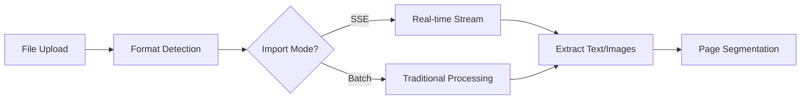
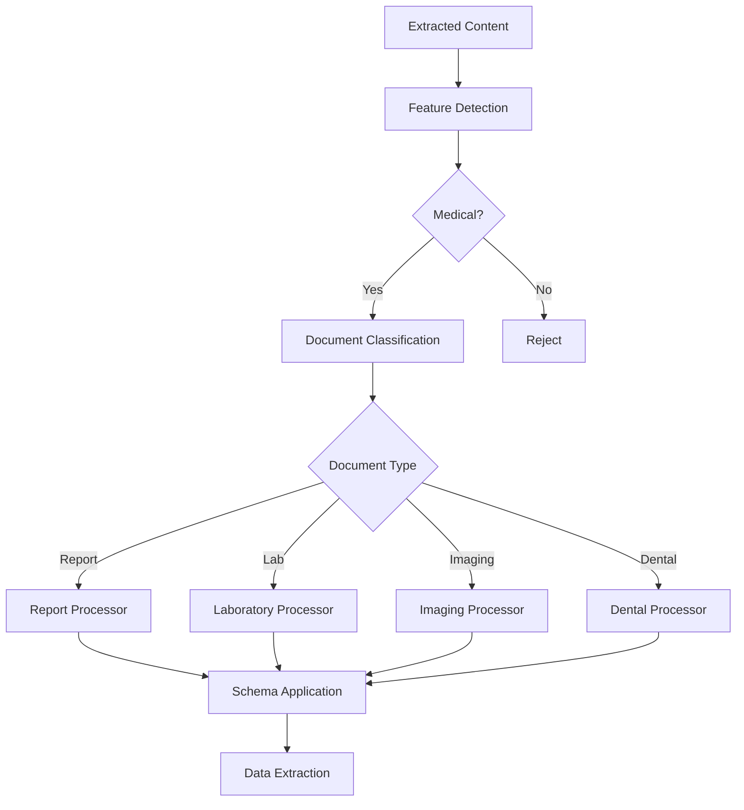
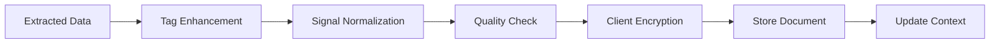

# Medical Document Import Architecture

## Overview

The Mediqom document import system is a sophisticated medical document processing pipeline that combines client-side document handling, server-side AI analysis, and end-to-end encryption to securely process and store medical records. The system supports multiple document types including medical reports, lab results, prescriptions, imaging studies, and dental records.

## Architecture Components

### 1. Client-Side Processing (`src/components/import/`)

The client-side import system handles document upload, preprocessing, and encryption:

- **`Index.svelte`**: Main orchestrator component managing the import flow
- **`ImportDocument.svelte`**: Individual document display and management
- **`FileProgressCard.svelte`**: Real-time progress visualization
- **`DualStageProgress.svelte`**: Two-stage progress indicator (extraction + analysis)
- **`SSEIndex.svelte`**: Server-Sent Events integration for real-time updates
- **`SelectProfile.svelte`**: Patient profile selection and assignment

### 2. Server-Side AI Processing (`src/lib/import.server/`)

The server-side analysis engine processes documents through multiple AI providers:

- **`analyzeReport.ts`**: Main analysis orchestrator with multi-language support
- **`assessInputs.ts`**: Document assessment and classification
- **`gemini.ts`**: Google Gemini Vision API integration

Key features:

- Multi-language schema localization (Czech, German, English)
- Document type detection (report, laboratory, dental, imaging, prescription)
- Conditional extraction based on detected features
- Token usage optimization and tracking

### 3. LangGraph Workflow Orchestration (`src/lib/langgraph/`)

Advanced workflow management using query-oriented models (QOM):

#### Core Workflows

- **`workflows/unified-workflow.ts`**: Main workflow orchestrator
- **`workflows/multi-node-orchestrator.ts`**: Parallel node execution engine
- **`workflows/document-processing.ts`**: Document-specific processing pipeline

#### Processing Nodes (23+ specialized nodes)

- **Input Validation**: Schema validation, format checking
- **Feature Detection**: Medical content classification
- **Provider Selection**: Optimal AI provider routing
- **Document Type Router**: Specialized processing paths
- **Medical Terms Generation**: Automatic medical terminology extraction
- **Quality Gate**: Output validation and confidence scoring
- **Cross-Validation Aggregator**: Multi-provider consensus building

#### Advanced Features

- **Universal Node Factory**: Dynamic node creation and configuration
- **Workflow Recording/Replay**: Development cost reduction (95% savings)
- **Parallel Processing**: Concurrent node execution for performance
- **Selective Analysis**: Process only relevant document sections

### 4. Security & Encryption (`src/lib/documents/`)

Multi-layer security architecture ensuring data privacy:

- **AES-256 Encryption**: Document content encryption
- **RSA Key Management**: Public key encryption of AES keys
- **Client-Side Only**: Server never accesses raw encryption keys
- **Per-Profile Keys**: Separate encryption keys per patient profile

## Processing Pipeline

### Phase 1: Document Upload & Extraction



1. **File Upload**: User selects PDF, images (JPG, PNG, WEBP)
2. **Format Detection**: Identify file type and structure
3. **Import Mode Selection**: Choose SSE streaming or batch processing
4. **Text/Image Extraction**: OCR for images, text extraction for PDFs
5. **Page Segmentation**: Split multi-page documents

### Phase 2: AI Analysis



1. **Feature Detection**: Identify medical relevance and document features
2. **Document Classification**: Determine specific document type
3. **Schema Selection**: Apply appropriate extraction schema
4. **Structured Extraction**: Extract data according to schema
5. **Validation**: Verify extracted data completeness

### Phase 3: Post-Processing & Storage



1. **Tag Enhancement**: Add body parts and medical terms
2. **Signal Normalization**: Standardize lab values and units
3. **Quality Validation**: Ensure data meets minimum requirements
4. **Client-Side Encryption**: AES encryption with RSA key management
5. **Secure Storage**: Save encrypted document to database
6. **Context Update**: Update patient medical context

## Import Modes

### 1. Traditional Batch Mode

- Sequential file processing
- Complete analysis before returning results
- Suitable for small batches (1-5 documents)
- No real-time progress updates

### 2. SSE Streaming Mode

- Real-time progress updates via Server-Sent Events
- Parallel processing capabilities
- Stage-by-stage progress tracking
- Optimal for large batches or slow connections

Configuration via feature flags:

```typescript
// src/lib/config/import-flags.ts
IMPORT_FEATURE_FLAGS.ENABLE_SSE_IMPORT = true;
```

## API Endpoints

### Document Extraction

- **POST** `/v1/import/extract` - Traditional extraction
- **POST** `/v1/import/extract/stream` - SSE streaming extraction

### Document Analysis

- **POST** `/v1/import/report` - Traditional analysis
- **POST** `/v1/import/report/stream` - SSE streaming analysis

### Attachment Management

- **POST** `/v1/med/profiles/{profile_id}/attachments` - Upload encrypted attachments
- **DELETE** `/v1/med/profiles/{profile_id}/attachments` - Remove attachments

## Configuration

### Feature Flags

```typescript
// Enable/disable features
IMPORT_FEATURE_FLAGS = {
  ENABLE_SSE_IMPORT: true, // SSE streaming mode
  ENABLE_LANGGRAPH_WORKFLOW: true, // LangGraph orchestration
  ENABLE_WORKFLOW_RECORDING: true, // Development replay
  ENABLE_EXTERNAL_VALIDATION: false, // MCP validation (Phase 4)
};
```

### Supported Document Types

- Medical Reports
- Laboratory Results
- Imaging Studies (X-ray, MRI, CT)
- Dental Records
- Prescriptions
- Immunization Records
- DICOM Images

### Language Support

- English (primary)
- Czech
- German

## Error Handling

### Client-Side Recovery

- Automatic retry with exponential backoff
- Partial batch processing on failure
- User-friendly error messages
- Progress preservation on reconnection

### Server-Side Resilience

- Provider fallback chains
- Graceful degradation
- Detailed error logging
- Transaction rollback on failure

## Performance Metrics

### Current Performance

- **Processing Time**: 3-8 seconds per document
- **Token Usage**: $0.08-0.18 per document
- **Concurrent Processing**: 10-20 documents
- **Success Rate**: 92-95% for medical documents

### Optimization Strategies

- Parallel node execution in LangGraph
- Selective section processing
- Provider-based cost optimization
- Workflow replay for development

## Security Considerations

### Data Protection

- **End-to-end encryption**: Client encrypts before transmission
- **Zero-knowledge architecture**: Server cannot decrypt documents
- **Key rotation**: Regular key updates for enhanced security
- **Audit trails**: Complete processing history

### HIPAA Compliance

- Encrypted data at rest and in transit
- Access controls and authentication
- Audit logging for all operations
- Secure key management practices

## Development Workflow

### Adding New Document Types

1. Create schema in `src/lib/configurations/`
2. Add processor node in `src/lib/langgraph/nodes/`
3. Update document router logic
4. Add UI components if needed
5. Test with sample documents

### Debugging Tools

- Workflow recording and replay
- SSE event monitoring
- Token usage tracking
- Processing time profiling

## Future Enhancements

### Phase 4 (Planned)

- MCP external validation integration
- Advanced medical term linking
- Multi-provider consensus validation
- LangSmith monitoring integration

### Phase 5 (Proposed)

- Support for additional document formats
- Real-time collaboration features
- Advanced duplicate detection
- Automated medical coding (ICD-10, CPT)

## Related Documentation

- [AI_IMPORT_README.md](../AI_IMPORT_README.md) - Import modernization overview
- [AI_IMPORT_03_ARCHITECTURE.md](../AI_IMPORT_03_ARCHITECTURE.md) - Detailed architecture design
- [AI_IMPORT_05_SSE_INTEGRATION.md](../AI_IMPORT_05_SSE_INTEGRATION.md) - SSE implementation details
- [CLAUDE.md](../CLAUDE.md) - Project overview and quick reference
