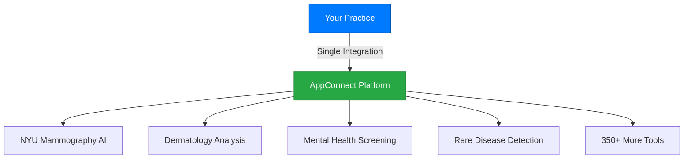
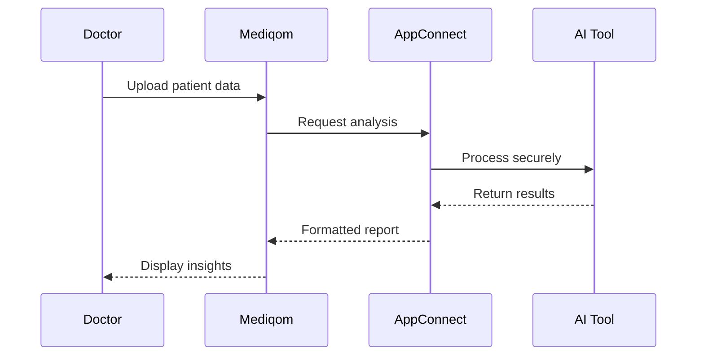
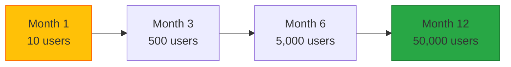

# AppConnect: Your Gateway to Medical AI Innovation

## The Problem with Medical AI Today

Healthcare providers need specialized AI tools, but face:
- **Fragmented landscape**: Different tools on different platforms
- **High costs**: Expensive subscriptions for occasional use
- **Integration nightmares**: Each tool requires separate setup
- **Trust issues**: Unvalidated AI with unclear accuracy

## AppConnect Changes Everything

One platform. 350+ medical specialists. Pay only for what you use.



## How It Works

### 1. Simple Credit System
- Buy credits in bulk (volume discounts available)
- Each AI analysis costs specific credits
- No subscriptions, no commitments
- Credits never expire

### 2. One-Click Analysis
- Upload patient data securely
- Select the AI tool you need
- Get results in seconds
- All HIPAA/GDPR compliant

### 3. Trusted Results
- Every tool is clinically validated
- See accuracy metrics upfront
- Read peer reviews
- Access supporting research

## Featured Partners

### 🏥 NYU Langone Health - Mammography AI
**Mammaio: Next-Generation Breast Cancer Detection**
- 94.5% accuracy rate
- Reduces false positives by 30%
- FDA-approved algorithm
- Results in under 60 seconds
- **Cost**: 50 credits per analysis

### 🧠 Stanford Medicine - Mental Health Assessment
**PsychAI: Depression & Anxiety Screening**
- Voice pattern analysis
- Validated against PHQ-9/GAD-7
- Multi-language support
- Longitudinal tracking
- **Cost**: 30 credits per assessment

### 🔬 Johns Hopkins - Rare Disease Identifier
**RareFind: Genetic Condition Analysis**
- Analyzes 7,000+ rare conditions
- Symptom pattern matching
- Genetic marker integration
- Treatment recommendations
- **Cost**: 100 credits per analysis

## Integration Made Simple

### For Healthcare Providers



### For Developers

```javascript
// Example: Request mammography analysis
const analysis = await mediqom.appconnect.analyze({
  tool: 'nyu-mammaio',
  data: mammogramData,
  patient: patientId,
  credits: 50
});

// Results include confidence scores
console.log(analysis.findings);
// => { malignancy: 0.02, confidence: 0.98, regions: [...] }
```

## Real-World Impact

### Rural Kentucky Clinic
> "AppConnect gives our patients access to specialists they'd need to drive 3 hours to see. The dermatology AI caught a melanoma we might have missed."
> 
> **Dr. Robert Chen**, Family Practice

### Berlin Women's Health Center  
> "We use Mammaio for every mammogram now. It's like having a world-class radiologist looking over our shoulder."
> 
> **Dr. Lisa Mueller**, Radiology

### Prague Psychiatric Hospital
> "The voice analysis helps us track patient progress objectively. We can see when therapy is working."
> 
> **Dr. Jan Novotný**, Psychiatry

## Pricing That Makes Sense

### Credit Packages

| Package | Credits | Price | Per Credit | Savings |
|---------|---------|-------|------------|---------|
| Starter | 100 | €99 | €0.99 | - |
| Professional | 500 | €399 | €0.80 | 20% |
| Practice | 1,000 | €699 | €0.70 | 30% |
| Enterprise | 5,000+ | Custom | Custom | 40%+ |

### Popular Tool Costs

- **Basic Analysis**: 10-30 credits
- **Advanced Imaging**: 40-60 credits  
- **Genetic/Rare Disease**: 80-120 credits
- **Multi-modal Analysis**: 150+ credits

## For AI Developers

### Join Our Marketplace

Turn your medical AI into a thriving business:

1. **Instant Distribution**: Reach thousands of healthcare providers
2. **Revenue Share**: Keep 70% of credit revenue
3. **No Infrastructure Costs**: We handle scaling, security, compliance
4. **Marketing Support**: Featured placement for top-performing tools

### Technical Requirements

- FHIR-compliant data formats
- REST API with < 5 second response time
- Clinical validation documentation
- HIPAA/GDPR compliance certification
- Multilingual support (preferred)

### Success Story: MedAInsight

Started with 10 users, now processes 50,000+ analyses monthly:



## Security & Compliance

### Zero-Knowledge Processing
- Patient data encrypted end-to-end
- AI tools never store patient info
- Audit trail for every access
- Automatic data deletion after analysis

### Certifications
- **HIPAA Compliant** (US Healthcare)
- **GDPR Compliant** (EU Privacy)
- **ISO 27001** (Information Security)
- **SOC 2 Type II** (Security Controls)

## Get Started Today

### For Healthcare Providers
[Start Free Trial](/www/en/beta)

### For AI Developers  
Coming soon
<!-- [Apply to Marketplace](/www/en/developers) | [View API Docs](/www/en/api)--<>

---

*Questions? Contact our AppConnect team at appconnect@mediqom.com*