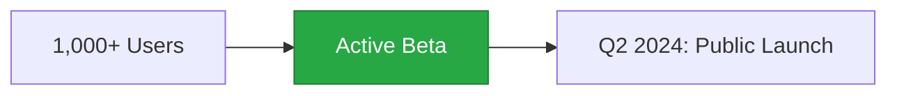

# Be Among the First to Experience the Future of Medical Records

## Join Our Exclusive Beta Program

We're selectively onboarding users who are ready to transform how they manage medical data. Whether you're a family looking for better health organization or a healthcare provider seeking efficiency, we want to hear from you.

### What You Get as a Beta User

- ✅ **Free access** during the entire beta period
- ✅ **Direct line** to our development team  
- ✅ **Priority support** with dedicated success manager
- ✅ **Grandfathered pricing** when we launch publicly
- ✅ **Shape our roadmap** - your feedback drives our features

## Current Beta Status

### By the Numbers
- **1,247** beta users across 3 countries
- **89%** would recommend to others
- **3.2M** medical documents processed
- **4.8/5** average satisfaction rating

## Who Should Apply?

### ✅ Perfect Fit
- Families managing multiple health records
- Healthcare providers seeing 20+ patients daily
- International families with multi-language needs
- Practices looking for AI-powered efficiency
- Developers building medical AI tools

### ❌ Not Ready Yet
- Hospitals with 500+ beds (coming Q3 2024)
- Countries outside US/EU/Czech Republic
- Veterinary practices (roadmap for 2025)

## Beta Application

### Tell Us About Yourself

**I am a:** (Select one)
- [ ] Family/Individual
- [ ] Healthcare Provider  
- [ ] Developer/AI Company
- [ ] Healthcare Organization

### Your Medical Records Challenge

**What problem are you trying to solve?**
*Example: "I have medical records from 3 countries in different languages and can never find what I need during doctor visits"*

[Text area for response]

### Current Solution

**What are you using now and why isn't it working?**
*Example: "Paper files and random PDFs on my computer. It's chaos and I've lost important documents"*

[Text area for response]

### Data Volume

**How many records/patients would you start with?**
- [ ] 1-10 documents/patients
- [ ] 11-50 documents/patients
- [ ] 51-200 documents/patients
- [ ] 200+ documents/patients

### Timeline

**When would you like to begin testing?**
- [ ] Immediately
- [ ] Within 1 week
- [ ] Within 1 month
- [ ] Just exploring

### Contact Information

- **Name**: [Required]
- **Email**: [Required]
- **Phone**: [Optional]
- **Organization**: [Optional]
- **Country**: [Dropdown: Czech Republic, Germany, United States]
- **Preferred Language**: [Dropdown: English, Čeština, Deutsch]

### Additional Information

**Anything else we should know?**
*Special requirements, specific features you need, etc.*

[Text area for response]

### Beta Agreement

- [ ] I understand this is beta software and may have bugs
- [ ] I agree to provide feedback at least once per month
- [ ] I agree to keep beta features confidential
- [ ] I agree to the [Terms of Service](/www/en/terms) and [Privacy Policy](/www/en/privacy)

[Submit Application Button]

## What Happens Next?

### Timeline
1. **Within 48 hours**: Application review and response
2. **Day 3-5**: Onboarding call scheduled
3. **Day 7**: Full platform access granted
4. **Week 2-4**: Weekly check-ins with your success manager
5. **Month 2+**: Monthly feedback sessions

### Your Success Manager

Every beta user gets a dedicated success manager who:
- Guides your onboarding
- Answers questions in real-time
- Collects your feedback
- Ensures you get maximum value

## Beta User Testimonials

### Family User - Prague
> "The beta program exceeded expectations. Our feedback actually shaped features - they added Czech document translation because we asked!"
> 
> **Petra Nováková**, Mother of 3

### Healthcare Provider - Berlin
> "Being in the beta let us influence the voice analysis features. Now it perfectly fits our psychiatric practice workflow."
> 
> **Dr. Klaus Weber**, Psychiatrist

### Developer - San Francisco  
> "The AppConnect beta access helped us validate our dermatology AI with real users before public launch. Invaluable feedback."
> 
> **TechMed AI**, Startup

## Frequently Asked Questions

### How long is the beta period?
The beta runs until our public launch in Q2 2024. All beta users get 3 months free after public launch.

### What if I need help during beta?
You'll have direct Slack access to our team, plus priority email/phone support. Average response time: 2 hours.

### Can I invite my colleagues/family?
Yes! Beta users can invite up to 5 additional users. They'll get the same benefits.

### What about my data privacy?
Same zero-knowledge encryption as our full platform. We can't see your data even in beta.

### Will I lose my data after beta?
Never. All beta data transfers seamlessly to your permanent account.

## Ready to Transform Your Medical Records?

Join innovative families and forward-thinking healthcare providers in our exclusive beta program.

[Submit Application Above ↑]

---

*For immediate assistance, email beta@mediqom.com or call +420 XXX XXX XXX*