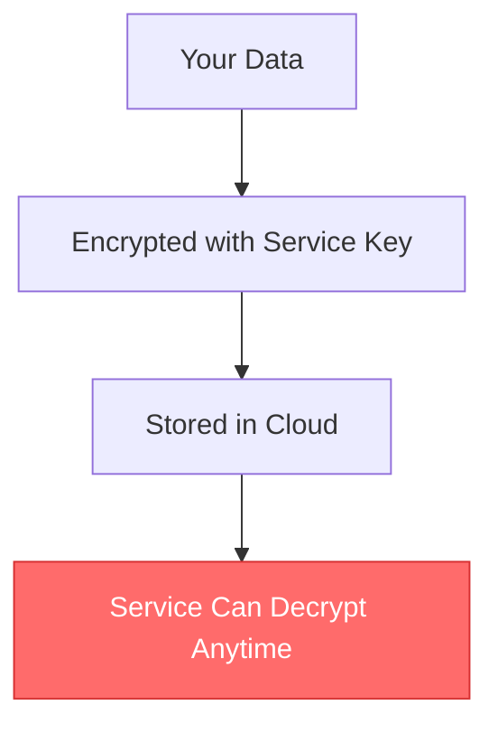
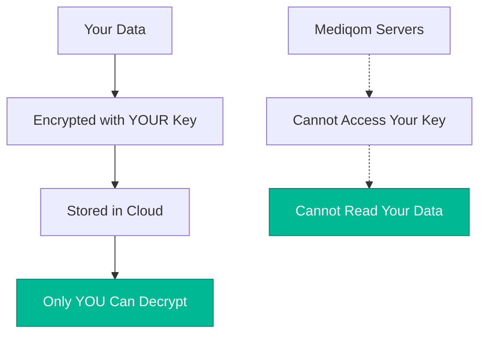
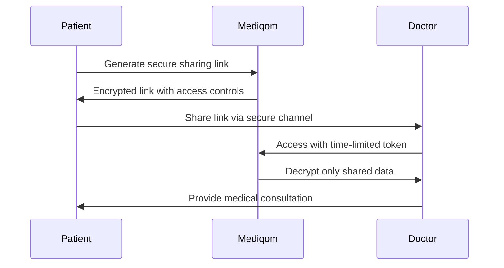

# Your Data Stays Yours

## Zero-Knowledge Security That Actually Works

**The Promise**: Even we can't see your private medical data.  
**The Reality**: It's mathematically impossible for us to access your information.

This isn't just marketing - it's how we built our entire platform.

## How Zero-Knowledge Encryption Works

### Traditional Cloud Storage (Vulnerable)

### Mediqom's Zero-Knowledge Architecture

## Your Encryption Key, Your Control

### How We Generate Your Keys

1. **Client-Side Generation**: Your encryption keys are created on your device
2. **Never Transmitted**: Your private key never leaves your control
3. **Password-Protected**: Additional encryption with your chosen passphrase
4. **Mathematically Secure**: RSA-4096 and AES-256 encryption standards

### What This Means for You

- ✅ **Complete Privacy**: We literally cannot read your medical records
- ✅ **Zero Data Breaches**: Even if our servers are compromised, your data is useless
- ✅ **Your Control**: Share exactly what you want, with whom you want
- ✅ **International Safe**: Your data sovereignty respected everywhere

## Compliance by Design

### HIPAA Compliance (United States)

- **Administrative Safeguards**: Role-based access, audit logs
- **Physical Safeguards**: Encrypted storage, secure data centers
- **Technical Safeguards**: Zero-knowledge encryption, secure transmission
- **Business Associate Agreements**: Available for healthcare providers

### GDPR Compliance (European Union)

- **Data Minimization**: We collect only what's necessary
- **Right to Erasure**: Complete data deletion on request
- **Data Portability**: Export your data in standard formats
- **Privacy by Design**: Zero-knowledge from day one

### Additional Certifications

- **SOC 2 Type II**: Annual security audits
- **ISO 27001**: Information security management
- **NIST Framework**: Cybersecurity best practices

## Technical Security Details

### Encryption Standards

- **RSA-4096**: Public key cryptography
- **AES-256**: Symmetric encryption
- **PBKDF2**: Password strengthening
- **SHA-256**: Data integrity verification

### Infrastructure Security

- **TLS 1.3**: All data in transit encrypted
- **Zero-Trust Architecture**: Every request verified
- **Geographic Distribution**: Data stored in your region
- **Backup Encryption**: Even backups are zero-knowledge

### Access Controls

- **Multi-Factor Authentication**: Required for all accounts
- **Session Management**: Automatic logout, device tracking
- **API Security**: Rate limiting, token expiration
- **Audit Logging**: Every action recorded (but not data content)

## Transparency Reports

### Security Metrics (Updated Monthly)

- **Uptime**: 99.97% availability
- **Incident Response**: Average 15 minutes
- **Vulnerability Patching**: Within 24 hours
- **Third-Party Audits**: Quarterly penetration testing

### What We Can See vs. What We Can't

#### We CAN See:

- Account creation timestamps
- Number of files uploaded (not content)
- API usage patterns
- System performance metrics

#### We CANNOT See:

- Your medical records content
- Your personal information
- Your uploaded documents
- Your session conversations
- Your AI analysis results

## Sharing Without Compromising

### Granular Control

Choose exactly what to share:

- **Specific Documents**: Share only relevant records
- **Time-Limited Access**: Set expiration dates
- **Read-Only Sharing**: Prevent data modification
- **Audit Trail**: See who accessed what and when

### Healthcare Provider Access

## Emergency Access

### Family Emergency Protocols

- **Trusted Contacts**: Designate emergency access persons
- **Emergency Cards**: Physical access codes for EMTs
- **Medical Alerts**: Critical information always accessible
- **Recovery Procedures**: Family can access data if needed

### Healthcare Emergency Access

- **Hospital Integration**: Direct access during emergencies
- **Critical Information**: Allergies, medications, conditions
- **No Delays**: Instant access to life-saving information

## Comparing Security Approaches

| Security Model        | Data Breach Risk              | Access Control          | Compliance         |
| --------------------- | ----------------------------- | ----------------------- | ------------------ |
| **Traditional Cloud** | High - Your data exposed      | Service controls access | Basic compliance   |
| **Encrypted Cloud**   | Medium - Service has keys     | Service controls access | Better compliance  |
| **Zero-Knowledge**    | None - Encrypted data useless | You control access      | Maximum compliance |

## International Data Sovereignty

### Regional Data Storage

- **US Data**: Stored in US data centers only
- **EU Data**: Kept within European Union
- **Czech Data**: Option for local Czech storage

### Cross-Border Sharing

- **Patient Controlled**: You decide where data can be shared
- **Legal Compliance**: Respects local data protection laws
- **Audit Trail**: Track all international access

## Building Trust Through Transparency

### Open Source Components

- **Encryption Libraries**: Auditable by security experts
- **Client-Side Code**: Verify our claims yourself
- **Security Documentation**: Public security architecture

### Regular Audits

- **Quarterly Reviews**: Independent security assessments
- **Penetration Testing**: Professional attack simulations
- **Bug Bounty Program**: Rewards for finding vulnerabilities

### Community Oversight

- **Security Advisory Board**: External experts review our practices
- **Public Incident Reports**: Transparent communication about any issues
- **Regular Updates**: Monthly security newsletters

## Getting Started Securely

### Initial Setup

1. **Create Account**: Standard email verification
2. **Generate Keys**: Client-side key creation
3. **Set Passphrase**: Your master password
4. **Backup Keys**: Secure storage recommendations
5. **Test Access**: Verify everything works

### Best Practices

- **Strong Passphrase**: Use a password manager
- **Backup Strategy**: Multiple secure locations
- **Regular Updates**: Keep your app current
- **Device Security**: Secure your devices
- **Network Safety**: Use secure connections

## Questions About Security?

### Common Concerns

**Q: What if I forget my passphrase?**  
A: Your data becomes unrecoverable. This is by design for maximum security.

**Q: Can governments force you to decrypt my data?**  
A: Impossible. We don't have your encryption keys.

**Q: How do I know you're not lying about zero-knowledge?**  
A: Our code is auditable, and third-party security firms verify our claims.

**Q: Is this really as secure as you claim?**  
A: More secure. Even we can't access your data if we wanted to.

### Contact Our Security Team

- **Email**: security@mediqom.com
- **Bug Reports**: security-bugs@mediqom.com
- **PGP Key**: Available on our website
- **Response Time**: 24 hours for security issues

---

_Your medical data is too important to trust to anyone but yourself. That's why we built a system where you're the only one with the keys._
