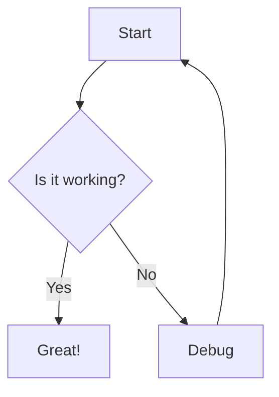
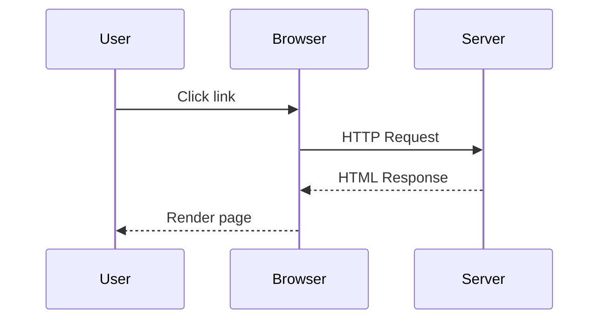

# Test Mermaid Diagrams

## Simple Flowchart


```mermaid
graph TD
    A[Start] --> B{Is it working?}
    B -->|Yes| C[Great!]
    B -->|No| D[Debug]
    D --> A
```

## Sequence Diagram


```mermaid
sequenceDiagram
    participant User
    participant Browser
    participant Server

    User->>Browser: Click link
    Browser->>Server: HTTP Request
    Server-->>Browser: HTML Response
    Browser-->>User: Render page
```

## Regular Code Block

```javascript
// This should remain as a code block
console.log("Hello World");
```
